**1．在系统启动时，ARM Linux 内核如何知道系统中有多大的内存空间？**

​	在 ARM Linux 中，各种设备的相关属性描述都采用 DTS 方式来呈现。在 ARM Vexpress 平台中，内存的定义在 vexpress-v2p-ca9.dts 文件中。该 DTS 文件定 义了内存的起始地址和大小。内核在启动的过程中，需要解析这些 DTS (device tree source)文件。解析“memory”描述的信息从而得到内存的 base_address 和 size 信息。

**2．在 32bit Linux 内核中，用户空间和内核空间的比例通常是 3:1，可以修改成 2:2 吗？**

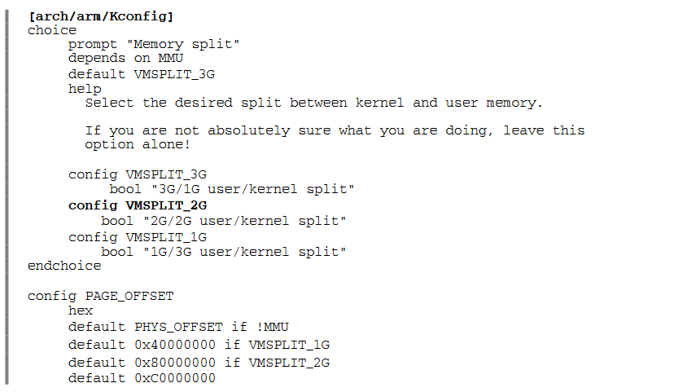

​	在 32bit Linux 中，一共能使用的虚拟地址空间是 4GB，用户空间和内核空间的划分通 常是按照 3:1 来划分，也可以按照 2:2 来划分。在 ARM Linux 中有一个配置选项“memory split”，可以用于调整内核空间和用户空间的 大小划分。通常使用“VMSPLIT_3G”选项，用户空间大小是 3GB，内核空间大小是 1GB， 那么 PAGE_OFFSET 描述内核空间的偏移量就等于 0xC000_0000。也可以选择“VMSPLIT_2G” 选项，这时内核空间和用户空间的大小都是 2GB，PAGE_OFFSET 就等于 0x8000_0000。内核中通常会使用 PAGE_OFFSET 这个宏来计算内核线性映射中虚拟地址和物理地址 的转换。例如，内核中用于计算线性映射的物理地址和虚拟地址的转换关系。线性映射的物理 地址等于虚拟地址 vaddr 减去 PAGE_OFFSET（0xC000_0000）再减去 PHYS_OFFSET（在 部分 ARM 系统中该值为 0）。

3．物理内存页面如何添加到伙伴系统中，是一页一页添加，还是以 2 的几次幂来加入呢？

以2的几次幂来加入，首先通过for_each_free_mem_range()函数来遍历所有的 memblock 内存块，找出内存块的起始地址start和结束地址end。将start和end传递给__free_pages_memory()函数中。**注意这里参数 start 和 end 指页帧号**。

```c
static void __init __free_pages_memory(unsigned long start, unsigned long end)

 {

	int order;

	while (start < end) {

		order = min(MAX_ORDER - 1UL, __ffs(start));

		while (start + (1UL << order) > end)

			order--;

		__free_pages_bootmem(pfn_to_page(start), order);

		start += (1UL << order);

	}

}
```

while 循环一直从起始页帧号 start 遍历到 end，循环的步 长和 order 有关。首先计算 order 的大小，取 MAX_ORDER−1 和__ffs(start)的最小值。ffs(start)函 数计算 start 中第一个 bit 为 1 的位置，注意__ffs() = ffs() −1。因为伙伴系统的链表都是 2 的 n 次幂， 最大的链表是 2 的 10 次方，也就是 1024，即 0x400。所以，通过 ffs()函数可以很方便地计算出地 址的对齐边界。例如 start 等于 0x63300，那么__ffs(0x63300)等于 8，那么这里 order 选用 8。得到 order 值后，我们就可以把这块内存通过__free_pages_bootmem()函数添加到伙伴 系统了。该函数调用__free_pages()函数，__free_pages()函数是伙伴系统的核心函数，这里按照 order 的方式添加到伙伴系统中。

下面是向系统中添加一段内存的情况，页帧号范围为[0x8800e, 0xaecea]，以 start 为起 始来计算其 order，一开始 order 的数值还比较凌乱，等到 start 和 0x400 对齐，以后基本上 order 都取值为 10 了，也就是都挂入 order 为 10 的 free_list 链表中。

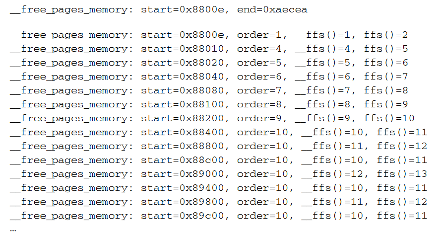

4．内核的一级页表存放在什么地方？内核空间的二级页表又存放在什么地方？

​	内核的页表存放在 swapper_pg_dir 地址中，可以通过 init_mm 数据结构来获取

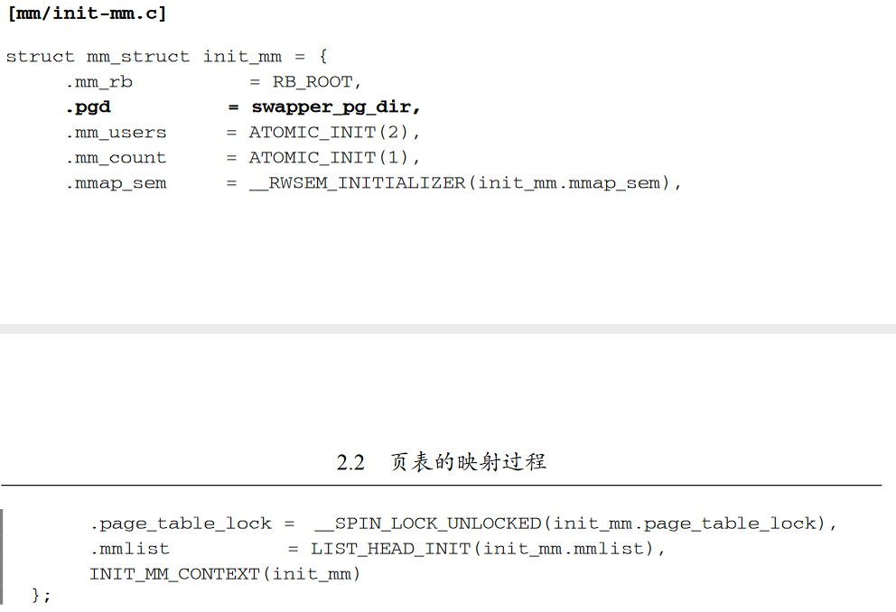

内核页表的基地址定义在 arch/arm/kernel/head.S 汇编代码中。

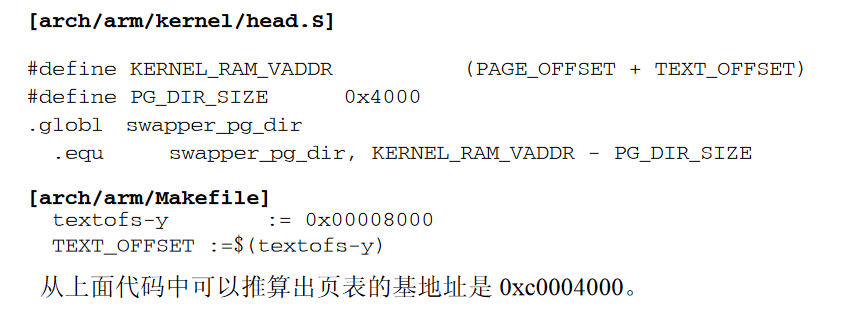


5．用户进程的一级页表存放在什么地方？二级页表又存放在什么地方？

**6．在 ARM32 系统中，页表是如何映射的？在 ARM64 系统中，页表又是如何映射的？**

​	ARM32:	如果采用页表映射的方式，段映射表就变成一级映射表（First Level table，在 Linux 内 核中称为 PGD），其表项提供的不再是物理段地址，而是二级页表的基地址。32 位虚拟地 址的高 12 位（bit[31:20]）作为访问一级页表的索引值，找到相应的表项，每个表项指向一 个二级页表。以虚拟地址的次 8 位（bit[19:12]）作为访问二级页表的索引值，得到相应的 页表项，从这个页表项中找到 20 位的物理页面地址。最后将这 20 位物理页面地址和虚拟 地址的低 12 位拼凑在一起，得到最终的 32 位物理地址。这个过程在 ARM32 架构中由 MMU 硬件完成，软件不需要接入。

​	ARM64:	对于 ARM64 架构来说，目前基于 ARMv8-A 架构的处理器最大可以支持到 48 根地址 线，也就是寻址 248 的虚拟地址空间，即虚拟地址空间范围为 0x0000_0000_0000_0000～ 0x0000_FFFF_FFFF_FFFF，另外基于 ARMv8-A 架构的处理器支持的最大物理地址宽度也是 48 位。并且支持3级或者4级页表映射。这里以4KB页面大小，48位地址宽度，4级映射为例。

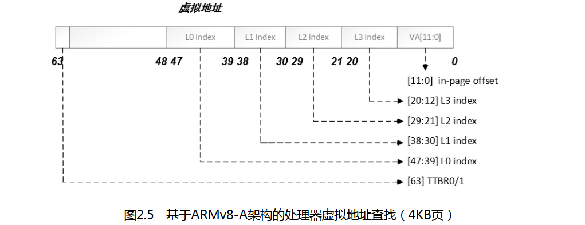

（1）如果输入的虚拟地址最高位 bit[63]为 1，那么这个地址是用于内核空间的，页表 的基地址寄存器用 TTBR1_EL1(Translation Table Base Register 1)。如 果 bit[63]等于 0，那 么 这个虚拟地址属于用户空间，页表基地址寄存器用 TTBR0。

 （2）TTBRx 寄存器保存了第 0 级页表的基地址（L0 Table base address，Linux 内核中 称为 PGD），L0 页表中有 512 个表项（Table Descriptor），以虚拟地址的 bit[47:39]作为索引 值在 L0 页表中查找相应的表项。每个表项的内容含有下一级页表的基地址，即 L1 页表 （Linux 内核中称为 PUD）的基地址。

 （3）PUD 页表中有 512 个表项，以虚拟地址的 bit[38:30]为索引值在 PUD 表中查找相应的表 项，每个表项的内容含有下一级页表的基地址，即 L2 页表（Linux 内核中称为 PMD）的基地址。 

（4）PMD 页表中有 512 个表项，以虚拟地址的 bit[29:21]为索引值在 PMD 表中查找相 应的表项，每个表项的内容含有下一级页表的基地址，即 L3 页表（Linux 内核中称为 PTE） 的基地址。 

（5）在 PTE 页表中，以虚拟地址的 bit[20:12]为索引值在 PTE 表中查找相应的表项， 每个 PTE 表项中含有最终的物理地址的 bit[47:12]，和虚拟地址中 bit[11:0]合并成最终的物 理地址，完成地址翻译过程。

​	在内核初始化阶段会对内核空间的页表进行一一映射，实现的函数依然是 create_ mapping()。首先会做虚拟地址的检查，低于 VMALLOC_START 的地址空间不是有效的内核虚拟 地址空间。VMALLOC_START 等于 0xffff_0000_0000_0000。PGD 页表的基地址和 ARM32 内核一样，通过 init_mm 数据结构的 pgd 成员来获取， swapper_pg_dir 全局变量指向 PGD 页表基地址。

​	在 pgtable-hwdef.h 头文件中，定义了 PGDIR_SHIFT、PUD_SHIFT 和 PMD_SHIFT 的 宏。在我们 QEMU 的 ARM64 的实验平台上，定义了 4 级页表，也就是 CONFIG_ARM64_ PGTABLE_LEVELS 等于 4，另外 VA _ B I T S 定义为 48。那么通过计算可以得到 PGDIR_SHIFT 等于 39，PUD_SHIFT 等于 30，PMD_SHIFT 等于 21。每级页表的页表项数目分别用 PTRS_ PER_PGD、PTRS_PER_PUD、PTRS_PER_PMD 和 PTRS_PER_PTE 来表示，都等于 512。 PGDIR_SIZE 宏表示一个 PGD 页表项能覆盖的内存范围大小为 512GB。PUD_SIZE 等于 1GB，PMD_SIZE 等于 2MB，PAGE_SIZE 等于 4KB。

**在内核初始化阶段会对内核空间的页表进行一一映射**，实现的函数依然是 create_ mapping()。在__create_mapping()函数中，以 PGDIR_SIZE 为步长遍历内存区域[virt, virt+size]，然 后通过调用 alloc_init_pud()来初始化 PGD 页表项内容和下一级页表 PUD。

alloc_init_pud()函数可以通过alloc_init_pmd()初始化PUD页表项和下一级页表PMD，配置PMD页表，同理alloc_init_pmd()通过alloc_init_pte()初始化PMD页表项和下一级页表PTE页表，配置 PTE 页表。


**7．请简述 Linux 内核在理想情况下页面分配器（page allocator）是如何分配出连续物 理页面的？**

首先回忆一下内存的组织情况：

内存节点node，即NUMA下的内存结点。------>zonelist。node中包含一个zonelist。-------->zonelist中有一个_zonerefs数组，该数组的每个元素用于描述zone。数组元素的field有zone_index、zone指针等----------->其中zone指针指向对应的zone---------->而每个zone有自己的free_area数组，数组的最大小标为MAX_ORDER-1.-------->而free_area数组的组成就如图所示了：

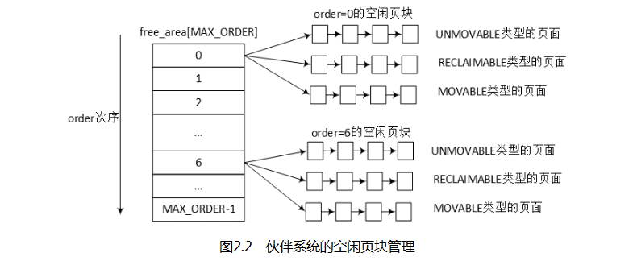


每个内存节点有一个 struct pglist_data 数据结构，其成员 node_zonelists 是一个 struct zonelist 数据结构，zonelist 中包含了 struct zoneref _zonerefs[ ]数组来描述这些 zone。分配页面时，我们会有一些分配的需求，这些需求组成了gfp_mask。这些需求中最低四位表示了从什么样的ZONE中分配页面。我们用gfp_zone()函数解析gfp_mask，可以得到一个highest_zoneidx，这个的意思就是说，我们分配的zone的index不能大于highest_zoneidx。

首先调用**_alloc_pages_nodemask()**函数，该函数会调用**get_page_from_freelist()**函数尝试分配物理页面。

假设get_page_from_freelist能够分配成功。

get_page_from_freelist函数首先调用for_each_zone_zonelist_nodemask宏扫描内存节点中的zonelist，查找适合分配内存的zone，这里的适合指的是，满足gfp_mask需求的zone，当然也包括high_zoneidx。注意这个zone的index不是说zone在zoneref _zonerefs[ ]数组中的下标，实际上zoneref struct中有包含有两个field，一个是zone_index 成员指向 zone 的编号，一个成员 zone 指针会指向 zone 数据结构，所以zone的index指的是该数组元素的zone_index域。

for_each_zone_zonelist_nodemask选好特定的zone过后，对该zone进行watermark check，即水位检查。如果空闲页面低于水位值，需要调用zone_reclaim()函数来回收页面，我们假设空闲页面充沛，也就是通过了水位检查。

这个时候就要调用buffer_rmqueue()函数从伙伴系统分配物理页面了。有两种情况在这里，一种是order=0，则直接从zone->per_cpu_pageset列表中分配；一种是order大于0，则从伙伴系统分配。我们关注order大于0的情况：最终调用__rmqueue_smallest()函数。

该函数从order开始查找链表，如果zone的当前order对应空闲区free_area中相应的migratetype类型链表中没有空闲对象，那么查找下一级order。当找到某一个order的空闲区有migratetype类型的空闲链表中有空闲内存块时，会把该内存块摘下来。然后调用expand()函数来“切蛋糕”。即，把分配完剩下的内存块重新插入回伙伴系统。

最后，回到get_page_from_freelist()做一些检查，页面也就分配成功。


**8．在页面分配器中，如何从分配掩码（gfp_mask）中确定可以从哪些 zone 中分配内存？**

我们用gfp_zone()函数解析gfp_mask，可以得到一个highest_zoneidx，这个的意思就是说，我们分配的zone的index不能大于highest_zoneidx。get_page_from_freelist函数首先调用for_each_zone_zonelist_nodemask宏扫描内存节点中的zonelist，查找适合分配内存的zone，这里的适合指的是，满足gfp_mask需求的zone，当然也包括high_zoneidx。


**9．页面分配器是按照什么方向来扫描 zone 的？**

扫描 _zonerefs[ ]数组，从头到尾。


**10．为用户进程分配物理内存，分配掩码应该选用 GFP_KERNEL，还 是 GFP_HIGHUSER_ MOVABLE 呢？**

GFP_HIGHUSER_MOVABLE.


11．slab 分配器是如何分配和释放小内存块的？

分配小内存块：

①首先是从本地缓冲池里面分配，若没有：

②从共享缓冲池里迁移batchcount个空闲对象到本地，然后分配。若没有：

③从本地节点的部分空闲slab链表或完全空闲slab链表中取下一个slab，然后从slab的freelist中分配batchcount个空闲对象进本地缓冲池。若没有部分空闲slab链表或完全空闲slab链表：

④从伙伴分配器分配2^gfporder个页，然后进行slab的组织，最后将slab挂到本地节点的完全空闲slab链表中，然后回到①。


释放小内存块：

释放 slab 缓存对象的 API 函数是 kmem_cache_free()。

①首先由对象的虚拟地址通过 virt_to_pfn()找到相应的 pfn，然后通过 pfn_to_page()由 pfn 找到对应的 page 结构。在一个 slab 中，第一个页面的 page 结构中 page->slab_cache 指 向这个 struct kmem_cache 数据结构。

②如果本地对象缓冲池的空闲对象 ac->avail < ac->limit 阈值，通过ac_put_obj()的“ac->entry[ac->avail++] = objp”把对象释放到本地对象 缓冲池 ac 中，释放过程已经结束了。

③如果本地对象缓冲池的空闲对象 ac->avail >= ac->limit 阈值，就会调用 cache_flusharray()做 flush 动作去尝试回收空闲对象.

​		<1>首先是判断是否有共享对象缓冲池，如果有，会把本地对象缓冲池的空闲对象（batchcount个）复制到共享对象缓冲池中。

​		<2>如果共享对象缓冲池中的空闲对象数量大于 limit 阈值，会调用free_block()函数主动释放 batchcount 个空闲对象。如果 slab 没有了 活跃对象（即 page->active == 0），并且 slab 节点中所有空闲对象数目 n->free_objects 超过 了 n->free_limit 阈值，那么调用 slabs_destroy()函数来销毁这个 slab。page->active 用于记录 活跃 slab 对象的计数，slab_get_obj()函数分配一个 slab 对象时会增加该计数，slab_put_obj() 函数释放一个 slab 对象时会递减该计数。


12．slab 分配器中有一个着色的概念（cache color），着色有什么作用？

这样可以使不同 slab 上同一个相对位置 slab 对象的起始地址在高速缓存中相互错开，有利于改善 高速缓存的效率。防止cache频繁的换入换出，使cache均匀映射。


13．slab 分配器中的 slab 对象有没有根据 Per-CPU 做一些优化？

有，每个cpu都有一个本地缓冲池，每次企图获得一个空闲对象时，首先询问本地缓冲池。让一个对象尽可能地运行在同一个 CPU 上，可以让对象尽可能地使用同一个 CPU 的 cache，有助于提高性能。访问 Per-CPU 类型的本地对象缓冲池不需要获取额外的自旋锁，因为不会有另外 的 CPU 来访问这些 Per-CPU 类型的对象缓存池，避免自旋锁的争用。

14．slab 增长并导致大量不用的空闲对象，该如何解决？

（1）使用 kmem_cache_free 释放一个对象，当发现本地和共享对象缓冲池中的空闲对 象数目 ac->avail 大于缓冲池的极限值 ac->limit 时，系统会主动释放 bacthcount 个对象。当 系统所有空闲对象数目大于系统空闲对象数目极限值，并且这个 slab 没有活跃对象时，那 么系统就会销毁这个 slab，从而回收内存。 （2）slab 系统还注册了一个定时器，定时去扫描所有的 slab 描述符，回收一部分空闲 对象，达到条件的 slab 也会被销毁，实现函数在 cache_reap()，大家可以自行阅读。


15．请问 kmalloc、vmalloc 和 malloc 之间有什么区别以及实现上的差异？


16．使用用户态的 API 函数 malloc()分配内存时，会马上为其分配物理内存吗？

不会。除非有vm_locked标志，才会立刻分配物理内存。

17．假设不考虑 libc 的因素，malloc 分配 100Byte，那么实际上内核是为其分配 100Byte 吗？

内核以页为最小单位分配。

18．假设两个用户进程打印的 malloc()分配的虚拟地址是一样的，那么在内核中这两块 虚拟内存是否打架了呢？

否。每个进程有自己独立的页表。

19．vm_normal_page()函数返回的是什么样页面的 struct page 数据结构？为什么内存管 理代码中需要这个函数？

//暂时没整理

20．请简述 get_user_page()函数的作用和实现流程。

首先从用户虚拟空间 找到空闲vma，将vma传入内核，内核根据vma对应的pte为空或present位没有置位，那么内存为其分配内存并建立映射。

21．请简述 follow_page()函数的作用的实现流程。

//暂时没整理

22．请简述私有映射和共享映射的区别。

 23．为什么第二次调用 mmap 时，Linux 内核没有捕捉到地址重叠并返回失败呢？

```
#strace捕捉某个app调用mmap的情况 
mmap(0x20000000, 819200, PROT_READ|PROT_WRITE, MAP_PRIVATE|MAP_FIXED|MAP_ANONYMOUS, -1, 0) = 0x20000000 
...
mmap(0x20000000, 4096, PROT_READ|PROT_WRITE, MAP_PRIVATE|MAP_FIXED|MAP_ANONYMOUS, -1, 0) = 0x20000000
```

24．struct page 数据结构中的_count 和_mapcount 有什么区别？

25．匿名页面和 page cache 页面有什么区别？

26．struct page 数据结构中有一个锁，请问 trylock_page()和 lock_page()有什么区别？

27．在 Linux 2.4.x 内核中，如何从一个 page 找到所有映射该页面的 VMA？反向映射 可以带来哪些便利？

28．阅 读 Linux 4.0 内核 RMAP 机制的代码，画出父子进程之间 VMA、AV C 、anon_vma 和 page 等数据结构之间的关系图。

29．在 Linux 2.6.34 中，RMAP 机制采用了新的实现，在 Linux 2.6.33 和之前的版本中 称为旧版本 RMAP 机制。那么在旧版本 RMAP 机制中，如果父进程有 1000 个子进程，每 个子进程都有一个 VMA，这个 VMA 里面有 1000 个匿名页面，当所有的子进程的 VMA 同 时发生写复制时会是什么情况呢？

30．当 page 加入 lru 链表中，被其他线程释放了这个 page，那么 lru 链表如何知道这 个 page 已经被释放了？

31．kswapd 内核线程何时会被唤醒？

33．kswapd 按照什么原则来换出页面？

 34．kswapd 按照什么方向来扫描 zone？

 35．kswapd 以什么标准来退出扫描 LRU？ 

36．手持设备例如 Android 系统，没有 swap 分区或者 swap 文件，kswapd 会扫描匿名 页面 LRU 吗？

37．swappiness 的含义是什么？kswapd 如何计算匿名页面和 page cache 之间的扫描比重？ 

38．当系统充斥着大量只访问一次的文件访问（use-one streaming IO）时，kswapd 如 何来规避这种风暴？

39．在回收 page cache 时，对于 dirty 的 page cache，kswapd 会马上回写吗？

40．内核有哪些页面会被 kswapd 写回交换分区？

41．ARM32 Linux 如何模拟这个 Linux 版本的 L_PTE_YOUNG 比特位呢？

42．如何理解 Refault Distance 算法？

43．请简述匿名页面的生命周期。在什么情况下会产生匿名页面？在什么条件下会释 放匿名页面？

44．KSM 是基于什么原理来合并页面的？

45．在 KSM 机制里，合并过程中把 page 设置成写保护的函数 write_protect_page()有 这样一个判断：请问这个判断的依据是什么？

```
if (page_mapcount(page) + 1 + swapped != page_count(page)) {

	goto out_unlock; 

}
```

46．如果多个 VMA 的虚拟页面同时映射了同一个匿名页面，那么此时 page->index 应 该等于多少？

47．为什么 Dirty COW 小程序可以修改一个只读文件的内容？

48．在 Dirty COW 内存漏洞中，如果 Dirty COW 程序没有 madviseThread 线程，即只 有 procselfmemThread 线程，能否修改 foo 文件的内容呢？

49．假设在内核空间获取了某个文件对应的 page cache 页面的 struct page 数据结构， 而对应的 VMA 属性是只读，那么内核空间是否可以成功修改该文件呢？

50．如果用户进程使用只读属性（PROT_READ）来 mmap 映射一个文件到用户空间， 然后使用 memcpy 来写这段内存空间，会是什么样的情况？

51．请画出内存管理中常用的数据结构的关系图，如 mm_struct、vma、vaddr、page、 pfn、pte、zone、paddr 和 pg_data 等，并思考如下转换关系。

 ‰ 如何由 mm 数据结构和虚拟地址 vaddr 找到对应的 VMA？

 ‰ 如何由 page 和 VMA 找到虚拟地址 vaddr？

 ‰ 如何由 page 找到所有映射的 VMA？

 ‰ 如何由 VMA 和虚拟地址 vaddr 找出相应的 page 数据结构？

 ‰ page 和 pfn 之间的互换。

 ‰ pfn 和 paddr 之间的互换。

 ‰ page 和 pte 之间的互换。

 ‰ zone 和 page 之间的互换。

 ‰ zone 和 pg_data 之间的互换。

52．请画出在最糟糕的情况下分配若干个连续物理页面的流程图。

53．在 Android 中新添加了 LMK（Low Memory Killer），请描述 LMK 和 OOM Killer 之间的关系。

54．请描述一致性 DMA 映射 dma_alloc_coherent()函数在 ARM 中是如何管理 cache 一 致性的？

55．请描述流式 DMA 映射 dma_map_single()函数在 ARM 中是如何管理 cache 一致性的？

56．为什么在 Linux 4.8 内核中要把基于 zone 的 LRU 链表机制迁移到基于 Node 呢？


描述系统中物理内存的组织架构的三个数据结构：**struct pg_data_t、struct zone 、struct page**

描述进程的虚拟内 存用 **struct vm_area_struct** 数据结构。

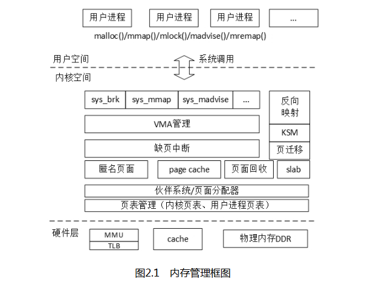


# struct zone

```c
struct zone { 

/* Read-mostly fields */ 

unsigned long watermark[NR_WMARK];//每个 zone 在系统启动时会计算出 3 个水位值，分别是 WMARK_MIN、 WMARK_LOW 和 WMARK_HIGH 水位，这在页面分配器和 kswapd 页面回收中 会用到

long lowmem_reserve[MAX_NR_ZONES]; //zone 中预留的内存

struct pglist_data *zone_pgdat; //指向内存节点

struct per_cpu_pageset __percpu *pageset;//用于维护 Per-CPU 上的一系列页面，以减少自旋锁的争用

unsigned long zone_start_pfn;//zone 中开始页面的页帧号

unsigned long managed_pages; //zone 中被伙伴系统管理的页面数量

unsigned long spanned_pages; //zone 包含的页面数量

unsigned long present_pages; //zone 里实际管理的页面数量。对一些体系结构来说，其值和 spanned_pages 相等

const char *name;

ZONE_PADDING(_pad1_) 

struct free_area free_area[MAX_ORDER]; //管理空闲区域的数组，包含管理链表等

unsigned long flags; 

spinlock_t lock; //并行访问时用于对 zone 保护的自旋锁

ZONE_PADDING(_pad2_) 

spinlock_t lru_lock; //用于对 zone 中 LRU 链表并行访问时进行保护的自旋锁

struct lruvec lruvec; //LRU 链表集合

ZONE_PADDING(_pad3_)

atomic_long_t vm_stat[NR_VM_ZONE_STAT_ITEMS]; //zone 计数

}____ cacheline_internodealigned_in_smp;

/*struct zone 是经常会被访问到的，因此这个数据结构要求以 L1 Cache 对齐。另外， 这里的 ZONE_PADDING()是让 zone->lock 和 zone->lru_lock 这两个很热门的锁可以分布在 不同的 cache line 中。*/
```

​	通常情况下，内核的 zone 分为 ZONE_DMA、ZONE_DMA32、ZONE_NORMAL 和 ZONE_HIGHMEM。在 ARM Vexpress 平台中，没有定义 CONFIG_ZONE_DMA 和 CONFIG_ ZONE_DMA32，所以只有 ZONE_NORMAL 和 ZONE_HIGHMEM 两种。

下面是 ARM Vexpress 平台运行之后打印出来的 zone 的信息。

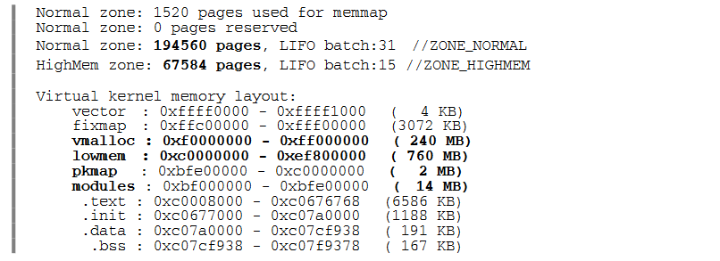

可以看出 ARM Vexpress 平台分为两个 zone，ZONE_NORMAL 和 ZONE_HIGHMEM。 其中 ZONE_NORMAL 是从 0xc0000000 到 0xef800000。

zone 的初始化函数在 free_area_init_core()中。

 [start_kernel->setup_arch->paging_init->bootmem_init->zone_sizes_init->fre e_area_init_node->free_area_init_core]

另外系统中会有一个 zonelist 的数据结构，伙伴系统分配器会从 zonelist 开始分配内存， zonelist 有一个 zoneref 数组，数组里有一个成员会指向 zone 数据结构。zoneref 数组的第一 个成员指向的 zone 是页面分配器的第一个候选者，其他成员则是第一个候选者分配失败之 后才考虑，优先级逐渐降低。zonelist 的初始化路径如下： 

[start_kernel->build_all_zonelists->build_all_zonelists_init->__build_all_ zonelists->build_zonelists->build_zonelists_node]。

**zone 数据结构中有一个 free_area 数组，数组的大小是 MAX_ORDER**。一般为11。这个MAX_ORDER表示伙伴系统的最大次幂。**所以每个ZONE中包含了一个伙伴分配系统。**free_area 数据结构中包含了 MIGRATE_TYPES 个链表，这里 相当于 zone 中根据 order 的大小有 0 到 MAX_ORDER−1 个 free_area，每个 free_area 根据 MIGRATE_TYPES 类型有几个相应的链表。MIGRATE_TYPES 类型包含 MIGRATE_UNMOVABLE、MIGRATE_RECLAIMABLE、 MIGRATE_MOVABLE 以及 MIGRATE_RESERVE 等几种类型。当前页面分配的状态可以 从/proc/pagetypeinfo 中获取得到。

```c
 struct free_area 
 { 
 	struct list_head free_list[MIGRATE_TYPES]; 
 	unsigned long nr_free; 
 };
```


‰ 大部分物理内存页面都存放在 MIGRATE_MOVABLE 链表中。

 ‰ 大部分物理内存页面初始化时存放在 2 的 10 次幂的链表中。

我们思考一个问题，Linux 内核初始化时究竟有多少页面是 MIGRATE_MOVABLE？

内存管理中有一个 pageblock 的概念，一个 pageblock 的大小通常是2^（MAX_ORDER−1） 个页面, 也就是4MB。如果体系结构中提供了 HUGETLB_PAGE 特性，那么 pageblock_order 定义为 HUGETLB_PAGE_ORDER。每个 pageblock 有一个相应的 MIGRATE_TYPES 类型。zone 数据结构中有一个成员指 针 pageblock_flags，它指向用于存放每个 pageblock 的 MIGRATE_TYPES 类型的内存空间。**pageblock_flags 指向的内存空间的大小**通过 usemap_size()函数来计算，每个 pageblock 用 4 个比特位来存放 MIGRATE_TYPES 类型。zone 的初始化函数free_area_init_core()会调用 setup_usemap()函数分配pageblock_flags 指向的内存空间。内核初始化时所有的页面最初都标记为 MIGRATE_MOVABLE 类型。


# 页表映射

create_mapping() 函数就是为一个给定的内存区间**建立页面映射**，这个函数使用 map_desc 数据结构来描述一个内存区间。

struct map_desc {

​	unsigned long virtual; //虚拟地址的起始地址 

​	unsigned long pfn; //物理地址的开始地址的页帧号 

​	unsigned long length; //内存区间大小 

​	unsigned int type;

 };

type 表示内存区间的属性，系统中定义了一个全局的struct mem_type[ ]数组来描述所有的内存区间类型，例如这些内存区间： MT_DEVICE_CACHED、MT_DEVICE_WC、MT_MEMORY_RWX 和 MT_MEMORY_RW。struct mem_type 数据结构描述内存区间类型以及相应的权限和属性等信息，其数据结构定义如下：

struct mem_type {

​	 pteval_t prot_pte;

​	 pteval_t prot_pte_s2; 

​	 pmdval_t prot_|1; 

​	 pmdval_t prot_sect; 

​	 unsigned int domain;

 };

其中，domain 成员用于 ARM 中定义的不同的域，ARM 中允许使用 16 个不同的域， 但在 ARM Linux 中只定义和使用 3 个。

#define DOMAIN_KERNEL 2 

#define DOMAIN_TABLE 2 

#define DOMAIN_USER 1

#define DOMAIN_IO 0

DOMAIN_KERNEL 和 DOMAIN_TABLE 其实用于系统空间，DOMAIN_IO 用于 I/O 地址域，实际上也属于系统空间，DOMAIN_USER 则是用户空间。prot_pte 成员用于页面表项的控制位和标志位。prot__|1 成员用于一级页表项的控制位和标志位。


**调用 create_mapping()时 以此map_desc 数据结构指针为调用参数。**

[start_kernel()->setup_arch()->paging_init()->map_lowmem ()->create_mapping]

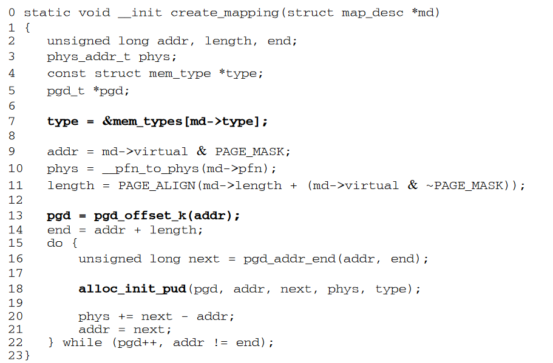

在 create_mapping()函数中，以 PGDIR_SIZE 为单位，在内存区域[virtual, virtual +length] 中通过调用 alloc_init_pud()来初始化 PGD 页表项内容和下一级页表 PUD。pgd_addr_end() 以 PGDIR_SIZE 为步长。

在第 13 行代码中，通过 pgd_offset_k()函数获取所属的页面目录项 PGD。内核的页表 存放在 swapper_pg_dir 地址中，可以通过 init_mm 数据结构来获取。

create_mapping()函数中的第 15～22 行代码，由于 ARM Vexpress 平台支持两级页表映 射，所以 PUD 和 PMD 设置成与 PGD 等同了。

因此 alloc_init_pud()函数一路调用到 alloc_init_pte()函数。

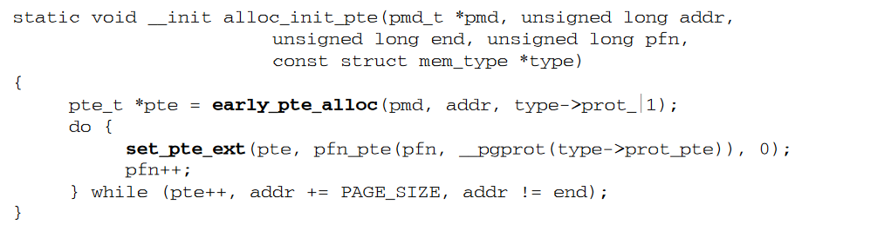

alloc_init_pte()首先判断相应的 PTE 页表项是否已经存在，如果不存在，那就要新建 PTE 页表项。接下来的 while 循环是根据物理地址的 pfn 页帧号来生成新的 PTE 表项（PTE entry），最后设置到 ARM 硬件页表中（由 set_pte_ext()完成对硬件页表项的设置）。ARM 结构中一级页表 PGD 的偏移量应该从 20 位开始,为何头文件定义从 21 位开始呢? 这是因为Linux内核默认PGD从21开始，也就是[31:21]，而ARM32硬件结构中PGD从20开始。具体详情查看书p56。我简单的总结一下：early_pte_alloc首先会检查pmd指向的table是否分配了，如果分配了那就返回addr对应的pte地址。如果没分配，那就得分配pmd指向的表。这个表有多大呢？512+512个页表项。但是在ARM32真实硬件中一个PGD页表项只有就256个页表项，为什么要分配这多？①其实其中512页表项是给Linux OS用的(用于模拟 L_PTE_DIRTY、L_PTE_YOUNG 等标志位)，因为Linux默认二级页表512项，剩下的512个页面表是给ARM硬件MMU使用的。而PGD 的定义其实是 pmdval_t pgd[2]，长度是两倍，也就是 pgd 包括两份相邻的 PTE 页 表。所以 pgd_offset()在查找 pgd 表项时，是按照 pgd[2]长度来进行计算的，因此查找相应 的 pgd 表项时，其中 pgd[0]指向第一份 PTE 页表，pgd[1]指向第二份 PTE 页表。


在 x86 的页 面表中有 3 个标志位是 ARM32 硬件页面表没有提供的。 ‰ PTE_DIRTY：CPU 在写操作时会设置该标志位，表示对应页面被写过，为脏页。 ‰ PTE_YOUNG：CPU 访问该页时会设置该标志位。在页面换出时，如果该标志位置位 了，说明该页刚被访问过，页面是 young 的，不适合把该页换出，同时清除该标志位。 ‰ PTE_PRESENT：表示页在内存中。 因此在 ARM Linux 实现中需要模拟上述 3 个比特位。

如何模拟 PTE_DIRTY 呢？在 ARM MMU 硬件为一个干净页面建立映射时，设置硬件 页表项是只读权限的。当往一个干净的页面写入时，会触发写权限缺页中断（虽然 Linux 版本的页面表项标记了可写权限，但是 ARM 硬件页面表项还不具有写入权限），那么在缺 页中断处理 handle_pte_fault()中会在该页的 Linux 版本 PTE 页面表项标记为“dirty”，并且 发现 PTE 页表项内容改变了，ptep_set_access_flags()函数会把新的 Linux 版本的页表项内容写入硬件页表，从而完成模拟过程。

**注意这个create_mapping和内核初始化时创建内核页表的create_mapping函数不一样。**这个create_mapping应该主要是为了映射一个内存区间。


# **内核内存的布局图**

**ARM32的内核内存布局：**

Linux 内核在启动时会打印出内核内存空间的布局图，下面是 ARM Vexpress 平台打印 出来的内存空间布局图：

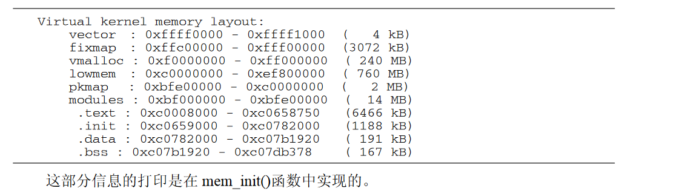

编译器在编译目标文件并且链接完成之后，就可以知道内核映像文件最终的大小，接下来打 包成二进制文件，该操作由 arch/arm/kernel/vmlinux.ld.S 控制，其中也划定了内核的内存布局。

‰ 代码段：_text 和_etext 为代码段的起始和结束地址，包含了编译后的内核代码。 

‰ init 段：__init_begin 和__init_end 为 init 段的起始和结束地址，包含了大部分模块 初始化的数据。 

‰ 数据段：_sdata 和_edata 为数据段的起始和结束地址，保存大部分内核的变量。 

‰ BSS 段: __bss_start 和__bss_stop 为 BSS 段的开始和结束地址，包含初始化为 0 的所有静态全局变量。

上述几个段的大小在编译链接时根据内核配置来确定，因为每种配置的代码段和数据 段长度都不相同，这取决于要编译哪些内核模块，但是起始地址_text 总是相同的。内核编 译完成之后，会生成一个 System.map 文件，查询这个文件可以找到这些地址的具体数值。

**内核模块**使用虚拟地址从 MODULES_VADDR 到 MODULES_END 的这段 14MB 大小 的内存区域。

用户空间和内核空间使用 3:1 的划分方法时，内核空间只有 1GB 大小。这 1GB 的映射 空间，其中有一部分用于直接映射物理地址，这个区域称为线性映射区。在 ARM32 平台上，物理地址[0:760MB]的这一部分内存被线性映射到[3GB:3GB+ 760MB]的虚拟地址上。线性映射区的虚拟地址和物理地址相差 PAGE_OFFSET，即 3GB。

那高端内存的起始地址（760MB）是如何确定的呢？在内核初始化内存时，在 sanity_check_meminfo()函数中确定高端内存的起始地址，全 局变量 high_memory 来存放高端内存的起始地址。

**为什么内核只线性映射 760MB 呢？剩下的 264MB 的虚拟地址空间用来做什么呢？** 那是保留给 vmalloc、fixmap 和高端向量表等使用的。内核很多驱动使用 vmalloc 来分 配连续虚拟地址的内存，因为有的驱动不需要连续物理地址的内存；除此以外，vmalloc 还 可以用于高端内存的临时映射。一个 32bit 系统中实际支持的内存数量会超过内核线性映射 的长度，但是内核要具有对所有内存的寻找能力。

内核通常把物理内存低于 760MB 的称为线性映射内存（Normal Memory），而高于 760MB 以上的称为高端内存（High Memory）。由于 32 位系统的寻址能力只有 4GB，对于物理内存 高于 760MB 而低于 4GB 的情况，我们可以从保留的 240MB 的虚拟地址空间中划出一部分 用于动态映射高端内存，这样内核就可以访问到全部的 4GB 内存了。如果物理内存高于 4GB， 那么在 ARMv7-A 架构中就要使用 LPE 机制来扩展物理内存访问了。用于映射高端内存的虚 拟地址空间有限，所以又可以划分为两部分，一部分为临时映射区，另一部分为固定映射区， PKMAP 指向的就是固定映射区。如图 2.6 所示是 ARM Vexpress 平台上画出内核空间的内存 布局图。

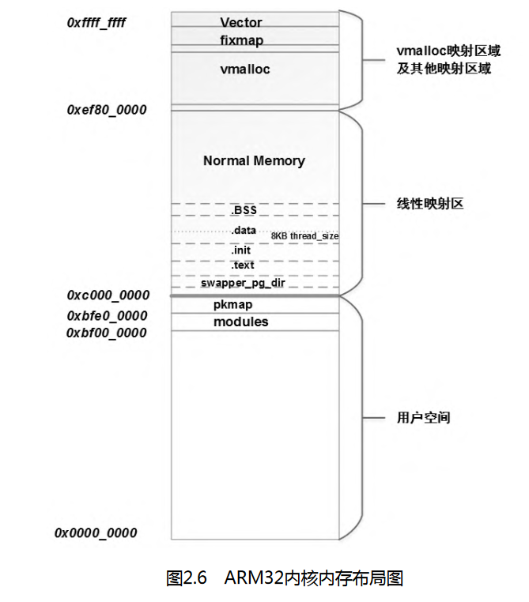

PKMAP 映射区也称为可持久映射区。当通过 alloc_page() 获得高端物理内存对于的page，内核专门为此保留一块线性地址空间，从 PKMAP_BASE 开始，用于映射高端物理内存页，就是可持久映射区。在可持久映射区，可以通过调用函数 kmap() 在物理页框与内核虚拟内存地址建立长期映射，这个空间通常为 4MB，最多能映射 1024 个页框，最大页框数使用 LAST_PKMAP 宏表示。PKMAP 可映射的页框数稀少，所以为了加强页框的使用率，应及时调用 kunmap() 函数将不使用的物理页框释放掉。在 Linux 2.6 内核上，可持久映射虚拟地址范围是 4GB - 8M 到 4G-4M 之间。而在上述布局图中(Linux4.X)，PKMAP的VMA位于用户空间，注意区别。


**ARM64的内核内存布局：**

​	在处理器架构设计上，把虚拟地址空间划分为两个空间，每个空间最大支持 256TB。Linux 内核在大多数体系结构上都把两个地址空间划分为用户空间和内核空间。

‰ 用户空间：0x0000_0000_0000_0000 到 0x0000_ffff_ffff_ffff。 

‰ 内核空间：0xffff_0000_0000_0000 到 0xffff_ffff_ffff_ffff。

64 位 Linux 内核中没有高端内存这个概念了，因为 48 位的寻址空间已经足够大了。

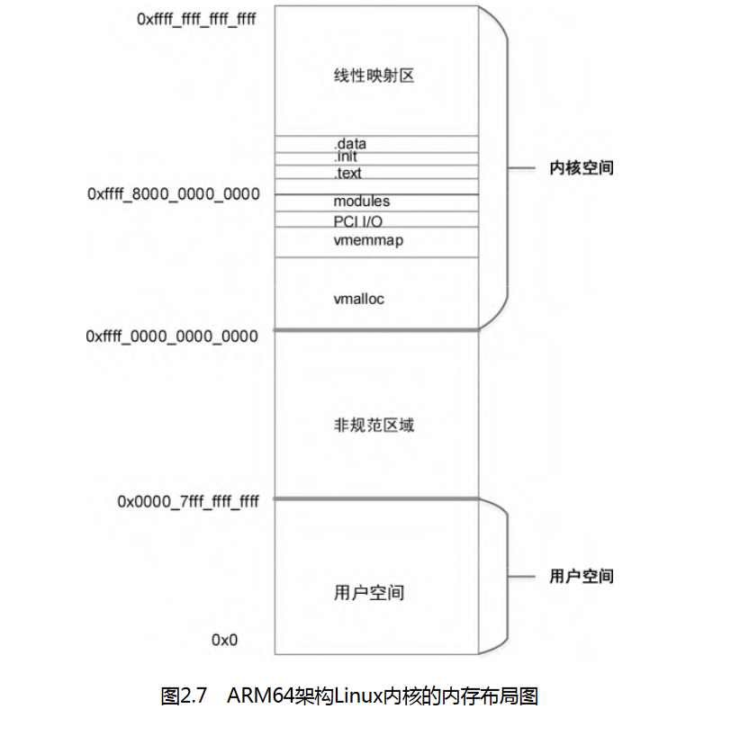

（1）用户空间：0x0000_0000_0000_0000 到 0x0000_ffff_ffff_ffff，一共有 256TB。 

（2）非规范区域。 

（3）内核空间：0xffff_0000_0000_0000 到 0xffff_ffff_ffff_ffff，一共有 256TB。 内核空间又做了如下细分。

 ‰ vmalloc 区域：0xffff000000000000 到 0xffff7bffbfff0000，大小为 126974GB。

 ‰ vmemmap 区域：0xffff7bffc0000000 到 0xffff7fffc0000000，大小为 4096GB。

 ‰ PCI I/O 区域：0xffff7ffffae00000 到 0xffff7ffffbe00000，大小为 16MB。

 ‰ Modules区域：0xffff7ffffc000000 到 0xffff800000000000，大小为 64MB。

 ‰ normal memory 线性映射区：0xffff800000000000 到 0xffffffffffffffff，大小为 128TB。


# **分配物理页面**（理想情况）

内核中常用的分配物理内存页面的接口函数是 alloc_pages()，用于分配一个或者多个连 续的物理页面，分配的页面个数只能是 2 的整数次幂。alloc_pages()函数的参数有两个，一个是分配掩码 gfp_mask，另一个是分配阶数 order。

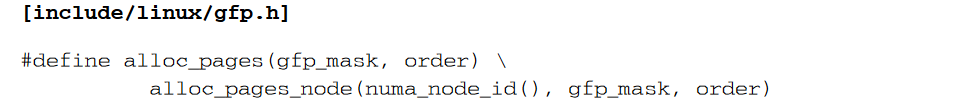

分配掩码是非常重要的参数，它同样定义在 gfp.h 头文件中。分配掩码在内核代码中分成两类，一类叫 zone modifiers，另一类叫 action modifiers。 zone modifiers 指定从哪个 zone 中分配所需的页面。zone modifiers 由分配掩码的最低 4 位 来定义，分别是_GFP_DMA、 \_\_GFP_HIGHMEM、\_\_GFP_DMA32 和__GFP_MOVABLE。action modifiers 并不限制从哪个内存域中分配内存，但会改变分配行为.

**下面以 GFP_KERNEL 为例，来看在理想情况下 alloc_pages()函数是如何分配出物理内存的。**

page = alloc_pages(GFP_KERNEL, order);

GFP_KERNEL 分配掩码定义在 gfp.h 头文件中，是一个分配掩码的组合。常用的分配掩码组合如下：

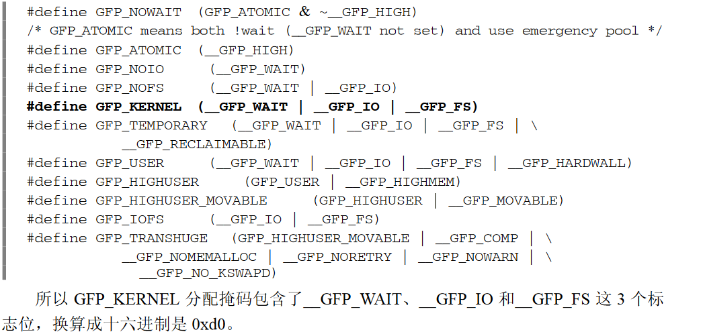

alloc_pages()最终调用__alloc_pages_nodemask()函数，它是伙伴系统的核心函数。

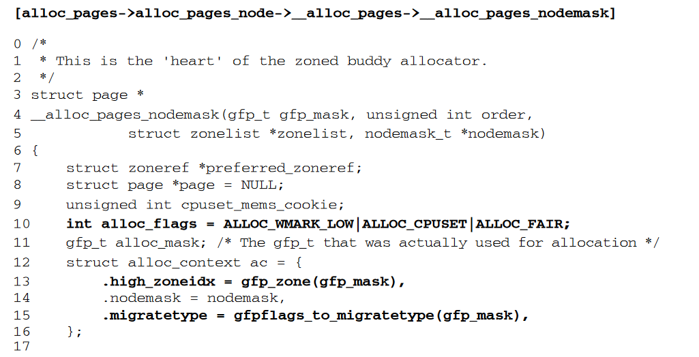

struct alloc_context 数据结构是伙伴系统分配函数中用于保存相关参数的数据结构。 gfp_zone()函数从分配掩码中计算出 zone 的 zoneidx，并存放在 high_zoneidx 成员中。另外__alloc_pages_nodemask()第 15 行代码中的 gfpflags_to_migratetype()函数把 gfp_ mask 分配掩码转换成 MIGRATE_TYPES 类型，例如分配掩码为 GFP_KERNEL，那么 MIGRATE_TYPES 类型是 MIGRATE_UNMOVABLE；如果分配掩码为 GFP_HIGHUSER_ MOVABLE，那么 MIGRATE_TYPES 类型是 MIGRATE_MOVABLE。

继续回到__alloc_pages_nodemask()函数中。

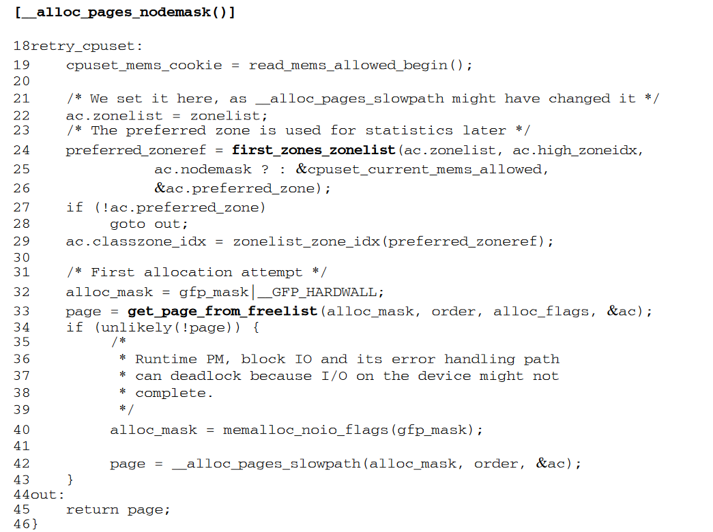

首先 get_page_from_freelist()会去尝试分配物理页面，如果这里分配失败，就会调用到 __alloc_pages_slowpath()函数，这个函数将处理很多特殊的场景。这里假设在理想情况下get_page_from_freelist()能分配成功。

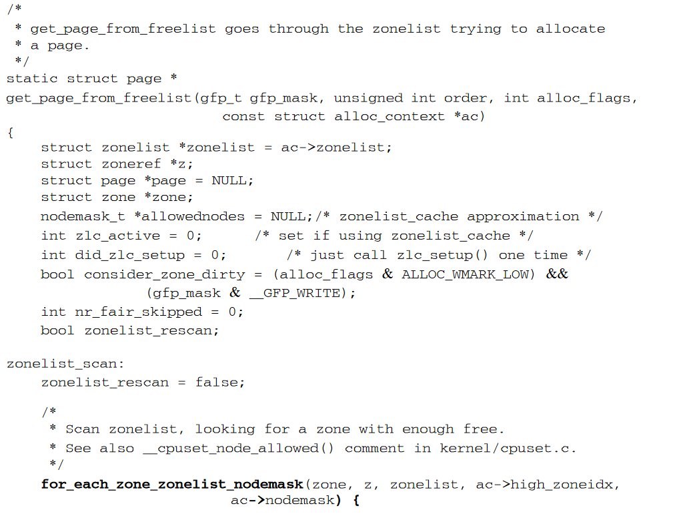

get_page_from_freelist()函数首先需要判断可以从哪个 zone 来分配内存,所以for_each_zone_ zonelist_nodemask 宏扫描内存节点中的 zonelist 去查找合适分配内存的 zone。


for_each_zone_zonelist_nodemask 首先通过 first_zones_zonelist()从给定的 zoneidx 开始 查找，这个给定的 zoneidx 就是 highidx，之前通过 gfp_zone()函数转换得来的。first_zones_zonelist()函数会调用 next_zones_zonelist()函数来计算 zoneref，最后返回 zone 数据结构。

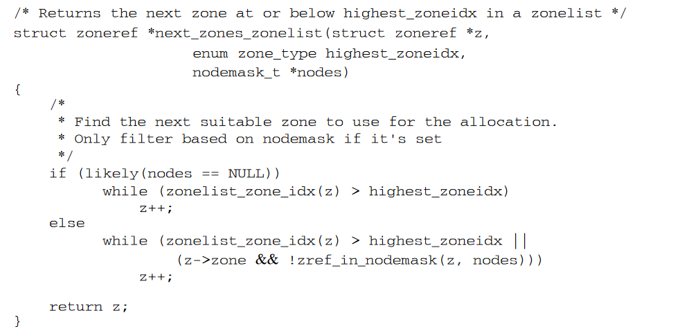

计算 zone 的核心函数在 next_zones_zonelist()函数中，这里 highest_zoneidx 是 gfp_zone() 函数计算分配掩码得来。**zonelist 有一个 zoneref 数组，zoneref 数据结构里有一个成员 zone 指针会指向 zone 数据结构，还有一个 zone_index 成员指向 zone 的编号。**zone 在系统处理 时会初始化这个数组，具体函数在 build_zonelists_node()中。在 ARM Vexpress 平台中，zone 类型、zoneref[ ]数组和 zoneidx 的关系如下：

ZONE_HIGHMEM	 _zonerefs[0]->zone_index=1

ZONE_NORMAL 	_zonerefs[1]->zone_index=0

zonerefs[0]表示 ZONE_HIGHME，其 zone 的编号 zone_index 值为 1；zonerefs[1]表示 ZONE_NORMAL，其 zone 的编号 zone_index 为 0。也就是说，基于 zone 的设计思想是：分配物理页面时会优先考虑 ZONE_HIGHMEM，因为 ZONE_HIGHMEM 在 zonelist 中排在 ZONE_NORMAL 前面。

回到我们之前的例子，gfp_zone(GFP_KERNEL)函数返回 0，即 highest_zoneidx 为 0， 而这个内存节点的第一个 zone 是 ZONE_HIGHME，其 zone 编号 zone_index 的值为 1。因 此在 next_zones_zonelist()中，z++，最终 first_zones_zonelist ()函数会返回 ZONE_NORMAL。 在 for_each_zone_zonelist_nodemask()遍历过程中也只能遍历 ZONE_NORMAL 这一个 zone 了。

再举一个例子，分配掩码为 GFP_HIGHUSER_MOVABLE ， GFP_HIGHUSER_ MOVABLE 包含了__GFP_HIGHMEM，那么 next_zones_zonelist()函数会返回哪个 zone 呢？ GFP_HIGHUSER_MOVABLE 值为 0x200da，那么gfp_zone(GFP_HIGHUSER_MOVABLE) 函数等于 2，即 highest_zoneidx 为 2，而这个内存节点的第一个 ZONE_HIGHME，其 zone 编号 zone_index 的值为 1。‰ 在 first_zones_zonelist()函数中，由于第一个 zone 的 zone_index 值小于 highest_ zoneidx，因此会返回 ZONE_HIGHMEM。

 ‰ 在 for_each_zone_zonelist_nodemask() 函数中，next_zones_zonelist(++z, highidx, nodemask)依然会返回 ZONE_NORMAL。

 ‰ 因此这里会遍历 ZONE_HIGHMEM 和 ZONE_NORMAL 这两个 zone，但是会先 遍历 ZONE_HIGHMEM，然后才是 ZONE_NORMAL。

**所以for_each_zone_zonelist_nodemask宏，可以看到他的宏展开其实是一个for循环，也就是说，该宏在按照规则遍历ZONE，然后再在for循环的循环体里面看看有没有足够order的区域。**

要正确理解 for_each_zone_zonelist_nodemask()这个宏的行为，需要理解如下两个方面。

‰ highest_zoneidx 是怎么计算来的，即如何解析分配掩码，这是 gfp_zone()函数的职责。

 ‰ 每个内存节点有一个 struct pglist_data 数据结构，其成员 node_zonelists 是一个 struct zonelist 数据结构，zonelist 中包含了 struct zoneref _zonerefs[ ]数组来描述这 些 zone。其中 ZONE_HIGHMEM 排在前面，并且_zonerefs[0]->zone_index=1， ZONE_NORMAL 排在后面，且_zonerefs[1]->zone_index=0。这是正确理解以 zone 为基础的物理页面分配机 制的基石。


回到 get_page_from_freelist()函数中，**for_each_zone_zonelist_nodemask()找到了接下来 可以从哪些 zone 中分配内存**，下面来做一些必要的检查。

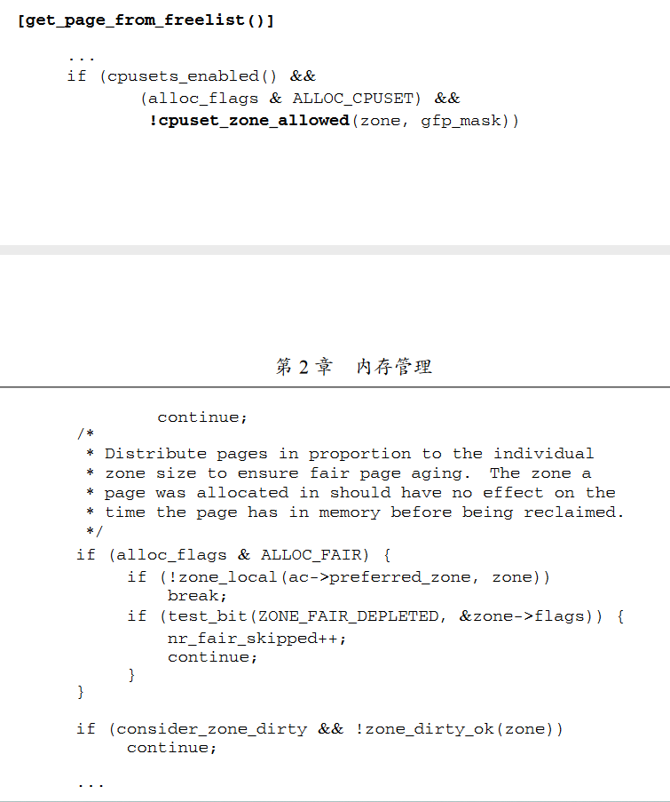

下面代码用于检测当前的 zone 的 watermark 水位是否充足。

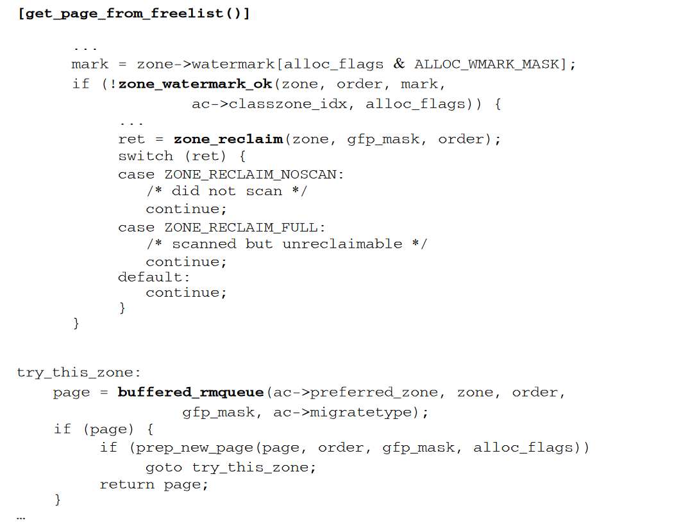

zone 数据结构中有一个成员 watermark 记录各种水位的情况。系统中定义了 3 种水位， 分别是 WMARK_MIN、WMARK_LOW 和 WMARK_HIGH。watermark 水位的计算在__setup_ per_zone_wmarks()函数中。计算 watermark 水位用到 min_free_kbytes 这个值，它是在系统启动时通过系统空闲页 面的数量来计算的，具体计算在 init_per_zone_wmark_min()函数中。另外系统起来之后也 可以通过 sysfs 来设置，节点在“/proc/sys/vm/min_free_kbytes”。计算 watermark 水位的公 式不算复杂，最后结果保存在每个 zone 的 watermark 数组中，后续伙伴系统和 kswapd 内 核线程会用到。

回到 get_page_from_freelist()函数，这里会读取 WMARK_LOW 水位的值到变量 mark 中，这里的 zone_watermark_ok()函数判断当前 zone 的空闲页面是否满足 WMARK_LOW 水位。通常 分配物理内存页面的内核路径是检查 WMARK_LOW 水位，而页面回收 kswapd 内核线程 则是检查 WMARK_HIGH 水位。

__zone_watermark_ok()函数首先判断 zone 的空闲页面是否小于某个水位值和 zone 的最 低保留值(lowmem_reserve)之和。返回 true 表示空闲页面在某个水位在上，否则返回 false。

回到 get_page_from_freelist()函数中，**当判断当前 zone 的空闲页面低于 WMARK_LOW 水位，会调用 zone_reclaim()函数来回收页面**。我们这里假设 zone_watermark_ok()判断空闲页面充沛，接下来就会调用 buffered_rmqueue()函数从伙伴系统中分配物理页面。这里根据 order 数值兵分两路：一路是 order 等于 0 的情况，也就是分配一个物理页面 时，从 zone->per_cpu_pageset 列表中分配；另一路 order 大于 0 的情况，就从伙伴系统中分 配。我们只关注 order 大于 0 的情况，它最终会调用__rmqueue_smallest()函数。

我们来看看_rmqueue_smallest()函数

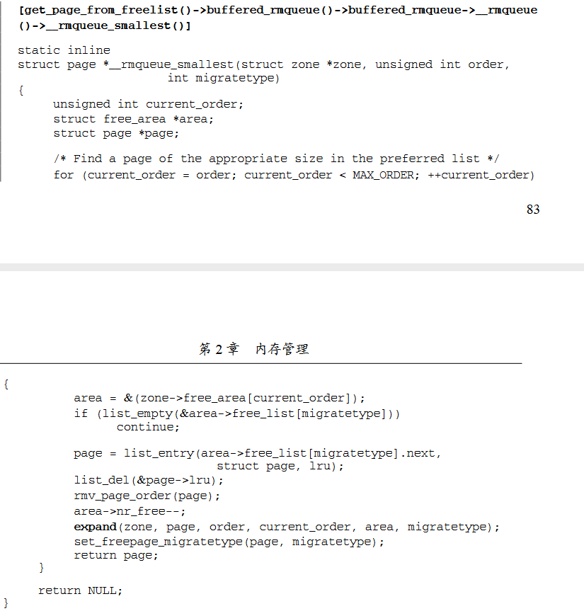

在__rmqueue_smallest()函数中，首先从 order 开始查找 zone 中空闲链表。如果 zone 的 当前 order 对应的空闲区 free_area 中相应 migratetype 类型的链表里没有空闲对象，**那么就 会查找下一级 orde**r。当 找到某一个 order 的空闲区中对应的 migratetype 类型的空闲链表中有空闲内存块时，就会 从中把一个内存块摘下来，然后**调用 expand()函数来“切蛋糕”**。因为通常摘下来的内存块 要比需要的内存大，切完之后需要把剩下的内存块重新放回伙伴系统中。

expand()函数就是实现“切蛋糕”的功能。这里参数 high 就是 current_order，通常 current_order 要比需求的 order 要大。每比较一次，area 减 1，相当于退了一级 order，最后 通过 list_add 把剩下的内存块添加到低一级的空闲链表中。

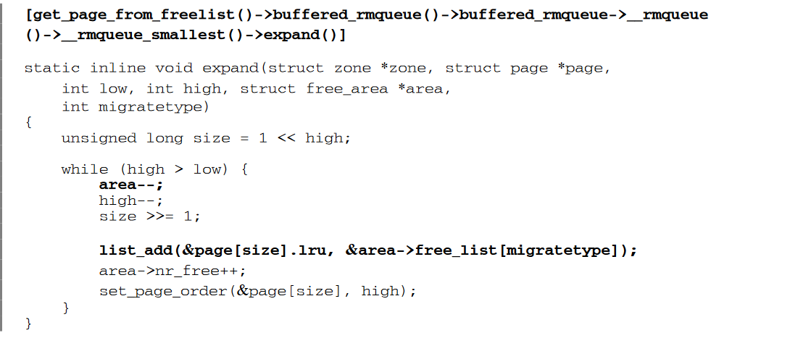

所需求的页面分配成功后，__rmqueue()函数返回这个内存块的起始页面的 struct page 数据结构。回到 buffered_rmqueue()函数，最后还需要利用 zone_statistics()函数做一些统计 数据的计算。

回到 get_page_from_freelist()函数中，最后还要通过 prep_new_page()函数做一些有趣的检查，才能最终出厂。

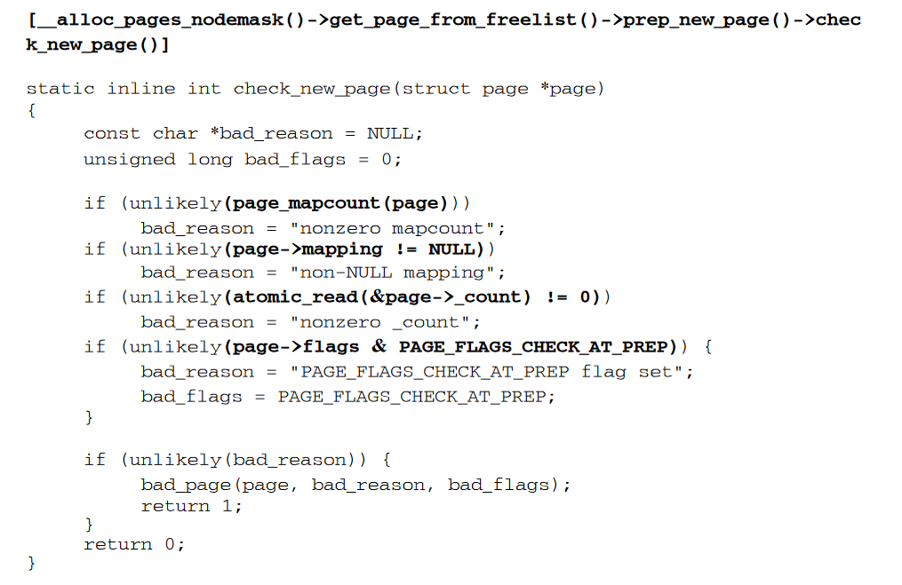

check_new_page()函数做如下检查.

刚分配页面的 struct page 的_mapcount 计数应该为 0。

这时 page->mapping 为 NULL。

判断这时 page 的_count 是否为 0。注意 alloc_pages()分配的 page 的_count 应该为 1，但是这里为 0，因为这个函数之后还调用 set_page_refcounted()->set_page_count()， 把_count 设置为 1。

检查 PAGE_FLAGS_CHECK_AT_PREP 标志位，这个 flag 在 free_page 时已经清 除了，而这时该 flag 被设置，说明分配过程中有问题。

上述检查都通过后，我们分配的页面就合格了，可以出厂了，页面 page 便开启了属于 它精彩的生命周期。


# 释放页面

​	释放页面的核心函数是 free_page()，最终还是调用__free_pages()函数。 __free_pages()函数会分两种情况，对于 order 等于 0 的情况，做特殊处理；对于 order 大于 0 的情况，属于正常处理流程。

1. **对于order大于0的情况**，__free_pages()函数内部调用__free_pages_ok()，最后调 用__free_one_page()函数。因此释放内存页面到伙伴系统，最终还是通过__free_one_page() 来实现。该函数不仅可以释放内存页面到伙伴系统，还会处理空闲页面的合并工作。

​		释放内存页面的核心功能是把页面添加到伙伴系统中适当的 free_area 链表中。在释放 内存块时，会查询相邻的内存块是否空闲，如果也空闲，那么就会合并成一个大的内存块， 放置到高一阶的空闲链表 free_area 中。如果还能继续合并邻近的内存块，那么就会继续合 并，转移到更高阶的空闲链表中，这个过程会一直重复下去，直至所有可能合并的内存块 都已经合并。回收流程见书P86.

2. __free_pages()**对于 order 等于 0 的情况**，作为特殊情况来处理。，zone 中有一个变量 zone-> pageset 为每个 CPU 初始化一个 percpu 变量 struct per_cpu_pageset。当释放 order 等于 0 的 页面时，首先页面释放到 per_cpu_page->list 对应的链表中。

​		per_cpu_pageset 和 per_cpu_pages 数据结构定义如下：

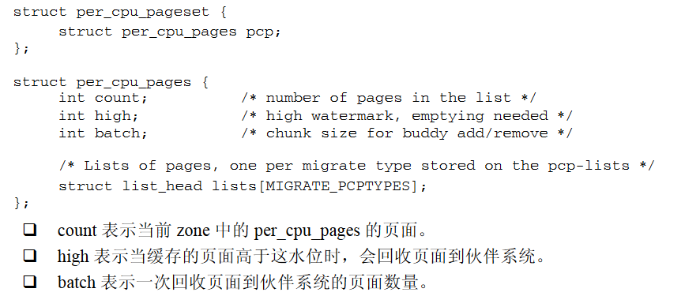

当 count 大于 high 时，会调用 free_pcppages_bulk() 函数把 per_cpu_pages 的页面添加到伙伴系统中。最终还是调用__free_one_page()函数来释放页面并添加到伙伴系统中。


# slab分配器

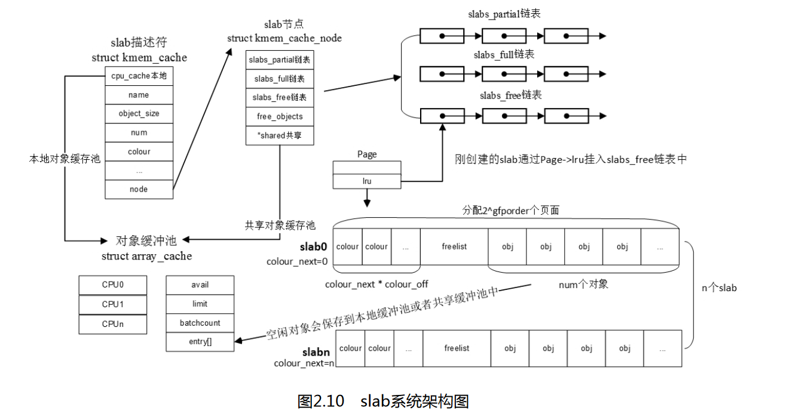

​	slab 分配器是用来解决小内存块分配问题的，也是内存分配中非常重要的角色之一。slab 分配器最终还是 由伙伴系统来分配出实际的物理页面，只不过 slab 分配器在这些连续的物理页面上实现了自 己的算法，以此来对小内存块进行管理。

关于 slab 分配器，我们需要思考如下几个问题。

‰ slab 分配器是如何分配和释放小内存块的？

‰ slab 分配器中有一个着色的概念（cache color），着色有什么作用？

‰ slab 分配器中的 slab 对象有没有根据 Per-CPU 做一些优化？

‰ slab 增长并导致大量不用的空闲对象，该如何解决？


slab 分配器提供如下接口来创建、释放 slab 描述符和分配缓存对象。

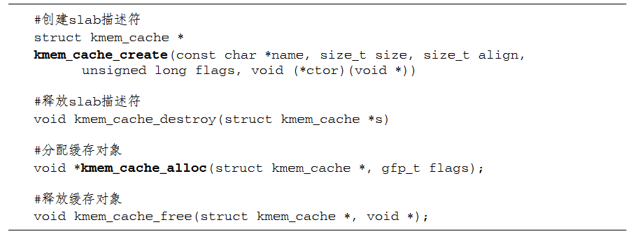

kmem_cache_create()函数中有如下参数。 

‰ name：slab 描述符的名称。

 ‰ size：缓存对象的大小。

 ‰ align：缓存对象需要对齐的字节数。

 ‰ flags：分配掩码。

 ‰ ctor：对象的构造函数。

​	一个大量使用slab机制的是 kmalloc()函数接口。kmem_cache_create()函数用于创建自己 的缓存描述符，kmalloc()函数用于创建通用的缓存，类似于用户空间中 C 标准库 malloc()函数。在 Intel 显卡驱动中也大量使用 kmem_cache_create()来创建自己的 slab 描述符。


## 创建slab描述符

**struct kmem_cache 数据结构**是 slab 分配器中的核心数据结构，我们把它称为 slab 描述符。

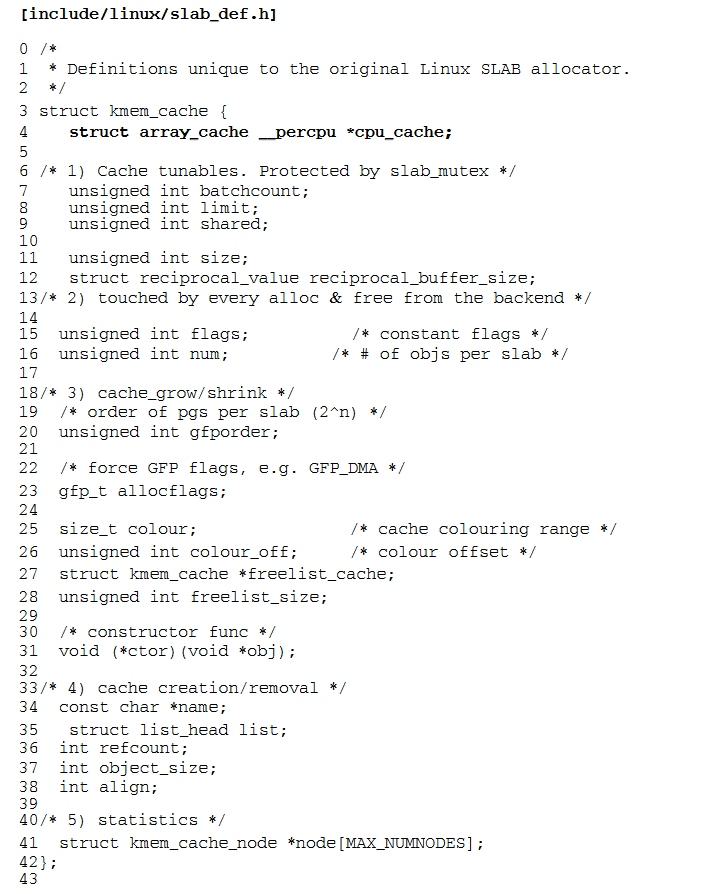

每个 slab 描述符都由一个 struct kmem_cache 数据结构来抽象描述。

‰ cpu_cache：一 个 Per-CPU 的 struct array_cache 数据结构，每个 CPU 一个，表示本地 CPU 的对象缓冲池。

‰ batchcount：表示当前 CPU 的本地对象缓冲池 array_cache 为空时，从共享的缓冲 池或者 slabs_partial/slabs_free 列表中获取对象的数目。

‰ limit：当本地对象缓冲池的空闲对象数目大于 limit 时就会主动释放 batchcount 个 对象，便于内核回收和销毁 slab。

‰ shared：用于多核系统。

‰ size：对象的长度，这个长度要加上 align 对齐字节。

‰ flags：对象的分配掩码。

‰ num：一个 slab 中最多可以有多少个对象。 

‰ gfporder：一个 slab 中占用 2^gfporder 个页面。

‰ colour：一个 slab 中有几个不同的 cache line。

‰ colour_off：一个 cache colour 的长度，和 L1 cache line 大小相同。

‰ freelist_size：每个对象要占用 1Byte 来存放 freelist。

‰ name：slab 描述符的名称。

‰ object_size: 对象的实际大小。

‰ align：对齐的长度。

‰ node：slab 节点，在 NUMA 系统中每个节点有一个 struct kmem_cache_node 数据 结构。在 ARM Vexpress 平台中，只有一个节点。

struct array_cache 数据结构定义如下：

```c
struct array_cache { 

    unsigned int avail; 

    unsigned int limit; 

    unsigned int batchcount; 

    unsigned int touched; 

    void *entry[]; 

};
```

slab 描述符给每个 CPU 都提供一个对象缓存池（array_cache）。

‰ batchcount/limit：和 struct kmem_cache 数据结构中的语义一样。

‰ avail：对象缓存池中可用的对象数目。

‰ touched：从缓冲池移除一个对象时，将 touched 置 1，而收缩缓存时，将 touched 置 0.

‰ entry：保存对象的实体。


**kmem_cache_node 节点，也称slab节点。**

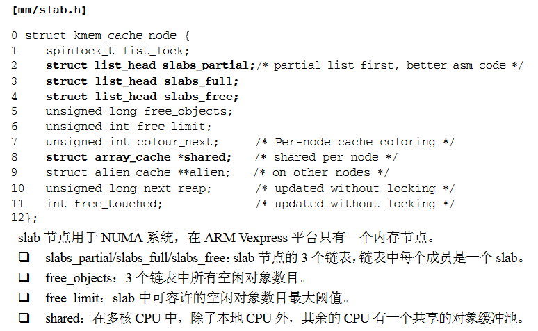


**kmem_cache_create()函数**的实现是在 slab_common.c 文件中。

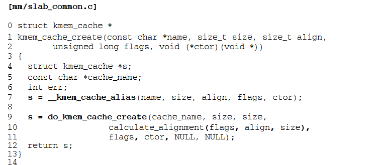

​	首先通过__kmem_cache_alias()函数查找是否有现成的 slab 描述符可以复用，若没有， 就通过 do_kmem_cache_create()来创建一个新的 slab 描述符。do_kmem_cache_create()函数首先分配一个 struct kmem_cache 数据结构。分配好 struct kmem_cache 数据结构后把 name、 size、align 等值填入 struct kmem_cache 相关成员中，然后调用\_\_kmem_cache_create()来创 建 slab 缓冲区，最后把这个新创建的 slab 描述符都加入全局链表 slab_caches 中。\_\_kmem_cache_create()函数见P94。


总结：创建slab描述符主要有两件事：

①初始化per-CPU array cache。即本地对象缓冲池。注意，此时本地对象缓冲池里可用的obj数量为0。

②初始化slab节点。每个内存节点对应一个slab节点。本地对象缓冲池会从slab节点中分配空闲对象。


## 分配slab对象

kmem_cache_alloc()是分配 slab 缓存对象的核心函数，在 slab 分配过程中是**全程关闭本地中断的。**

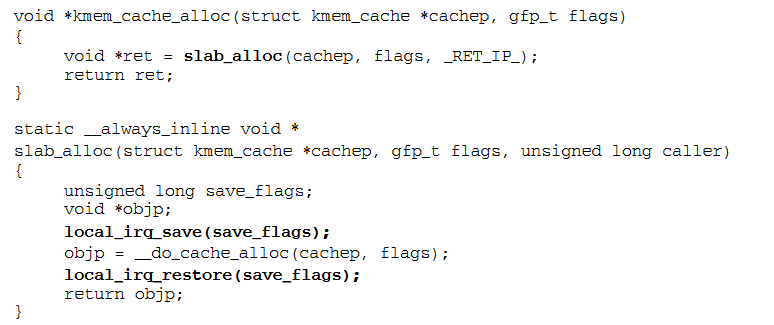

在关闭本地中断的情况下调用__do_cache_alloc()函数，内部调用____cache_alloc()函数。

①____cache_alloc()函数获取slab描述符中的本地对象缓冲池ac。如果本地对象缓冲池中有空闲对象(ac->avail == 0)，则可直接通过ac_get_obj()来分配一个对象。ac_get_obj()函数通过 ac->entry[--ac->avail]来 获取 slab 对象。也就是说per-CPU对象缓冲池中entry数组只存储空闲对象。

**从 kmem_cache_create()函数创建成功返回时，ac->avail 应该为 0， 而且没有看到 kmem_cache_create()函数有向伙伴系统申请要内存，那对象是从哪里来的呢？**

​	_cache_alloc()函数，因为第一次分配缓存对象时 ac->avail 值为 0，因此 是运行不到第 6～18 行代码处的，直接运行到了第 20 行代码的 cache_alloc_refill()。

② cache_alloc_refill()函数的**主要目的为往本地缓冲池里添加空闲对象**(一次添加batchcount个)， 主要干这几个事：

​	<1>首先去判断共享对象缓冲池（n->shared）中有没有空闲的对象。如果有，就尝试 迁移 batchcount 个空闲对象到本地对象缓冲池 ac 中。

​	<2>如果共享对象缓冲池中没有空闲对象，那么去查看 slab 节点中的 slabs_partial 链 表（部分空闲链表）和 slabs_free 链表（全部空闲链表）。如果 slabs_partial 链表或者 slabs_free 链表不为空，说明有空闲对象，那么从队列中取出一个成员 slab，通过 slab_get_obj()函数获取对象的地址，然后通过 ac_put_obj()把对象迁移到本地对象缓冲池 ac 中，最后把这个 slab 挂回合适的链表。

​	<3> 如果 slabs_partial 链表或者 slabs_free 链表都为空，说明整个 slab 节点都没有空 闲对象，这时需要重新分配 slab.这是我们例子第一次运行 kmem_cache_alloc() 这个 API 的情景.因为初始化了slab描述符并没有分配slab节点，所以第一次运行分配slab对象函数时，会涉及到向伙伴系统申请要内存。此时，cache_alloc_refill()函数会调用cache_grow函数。

③cache_grow函数的主要目为：

​	<1>分配**一个slab**所需要的页面，也就是2^cachep->gfporder 个页面。然后在slab中进行地址布局，简单来说就是调用alloc_slabmgmt()函数计算 slab 中的 cache colour 和 freelist，以及对象的地址布局。其中 page->freelist 是内存块开始地址减去 cache colour 后的地址，可以想象成一个 char 类型的数组，每个对象占用一个数组成员来存放对象的序号。page->s_mem 是 slab 中第 一个对象的开始地址，内存块开始地址减去 cache colour 和 freelist_size。在 slab_map_pages() 函数中，page->slab_cache 指向这个 cachep。alloc_slabmgmt()和 slab_map_pages()函数实现 如下：

​	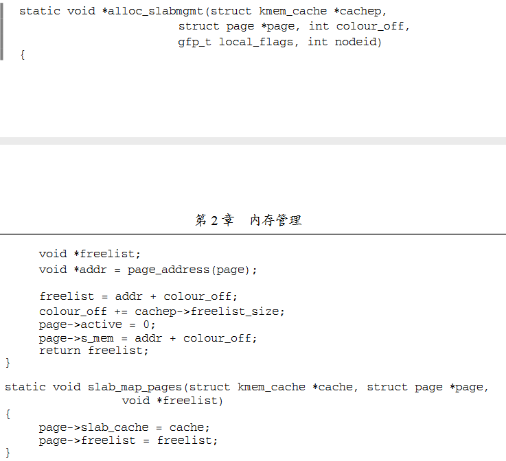

​	<2>在 cache_grow()函数第 39 行代码初始化 slab 中所有对象的状态，其中 set_free_obj()函 数会把对象的序号填入到 freelist 数组中。

​	<3>最后这个 slab 添加到 slab 节点的 slabs_free 链表中。

​	<4>现在slab节点一定能分配出对象了，但当前 CPU 的 ac->avail 为 0，所以cache_alloc_refill()函数会所以跳转到 retry 标签，重新来一次，这次一定能分配出来对象 obj。


以下为slab组织结构图：特别注意三个数据结构:kmem_cache、kmem_cache_node、本地对象缓冲池

**总结一下slab对象的分配流程：**

①如果本地缓冲池不为空，则直接从本地缓冲池获取obj。

②否则如果共享缓冲池不为空，则从共享缓冲池迁移batchcount个obj到本地缓冲池。然后从本地缓冲池获取obj。

③否则查看slab节点中的slabs_partial 链 表（部分空闲链表）和 slabs_free 链表（全部空闲链表）。如果不为空，则从队列中取出一个slab成员，从slab成员中迁移batchcount个对象到本地缓冲池中。然后从本地缓冲池获取obj。

④如果上述两个链表皆为空。则需要分配slab成员。一个slab成员是包括2^gfporder个页的请注意。分配好slab成员后，将其插入slab节点的slabs_free链表。然后重新执行③，这时一定能分配出obj。

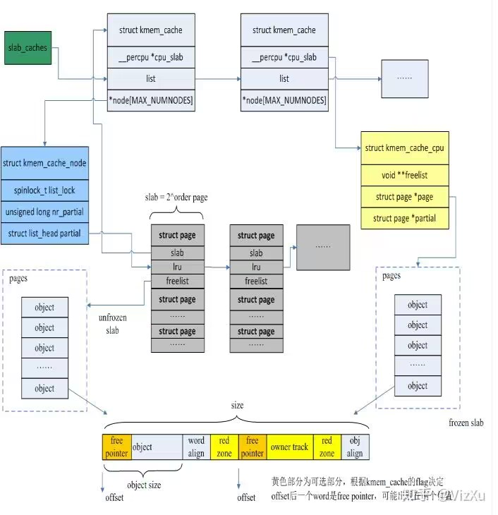


## 释放slab对象

释放 slab 缓存对象的 API 函数是 kmem_cache_free()。

①首先由对象的虚拟地址通过 virt_to_pfn()找到相应的 pfn，然后通过 pfn_to_page()由 pfn 找到对应的 page 结构。在一个 slab 中，第一个页面的 page 结构中 page->slab_cache 指 向这个 struct kmem_cache 数据结构。

②如果本地对象缓冲池的空闲对象 ac->avail < ac->limit 阈值，通过ac_put_obj()的“ac->entry[ac->avail++] = objp”把对象释放到本地对象 缓冲池 ac 中，释放过程已经结束了。

③如果本地对象缓冲池的空闲对象 ac->avail >= ac->limit 阈值，就会调用 cache_flusharray()做 flush 动作去尝试回收空闲对象.

​		<1>首先是判断是否有共享对象缓冲池，如果有，会把本地对象缓冲池的空闲对象（batchcount个）复制到共享对象缓冲池中。

​		<2>如果共享对象缓冲池中的空闲对象数量大于 limit 阈值，会调用free_block()函数主动释放 batchcount 个空闲对象。如果 slab 没			有了 活跃对象（即 page->active == 0），并且 slab 节点中所有空闲对象数目 n->free_objects 超过 了 n->free_limit 阈值，那么			调用 slabs_destroy()函数来销毁这个 slab。page->active 用于记录 活跃 slab 对象的计数，slab_get_obj()函数分配一个 slab 对象			时会增加该计数，slab_put_obj() 函数释放一个 slab 对象时会递减该计数。


## kmalloc分配函数

​	kmalloc用于分配一个具体大小的obj。内核中常用的 kmalloc()函数的核心是 slab机制。类似伙伴系统机制，按照内存块的 2^order 来创建多个 slab 描述符，例如 16B、32B、64B、128B、...、32MB 等大小，系统 会分别创建名为 kmalloc-16、kmalloc-32、kmalloc-64......的 slab 描述符，**这在系统启动时 在 create_kmalloc_caches() 函数中完成**。例如分配 30Byte 的一个小内存块，可以用 “kmalloc(30, GFP_KERNEL)”，那么系统会从名为“kmalloc-32”的 slab 描述符中分配一个对象出来。


## 小结

见书p112


# vmalloc函数

**请问 kmalloc、vmalloc 和 malloc 之间有什么区别以及实现上的差异？**

kmalloc 基于 slab 分配器，用于分配一个小内存块，比如30B，48B......

如果在内核中不需要连续的物理地址，而 仅仅需要内核空间里连续虚拟地址的内存块，该如何处理呢？这时 **vmalloc()就派上用场了。**

vmlloc()函数声明如下：

void *vmalloc(unsigned long size) { 

​	return \_\_vmalloc_node_flags(size, NUMA_NO_NODE, GFP_KERNEL | __GFP_HIGHMEM); 

}

vmalloc 使用的分配掩码是“GFP_KERNEL | __GFP_HIGHMEM”，说明会优先使用高 端内存 High Memory。

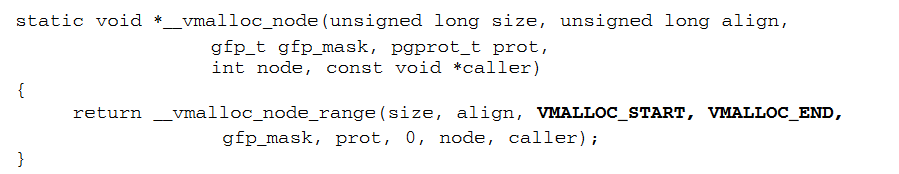

这里的 VMALLOC_START 和 VMALLOC_END 是 vmalloc 中很重要的宏。VMALLOC_START 是 vmalloc 区域的开始地址，它是在 High_memory 指定的高端内存开始地址再加上 8MB 大小的安全区域（VMALLOC_OFFSET）。如下图可见vmalloc映射区域。


vmalloc实现流程：

①分配一个struct vm_struct数据结构来描述即将分配的vmalloc区域。

②在整个vmalloc映射区域找一块大小合适没有人使用的空间，这段空间称为hole。查找的地址从VMALLOC_START开始，首先从vmap_area_root 这棵红黑树上查找，这个红黑树里存放着系统中正在使用的 vmalloc 区块，遍历左子叶节点找区间地址最小的区块。如果区块的开始地址等于 VMALLOC_START，说明这区块是第一块 vmalloc 区块。 如果红黑树没有一个节点，说明整个 vmalloc 区间都是空的。然后从 VMALLOC_START 的地址开始，查找每个已存在的 vmalloc 区块的缝隙 hole 能否容纳目前要分配内存的大小。如果在已有 vmalloc 区块的缝隙中没能找到合适的 hole， 那么从最后一块 vmalloc 区块的结束地址开始一个新的 vmalloc 区域。

③找到新的区块 hole 后，调用__insert_vmap_area()函数把这个 hole 注册 到红黑树中。

④把刚找到的 struct vmap_area *va 的相 关信息填到 struct vm_struct *vm 中。

⑤计算 vmalloc 分配内存大小有几个页面，然后使 用 alloc_page()这个 API 来分配物理页面，并且使用 area->pages 保存已分配页面的 page 数 据结构指针，最后调用 map_vm_area()函数来建立页面映射。map_vm_area()函数最后调用 vmap_page_range_noflush()来建立页面映射关系。


# VMA

VMA即为进程地址空间。用 struct vm_area_struct 数据结构来描述。

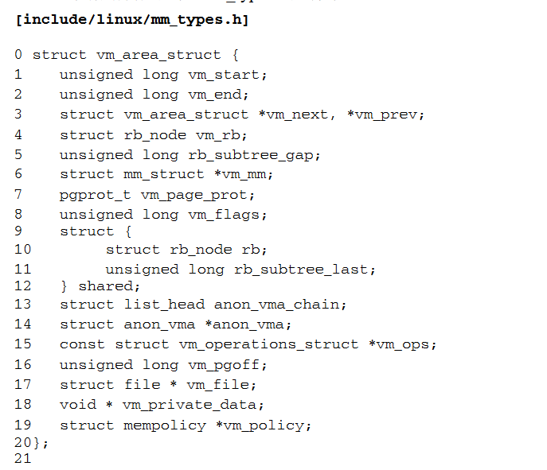

1. vm_start 和 vm_end：指定 VMA 在进程地址空间的起始地址和结束地址。

2. vm_next 和 vm_prev：进程的 VMA 都连接成一个链表。
3. vm_rb：VMA 作为一个节点加入红黑树中，每个进程的 struct mm_struct 数据结构 中都有这样一棵红黑树 mm->mm_rb。
4. vm_mm：指向该 VMA 所属的进程 struct mm_struct 数据结构。
5. vm_page_prot：VMA 的访问权限。
6. vm_flags：描述该 VMA 的一组标志位。
7. anon_vma_chain 和 anon_vma：用于管理 RMAP 反向映射。
8. vm_ops：指向许多方法的集合，这些方法用于在 VMA 中执行各种操作，通常用 于文件映射。
9. vm_pgoff：指定文件映射的偏移量，这个变量的单位不是 Byte，而是页面的大小 （PAGE_SIZE）
10. vm_file：指向 file 的实例，描述一个被映射的文件。

**struct mm_struct** 数据结构是描述进程内存管理的核心数据结构，该数据结构也提供了 管理 VMA 所需要的信息.每个 VMA 都要连接到 mm_struct 中的链表和红黑树中，以方便查找。

```c
struct mm_struct 
{ 
    struct vm_area_struct *mmap; 
    struct rb_root mm_rb; 
    ... 
};
```

1. mmap 形成一个单链表，进程中所有的 VMA 都链接到这个链表中，链表头是 mm_struct->mmap。
2. mm_rb 是红黑树的根节点，每个进程有一棵 VMA 的红黑树。

VMA 按照起始地址以递增的方式插入 mm_struct->mmap 链表中。当进程拥有大量的 VMA 时，扫**描链表和查找特定的 VMA 是非常低效的操作，例如在云计算的机器中，所以 内核中通常要靠红黑树来协助，以便提高查找速度.**


## 查找VMA

通过虚拟地址 addr 来查找 VMA 是内核中常用的操作，内核提供一个 API 函数来实现 这个查找操作。**find_vma()函数**根据给定地址 addr 查找满足如下条件之一的 VMA，如 图 2.11 所示。

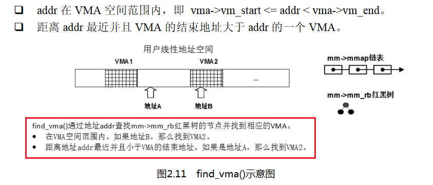

**find_vma_intersection()函数是另外一个 API 接口**，用于查找 start_addr、end_addr 和现 存的 VMA 有重叠的一个 VMA，它基于 find_vma()来实现。


**find_vma_prev()函数**的逻辑和 find_vma()一样，但是返回 VMA 的前继成员 vma->vm_prev。


## 插入VMA

**insert_vm_struct()**是内核提供的插入 VMA 的核心 API 函数。insert_vm_struct()函数向 VMA 链表和红黑树插入一个新的 VMA。参数 mm 是进程的 内存描述符，vma 是要插入的线性区 VMA。

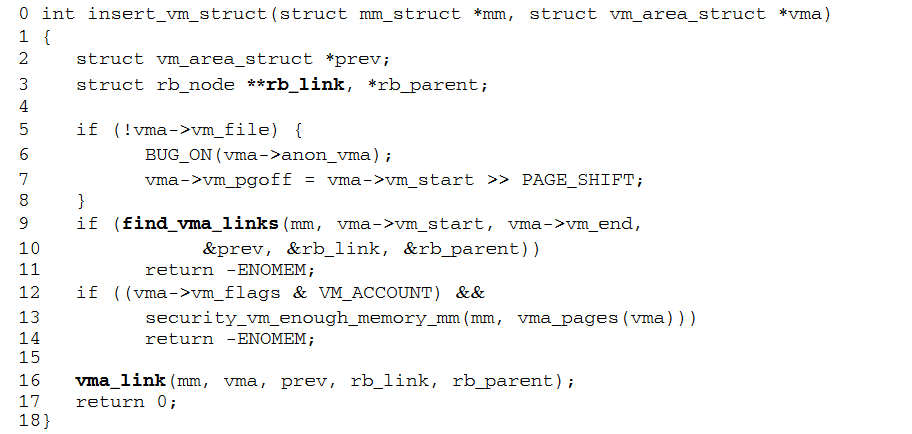

第 5～8 行代码，如果 vma 不是文件映射，设置 vm_pgoff 成员。 第 9 行代码，find_vma_links()查找要插入的位置。 第 16 行代码，将 vma 插入链表和红黑树中。

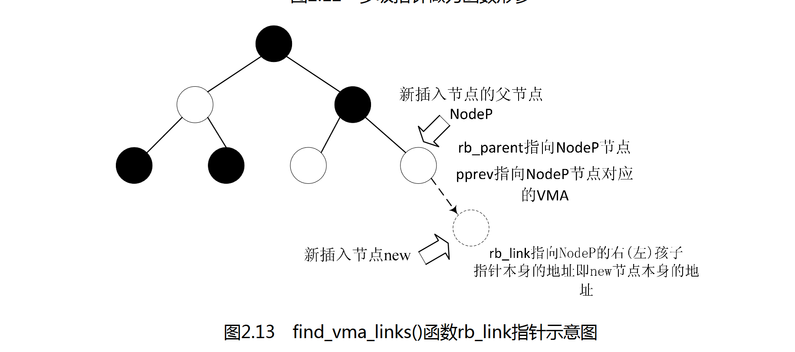

vma_link()通过\_\_vma_link()添加到红黑树和链表中.\_\_vma_link()函数调用__vma_link_list()，把 vma 添加到 mm->mmap 链表中,调用\_\_vma_link_rb()把vma插入到红黑树中。


## 合并VMA

在新的 VMA 被加入到进程的地址空间时，内核会检查它是否可以与一个或多个现存 的 VMA 进行合并。vma_merge()函数实现将一个新的 VMA 和附近的 VMA 合并功能。如图 2.14 所示是 vma-merge()函数实现示意图。


# malloc

考虑以下问题：

1. malloc()函数返回的内存是否马上就分配物理内存？testA 和 testB 分别在何时分配 物理内存？
2. 假设不考虑 libc 的因素，malloc 分配 100Byte，那么实际上内核是为其分配 100 Byte 吗？
3. 假设使用 printf 打印指针 bufA 和 bufB 指向的地址是一样的，那么在内核中这两 块虚拟内存是否“打架”了呢？
4. vm_normal_page()函数返回的什么样页面的 struct page 数据结构？为什么内存管 理代码中需要这个函数？
5. 请简述 get_user_page()函数的作用和实现流程。
6. 请简述 follow_page()函数的作用的实现流程。


malloc()函数是 C 函数库封装的一个核心函数，C 函数库会做一些处理后调用 Linux 内 核系统去调用 brk。

## brk实现

在 32 位 Linux 内核中，每个用户进程 拥有 3GB 的虚拟空间。内核如何为用户空 间来划分这 3GB 的虚拟空间呢？用户进程 的可执行文件由代码段和数据段组成，数 据段包括所有的静态分配的数据空间，例 如全局变量和静态局部变量等。这些空间 在可执行文件装载时，内核就为其分配好 这些空间，包括虚拟地址和物理页面，并 建立好二者的映射关系。用户进程的用户栈从 3GB 虚拟空间的顶部 开始，由顶向下延伸，而 brk 分配的空间 是从数据段的顶部 end_data 到用户栈的底 部。所以动态分配空间是从进程的 end_data 开始，每次分配一块空间，就把 这个边界往上推进一段，同时内核和进程都会记录当前的边界的位置。

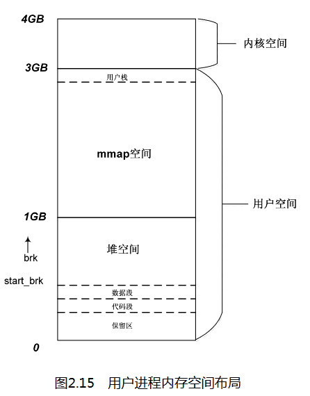

brk 系统调用主要实现在 mm/mmap.c 函数中。SYSCALL_DEFINE1(brk, unsigned long, brk)。

参数brk表示所要求的新边界。是用户进程要求分配内存的大小与其当前动态分配区底部边界相加。首先判断brk 请求的边界是否小于mm->end_data，即数据段的末尾，如果 brk 请求的边界小于这个地址，那么请求无效。然后判断，如果新边界小于老边界，那么表示释放空间，调用 do_munmap()来释放这一部分空间 的内存。再然后判断find_vma_intersection()函数以老边界 oldbrk 地址去查找系统中有没有一块已经存在的 VMA，它通过 find_vma()来查找当前用户进程中是否已经有一块 VMA 和 start_addr 地址有重叠，如果 find_vma_intersection()找到一块包含 start_addr 的 VMA，说明老边界开始的地址 空间已经在使用了，就不需要再寻找了。

最后，调用do_brk函数做内存分配。**do_brk()函数**是这里的核心函数。

在do_brk()函数中，申请分配的内存大小要以页面对齐。首先会调用get_unmapped_area()函数来判断虚拟内存空间是否足够，返回一段没有映射过的空间的起始地址（这里没太懂，为啥不就是返回需要分配的起始虚拟地址addr？？？？）。然后调用vma_merge()函数去找有没有可能合并 addr 附近的 VMA。 如果没办法合并，那么只能新创建一个 VMA，**VMA 的地址空间就是[addr, addr+len]**。然后调用vam_link()将VMA插入到mm->mmap链表和红黑树中。**最后：**

**判断 flags 是否置位 VM_LOCKED，这个 VM_LOCKED 通常从 mlockall 系统调用中设置而来。如果有，那么需要调用 mm_populate() 马上分配物理内存并建立映射。通常用户程序很少使用 VM_LOCKED 分配掩码，所以 brk 不会为这个用户进程立马分配物理页面，而是一直将分配物理页面的工作推延到用户进程需 要访问这些虚拟页面时，发生了缺页中断才会分配物理内存，并和虚拟地址建立映射关系。**

至于mm_populate()函数，见p138。暂时不想整理。该函数调用了\_\_get_user_pages函数。

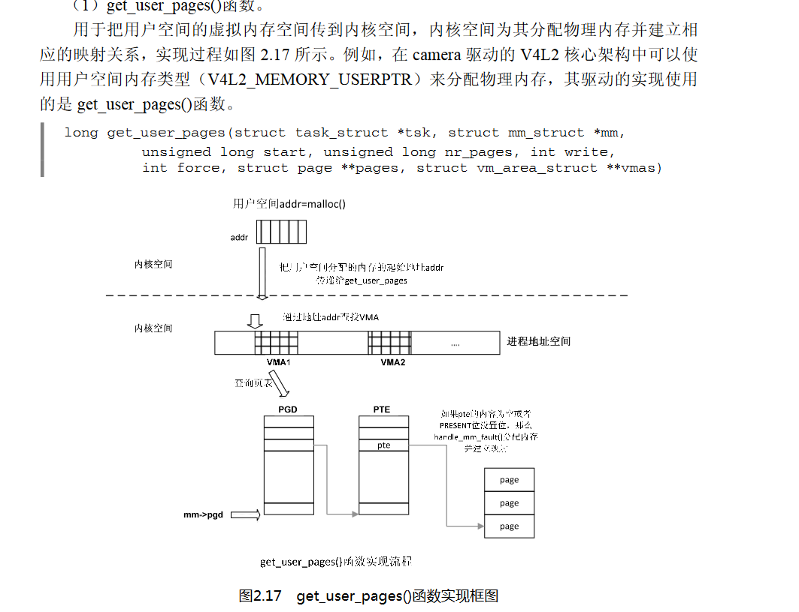

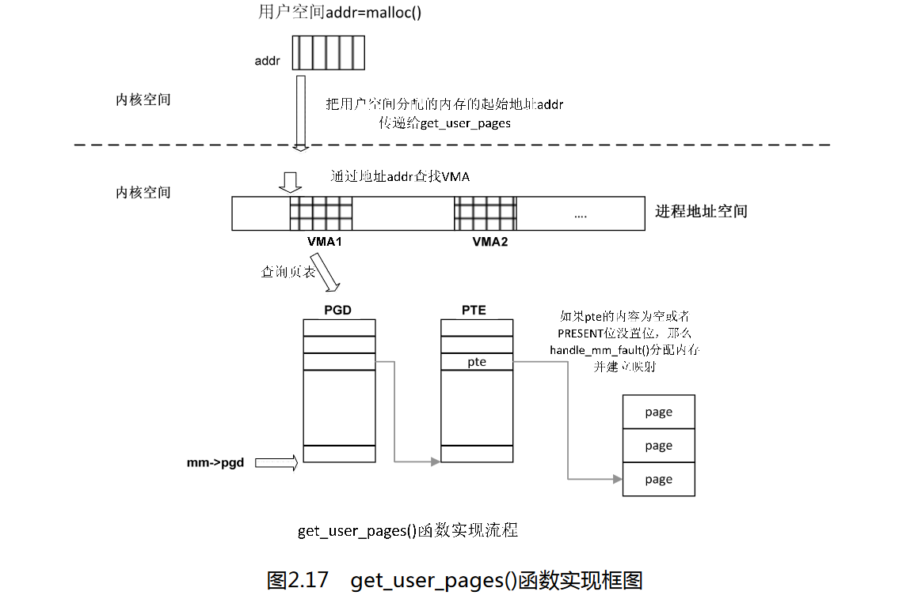

# mmap

mmap/munmap 接口是用户空间最常用的一个系统调用接口，无论是在用户程序中分配 内存、读写大文件、链接动态库文件，还是多进程间共享内存，都可以看到 mmap/munmap 的身影。

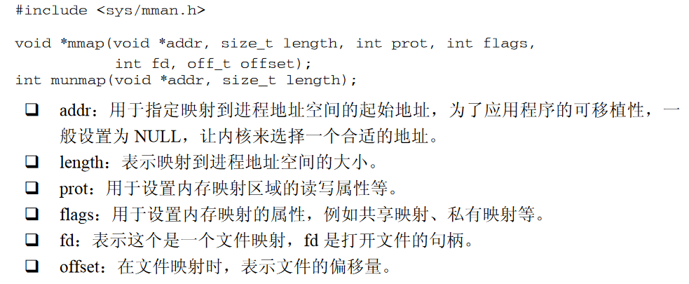

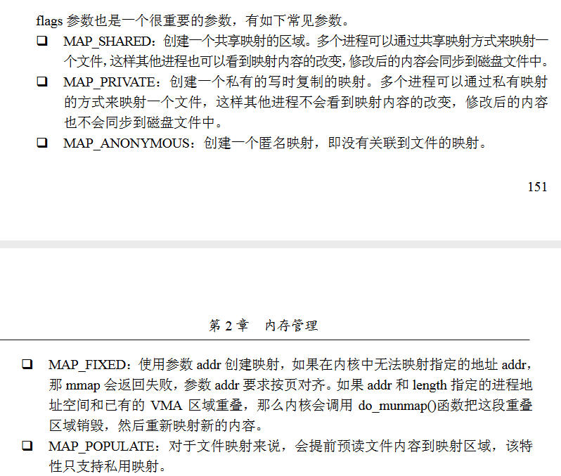

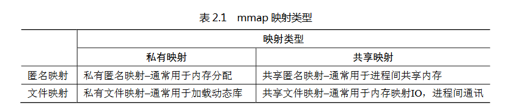

**1. 私有匿名映射**

当使用参数 fd=−1 且 flags= MAP_ANONYMOUS | MAP_PRIVATE 时，创建的 mmap 映射是私有匿名映射。私有匿名映射最常见的用途是在 glibc 分配大块的内存中，**当需 要分配的内存大于 MMAP_THREASHOLD（128KB）时，glibc 会默认使用 mmap 代替 brk 来分配内存。**

**2．共享匿名映射**

当使用参数 fd=−1 且 flags= MAP_ANONYMOUS | MAP_SHARED 时，创建的 mmap 映射是 共享匿名映射。共享匿名映射让相关进程共享一块内存区域，通常用于父子进程之间通信。 创建共享匿名映射有如下两种方式。 （1）fd=−1 且 flags= MAP_ANONYMOUS | MAP_SHARED。在这种情况下，do_mmap_ pgoff()->mmap_region()函数最终会调用 shmem_zero_setup()来打开一个“/dev/zero”特殊的 设备文件。 （2）另外一种是直接打开“/dev/zero”设备文件，然后使用这个文件句柄来创建 mmap。 上述两种方式最终都是调用到 shmem 模块来创建共享匿名映射。

**3．私有文件映射**

创建文件映射时 flags 的标志位被设置为 MAP_PRIVATE，那么就会创建私有文件映射。 私有文件映射最常用的场景是加载动态共享库。

**4．共享文件映射**

创建文件映射时 flags 的标志位被设置为 MAP_SHARED，那么就会创建共享文件映射。 如果 prot 参数指定了 PROT_WRITE，那么打开文件时需要指定 O_RDWR 标志位。共享文 件映射通常有如下两个场景。 （1）读写文件。把文件内容映射到进程地址空间，同时对映射的内容做了修改，内核 的回写机制（writeback）最终会把修改的内容同步到磁盘中。 （2）进程间通信。进程之间的进程地址空间相互隔离，一个进程不能访问到另外一 个进程的地址空间。如果多个进程都同时映射到一个相同文件时，就实现了多进 程间 的共享内存通信。如果一个进程对映射内容做了修改，那么另外的进程是可以看到的。

mmap机制在Linux内核中实现的代码框架与brk机制非常相似。**由下列流程图可知，mmap虽然映射了vma，但是其实还是没有直接分配物理地址。**内核可以通过对文件内容进行预读，一定程度上改变文件mmap性能。见p155.

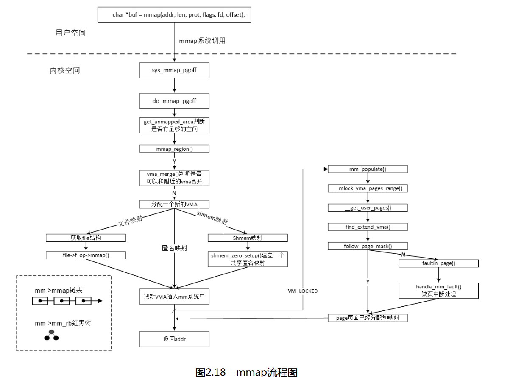
