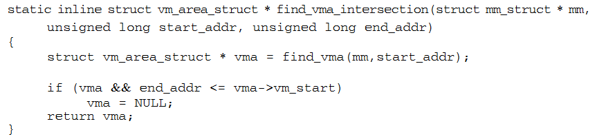
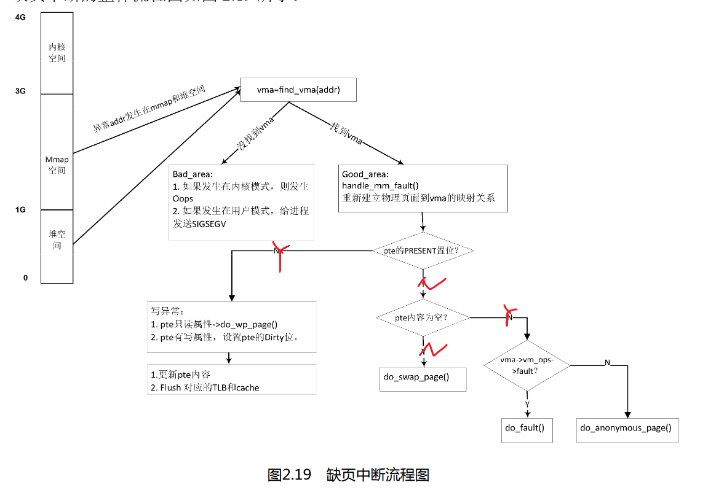
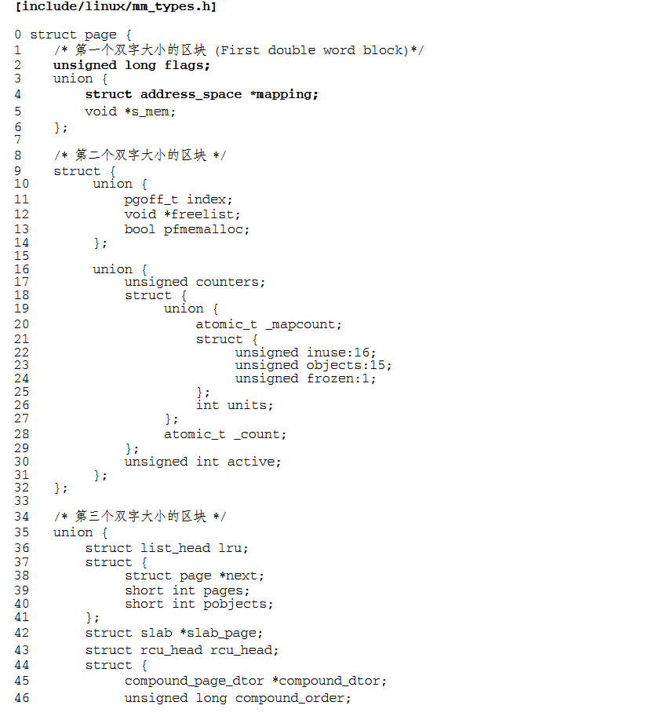
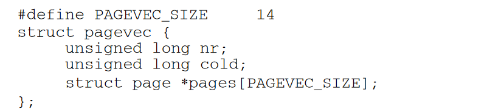

**1．在系统启动时，ARM Linux 内核如何知道系统中有多大的内存空间？**

​	在 ARM Linux 中，各种设备的相关属性描述都采用 DTS 方式来呈现。在 ARM Vexpress 平台中，内存的定义在 vexpress-v2p-ca9.dts 文件中。该 DTS 文件定 义了内存的起始地址和大小。内核在启动的过程中，需要解析这些 DTS (device tree source)文件。解析“memory”描述的信息从而得到内存的 base_address 和 size 信息。

**2．在 32bit Linux 内核中，用户空间和内核空间的比例通常是 3:1，可以修改成 2:2 吗？**


​	在 32bit Linux 中，一共能使用的虚拟地址空间是 4GB，用户空间和内核空间的划分通 常是按照 3:1 来划分，也可以按照 2:2 来划分。在 ARM Linux 中有一个配置选项“memory split”，可以用于调整内核空间和用户空间的 大小划分。通常使用“VMSPLIT_3G”选项，用户空间大小是 3GB，内核空间大小是 1GB， 那么 PAGE_OFFSET 描述内核空间的偏移量就等于 0xC000_0000。也可以选择“VMSPLIT_2G” 选项，这时内核空间和用户空间的大小都是 2GB，PAGE_OFFSET 就等于 0x8000_0000。内核中通常会使用 PAGE_OFFSET 这个宏来计算内核线性映射中虚拟地址和物理地址 的转换。例如，内核中用于计算线性映射的物理地址和虚拟地址的转换关系。线性映射的物理 地址等于虚拟地址 vaddr 减去 PAGE_OFFSET（0xC000_0000）再减去 PHYS_OFFSET（在 部分 ARM 系统中该值为 0）。

3．物理内存页面如何添加到伙伴系统中，是一页一页添加，还是以 2 的几次幂来加入呢？

以2的几次幂来加入，首先通过for_each_free_mem_range()函数来遍历所有的 memblock 内存块，找出内存块的起始地址start和结束地址end。将start和end传递给__free_pages_memory()函数中。**注意这里参数 start 和 end 指页帧号**。

```c
static void __init __free_pages_memory(unsigned long start, unsigned long end)

 {

	int order;

	while (start < end) {

		order = min(MAX_ORDER - 1UL, __ffs(start));

		while (start + (1UL << order) > end)

			order--;

		__free_pages_bootmem(pfn_to_page(start), order);

		start += (1UL << order);

	}

}
```

while 循环一直从起始页帧号 start 遍历到 end，循环的步 长和 order 有关。首先计算 order 的大小，取 MAX_ORDER−1 和__ffs(start)的最小值。ffs(start)函 数计算 start 中第一个 bit 为 1 的位置，注意__ffs() = ffs() −1。因为伙伴系统的链表都是 2 的 n 次幂， 最大的链表是 2 的 10 次方，也就是 1024，即 0x400。所以，通过 ffs()函数可以很方便地计算出地 址的对齐边界。例如 start 等于 0x63300，那么__ffs(0x63300)等于 8，那么这里 order 选用 8。得到 order 值后，我们就可以把这块内存通过__free_pages_bootmem()函数添加到伙伴 系统了。该函数调用__free_pages()函数，__free_pages()函数是伙伴系统的核心函数，这里按照 order 的方式添加到伙伴系统中。

下面是向系统中添加一段内存的情况，页帧号范围为[0x8800e, 0xaecea]，以 start 为起 始来计算其 order，一开始 order 的数值还比较凌乱，等到 start 和 0x400 对齐，以后基本上 order 都取值为 10 了，也就是都挂入 order 为 10 的 free_list 链表中。


4．内核的一级页表存放在什么地方？内核空间的二级页表又存放在什么地方？

​	内核的页表存放在 swapper_pg_dir 地址中，可以通过 init_mm 数据结构来获取


内核页表的基地址定义在 arch/arm/kernel/head.S 汇编代码中。


5．用户进程的一级页表存放在什么地方？二级页表又存放在什么地方？

**6．在 ARM32 系统中，页表是如何映射的？在 ARM64 系统中，页表又是如何映射的？**

​	ARM32:	如果采用页表映射的方式，段映射表就变成一级映射表（First Level table，在 Linux 内 核中称为 PGD），其表项提供的不再是物理段地址，而是二级页表的基地址。32 位虚拟地 址的高 12 位（bit[31:20]）作为访问一级页表的索引值，找到相应的表项，每个表项指向一 个二级页表。以虚拟地址的次 8 位（bit[19:12]）作为访问二级页表的索引值，得到相应的 页表项，从这个页表项中找到 20 位的物理页面地址。最后将这 20 位物理页面地址和虚拟 地址的低 12 位拼凑在一起，得到最终的 32 位物理地址。这个过程在 ARM32 架构中由 MMU 硬件完成，软件不需要接入。

​	ARM64:	对于 ARM64 架构来说，目前基于 ARMv8-A 架构的处理器最大可以支持到 48 根地址 线，也就是寻址 248 的虚拟地址空间，即虚拟地址空间范围为 0x0000_0000_0000_0000～ 0x0000_FFFF_FFFF_FFFF，另外基于 ARMv8-A 架构的处理器支持的最大物理地址宽度也是 48 位。并且支持3级或者4级页表映射。这里以4KB页面大小，48位地址宽度，4级映射为例。


（1）如果输入的虚拟地址最高位 bit[63]为 1，那么这个地址是用于内核空间的，页表 的基地址寄存器用 TTBR1_EL1(Translation Table Base Register 1)。如 果 bit[63]等于 0，那 么 这个虚拟地址属于用户空间，页表基地址寄存器用 TTBR0。

 （2）TTBRx 寄存器保存了第 0 级页表的基地址（L0 Table base address，Linux 内核中 称为 PGD），L0 页表中有 512 个表项（Table Descriptor），以虚拟地址的 bit[47:39]作为索引 值在 L0 页表中查找相应的表项。每个表项的内容含有下一级页表的基地址，即 L1 页表 （Linux 内核中称为 PUD）的基地址。

 （3）PUD 页表中有 512 个表项，以虚拟地址的 bit[38:30]为索引值在 PUD 表中查找相应的表 项，每个表项的内容含有下一级页表的基地址，即 L2 页表（Linux 内核中称为 PMD）的基地址。 

（4）PMD 页表中有 512 个表项，以虚拟地址的 bit[29:21]为索引值在 PMD 表中查找相 应的表项，每个表项的内容含有下一级页表的基地址，即 L3 页表（Linux 内核中称为 PTE） 的基地址。 

（5）在 PTE 页表中，以虚拟地址的 bit[20:12]为索引值在 PTE 表中查找相应的表项， 每个 PTE 表项中含有最终的物理地址的 bit[47:12]，和虚拟地址中 bit[11:0]合并成最终的物 理地址，完成地址翻译过程。

​	在内核初始化阶段会对内核空间的页表进行一一映射，实现的函数依然是 create_ mapping()。首先会做虚拟地址的检查，低于 VMALLOC_START 的地址空间不是有效的内核虚拟 地址空间。VMALLOC_START 等于 0xffff_0000_0000_0000。PGD 页表的基地址和 ARM32 内核一样，通过 init_mm 数据结构的 pgd 成员来获取， swapper_pg_dir 全局变量指向 PGD 页表基地址。

​	在 pgtable-hwdef.h 头文件中，定义了 PGDIR_SHIFT、PUD_SHIFT 和 PMD_SHIFT 的 宏。在我们 QEMU 的 ARM64 的实验平台上，定义了 4 级页表，也就是 CONFIG_ARM64_ PGTABLE_LEVELS 等于 4，另外 VA _ B I T S 定义为 48。那么通过计算可以得到 PGDIR_SHIFT 等于 39，PUD_SHIFT 等于 30，PMD_SHIFT 等于 21。每级页表的页表项数目分别用 PTRS_ PER_PGD、PTRS_PER_PUD、PTRS_PER_PMD 和 PTRS_PER_PTE 来表示，都等于 512。 PGDIR_SIZE 宏表示一个 PGD 页表项能覆盖的内存范围大小为 512GB。PUD_SIZE 等于 1GB，PMD_SIZE 等于 2MB，PAGE_SIZE 等于 4KB。

**在内核初始化阶段会对内核空间的页表进行一一映射**，实现的函数依然是 create_ mapping()。在__create_mapping()函数中，以 PGDIR_SIZE 为步长遍历内存区域[virt, virt+size]，然 后通过调用 alloc_init_pud()来初始化 PGD 页表项内容和下一级页表 PUD。

alloc_init_pud()函数可以通过alloc_init_pmd()初始化PUD页表项和下一级页表PMD，配置PMD页表，同理alloc_init_pmd()通过alloc_init_pte()初始化PMD页表项和下一级页表PTE页表，配置 PTE 页表。


**7．请简述 Linux 内核在理想情况下页面分配器（page allocator）是如何分配出连续物 理页面的？**

首先回忆一下内存的组织情况：

内存节点node，即NUMA下的内存结点。------>zonelist。node中包含一个zonelist。-------->zonelist中有一个_zonerefs数组，该数组的每个元素用于描述zone。数组元素的field有zone_index、zone指针等----------->其中zone指针指向对应的zone---------->而每个zone有自己的free_area数组，数组的最大小标为MAX_ORDER-1.-------->而free_area数组的组成就如图所示了：


每个内存节点有一个 struct pglist_data 数据结构，其成员 node_zonelists 是一个 struct zonelist 数据结构，zonelist 中包含了 struct zoneref _zonerefs[ ]数组来描述这些 zone。分配页面时，我们会有一些分配的需求，这些需求组成了gfp_mask。这些需求中最低四位表示了从什么样的ZONE中分配页面。我们用gfp_zone()函数解析gfp_mask，可以得到一个highest_zoneidx，这个的意思就是说，我们分配的zone的index不能大于highest_zoneidx。

首先调用**_alloc_pages_nodemask()**函数，该函数会调用**get_page_from_freelist()**函数尝试分配物理页面。

假设get_page_from_freelist能够分配成功。

get_page_from_freelist函数首先调用for_each_zone_zonelist_nodemask宏扫描内存节点中的zonelist，查找适合分配内存的zone，这里的适合指的是，满足gfp_mask需求的zone，当然也包括high_zoneidx。注意这个zone的index不是说zone在zoneref _zonerefs[ ]数组中的下标，实际上zoneref struct中有包含有两个field，一个是zone_index 成员指向 zone 的编号，一个成员 zone 指针会指向 zone 数据结构，所以zone的index指的是该数组元素的zone_index域。

for_each_zone_zonelist_nodemask选好特定的zone过后，对该zone进行watermark check，即水位检查。如果空闲页面低于水位值，需要调用zone_reclaim()函数来回收页面，我们假设空闲页面充沛，也就是通过了水位检查。

这个时候就要调用buffer_rmqueue()函数从伙伴系统分配物理页面了。有两种情况在这里，一种是order=0，则直接从zone->per_cpu_pageset列表中分配；一种是order大于0，则从伙伴系统分配。我们关注order大于0的情况：最终调用__rmqueue_smallest()函数。

该函数从order开始查找链表，如果zone的当前order对应空闲区free_area中相应的migratetype类型链表中没有空闲对象，那么查找下一级order。当找到某一个order的空闲区有migratetype类型的空闲链表中有空闲内存块时，会把该内存块摘下来。然后调用expand()函数来“切蛋糕”。即，把分配完剩下的内存块重新插入回伙伴系统。

最后，回到get_page_from_freelist()做一些检查，页面也就分配成功。


**8．在页面分配器中，如何从分配掩码（gfp_mask）中确定可以从哪些 zone 中分配内存？**

我们用gfp_zone()函数解析gfp_mask，可以得到一个highest_zoneidx，这个的意思就是说，我们分配的zone的index不能大于highest_zoneidx。get_page_from_freelist函数首先调用for_each_zone_zonelist_nodemask宏扫描内存节点中的zonelist，查找适合分配内存的zone，这里的适合指的是，满足gfp_mask需求的zone，当然也包括high_zoneidx。


**9．页面分配器是按照什么方向来扫描 zone 的？**

扫描 _zonerefs[ ]数组，从头到尾。


**10．为用户进程分配物理内存，分配掩码应该选用 GFP_KERNEL，还 是 GFP_HIGHUSER_ MOVABLE 呢？**

GFP_HIGHUSER_MOVABLE.


**11．slab 分配器是如何分配和释放小内存块的？**

分配小内存块：

①首先是从本地缓冲池里面分配，若没有：

②从共享缓冲池里迁移batchcount个空闲对象到本地，然后分配。若没有：

③从本地节点的部分空闲slab链表或完全空闲slab链表中取下一个slab，然后从slab的freelist中分配batchcount个空闲对象进本地缓冲池。若没有部分空闲slab链表或完全空闲slab链表：

④从伙伴分配器分配2^gfporder个页，然后进行slab的组织，最后将slab挂到本地节点的完全空闲slab链表中，然后回到①。


释放小内存块：

释放 slab 缓存对象的 API 函数是 kmem_cache_free()。

①首先由对象的虚拟地址通过 virt_to_pfn()找到相应的 pfn，然后通过 pfn_to_page()由 pfn 找到对应的 page 结构。在一个 slab 中，第一个页面的 page 结构中 page->slab_cache 指 向这个 struct kmem_cache 数据结构。

②如果本地对象缓冲池的空闲对象 ac->avail < ac->limit 阈值，通过ac_put_obj()的“ac->entry[ac->avail++] = objp”把对象释放到本地对象 缓冲池 ac 中，释放过程已经结束了。

③如果本地对象缓冲池的空闲对象 ac->avail >= ac->limit 阈值，就会调用 cache_flusharray()做 flush 动作去尝试回收空闲对象.

​		<1>首先是判断是否有共享对象缓冲池，如果有，会把本地对象缓冲池的空闲对象（batchcount个）复制到共享对象缓冲池中。

​		<2>如果共享对象缓冲池中的空闲对象数量大于 limit 阈值，会调用free_block()函数主动释放 batchcount 个空闲对象。如果 slab 没有了 活跃对象（即 page->active == 0），并且 slab 节点中所有空闲对象数目 n->free_objects 超过 了 n->free_limit 阈值，那么调用 slabs_destroy()函数来销毁这个 slab。page->active 用于记录 活跃 slab 对象的计数，slab_get_obj()函数分配一个 slab 对象时会增加该计数，slab_put_obj() 函数释放一个 slab 对象时会递减该计数。


**12．slab 分配器中有一个着色的概念（cache color），着色有什么作用？**

这样可以使不同 slab 上同一个相对位置 slab 对象的起始地址在高速缓存中相互错开，有利于改善 高速缓存的效率。防止cache频繁的换入换出，使cache均匀映射。


**13．slab 分配器中的 slab 对象有没有根据 Per-CPU 做一些优化？**

有，每个cpu都有一个本地缓冲池，每次企图获得一个空闲对象时，首先询问本地缓冲池。让一个对象尽可能地运行在同一个 CPU 上，可以让对象尽可能地使用同一个 CPU 的 cache，有助于提高性能。访问 Per-CPU 类型的本地对象缓冲池不需要获取额外的自旋锁，因为不会有另外 的 CPU 来访问这些 Per-CPU 类型的对象缓存池，避免自旋锁的争用。

**14．slab 增长并导致大量不用的空闲对象，该如何解决？**

（1）使用 kmem_cache_free 释放一个对象，当发现本地和共享对象缓冲池中的空闲对 象数目 ac->avail 大于缓冲池的极限值 ac->limit 时，系统会主动释放 bacthcount 个对象。当 系统所有空闲对象数目大于系统空闲对象数目极限值，并且这个 slab 没有活跃对象时，那 么系统就会销毁这个 slab，从而回收内存。 （2）slab 系统还注册了一个定时器，定时去扫描所有的 slab 描述符，回收一部分空闲 对象，达到条件的 slab 也会被销毁，实现函数在 cache_reap()，大家可以自行阅读。


**15．请问 kmalloc、vmalloc 和 malloc 之间有什么区别以及实现上的差异？**

kmalloc 基于 slab 分配器，用于分配一个小内存块，比如30B，48B......。基于slab分配器

如果在内核中不需要连续的物理地址，而 仅仅需要内核空间里连续虚拟地址的内存块，该如何处理呢？这时 **vmalloc()就派上用场了。**

而malloc用于用户态进程申请内存。后面这两者都基于伙伴分配器。


**16．使用用户态的 API 函数 malloc()分配内存时，会马上为其分配物理内存吗？**

不会。除非有vm_locked标志，才会立刻分配物理内存。

**17．假设不考虑 libc 的因素，malloc 分配 100Byte，那么实际上内核是为其分配 100Byte 吗？**

内核以页为最小单位分配。

**18．假设两个用户进程打印的 malloc()分配的虚拟地址是一样的，那么在内核中这两块 虚拟内存是否打架了呢？**

否。每个进程有自己独立的页表。

**19．vm_normal_page()函数返回的是什么样页面的 struct page 数据结构？为什么内存管 理代码中需要这个函数？**

//暂时没整理

**20．请简述 get_user_page()函数的作用和实现流程。**

首先从用户虚拟空间 找到空闲vma，将vma传入内核，内核根据vma对应的pte为空或present位没有置位，那么内存为其分配内存并建立映射。

**21．请简述 follow_page()函数的作用的实现流程。**

//暂时没整理

**22．请简述私有映射和共享映射的区别。**

私有映射分为私有匿名映射和私有文件映射，前者通常同于分配内存(在glibc分配大内存时，当需要分配的内存大于128KB时，glibc默认使用mmap代替brk来分配内存)。后者通常用于加载动态库。

共享映射分为共享匿名映射和共享文件映射。前者通常用于进程间共享内存。后者通常用于内存映射IO、进程间的通讯。

 **23．为什么第二次调用 mmap 时，Linux 内核没有捕捉到地址重叠并返回失败呢？**

```
#strace捕捉某个app调用mmap的情况 
mmap(0x20000000, 819200, PROT_READ|PROT_WRITE, MAP_PRIVATE|MAP_FIXED|MAP_ANONYMOUS, -1, 0) = 0x20000000 
...
mmap(0x20000000, 4096, PROT_READ|PROT_WRITE, MAP_PRIVATE|MAP_FIXED|MAP_ANONYMOUS, -1, 0) = 0x20000000
```

mmap系统调用实现中，会首先查找用户进程中对应的vma，若检查到要映射的区域和已有的VMA有些许重叠时，会调用do_munmap()函数把这段将要映射区域先销毁，再重新映射，所以第二次映射同样的虚拟地址并没有返回错误。详见p155.

**24．struct page 数据结构中的\_count 和\_mapcount 有什么区别？**

_count和_mapcount都是引用计数，它们都是atomic类型的变量，但是它们的用途各不一样。 其中，_count表示内核中引用该页面的次数，当_count值为0时，表示该page页面为空闲或即将要被释放的页面。当_count的值大于0时，表示该page页面以及被分配且内核正在使用，暂时不会被释放。内核中加减_count引用计数的API为get_page()和put_page()。

_count引用计数常在内核中用于追踪page页面的使用情况。使用情况如下：
① 分配页面时_count引用计数会变成1
② 加入LRU链表时，page页面会被kswapd内核线程使用，_count会加1
③ 被映射到其他用户进程pte时，_count加1，例如创建子进程
④ 页面的private私有数据会增加引用
⑤ 内核对页面进行操作会增加引用计数（follow_page）

mapcount用于表示这个页面被进程映射的个数，即已经映射了多少个用户pte页表。_mapcount引用计数主要用于RMAP反向映射系统中。

_mapcount=-1，表示没有pte映射到页面
_mapcount=0，表示只有父进程映射了页面。匿名页面刚分配时，会设置_mapcount=0。
_mapcount>0，表示除了父进程还有其他进程映射了这个页面。


**25．匿名页面和 page cache 页面有什么区别？**

匿名页面：匿名页面没有指定映射的文件来源。出现匿名页面的场景由四个：

① 发生写时复制，当缺页中断出现写保护错误时，新分配的页面是匿名页面。
② 用户空间malloc/mmap接口函数来分配内存，在内核空间发生缺页中断时，调用do_anonymous_page()会产生匿名页面。
③ do_swap_page()，从swap分区 读回数据时会新分配匿名页面
④ 迁移页面

Page cache:
每当读取文件时，都会将数据放入page cache中，以避免后续读取时进行昂贵的磁盘访问。 类似地，当写入文件时，数据被放置在page cache中并最终进入后备存储设备。 写入的页面被标记为脏，当 Linux 决定将它们重用于其他目的时，它会确保将设备上的文件内容与更新的数据同步。


**26．struct page 数据结构中有一个锁，请问 trylock_page()和 lock_page()有什么区别？**

trylock_page使用test_and_set_bit_lock去尝试为page的flags设置PG_locked标志位，并且返回原来标志位的值。trylock_page返回false表示获取锁失败，返回true表示获取锁成功。
lock_page用于申请页面锁，如果页面锁被其他进程占用，那么就会睡眠等待。


**27．在 Linux 2.4.x 内核中，如何从一个 page 找到所有映射该页面的 VMA？反向映射 可以带来哪些便利？**

在2.4的内核中，为了从一个page找到映射该页面的VMA，必须遍历每个进程的页表。
反向映射的使用提高了查找进程页表的效率，减少了查找VMA的工作量。


**28．阅 读 Linux 4.0 内核 RMAP 机制的代码，画出父子进程之间 VMA、AVC 、anon_vma 和 page 等数据结构之间的关系图。**


**29．在 Linux 2.6.34 中，RMAP 机制采用了新的实现，在 Linux 2.6.33 和之前的版本中 称为旧版本 RMAP 机制。那么在旧版本 RMAP 机制中，如果父进程有 1000 个子进程，每 个子进程都有一个 VMA，这个 VMA 里面有 1000 个匿名页面，当所有的子进程的 VMA 同 时发生写复制时会是什么情况呢？**

没去了解linux2.6的remap机制，但是linux2.6的remap没有avc，所以一个av难以对应多个vma。父进程的 AV p 队列中会有 100 万个匿名页面，扫描这个队列要耗费 很长的时间。

linux2.6 remap在p203.

30．当 page 加入 lru 链表中，被其他线程释放了这个 page，那么 lru 链表如何知道这 个 page 已经被释放了？


31．kswapd 内核线程何时会被唤醒？

33．kswapd 按照什么原则来换出页面？

 34．kswapd 按照什么方向来扫描 zone？

 35．kswapd 以什么标准来退出扫描 LRU？ 

36．手持设备例如 Android 系统，没有 swap 分区或者 swap 文件，kswapd 会扫描匿名 页面 LRU 吗？

37．swappiness 的含义是什么？kswapd 如何计算匿名页面和 page cache 之间的扫描比重？ 

38．当系统充斥着大量只访问一次的文件访问（use-one streaming IO）时，kswapd 如 何来规避这种风暴？

39．在回收 page cache 时，对于 dirty 的 page cache，kswapd 会马上回写吗？

40．内核有哪些页面会被 kswapd 写回交换分区？

41．ARM32 Linux 如何模拟这个 Linux 版本的 L_PTE_YOUNG 比特位呢？

42．如何理解 Refault Distance 算法？

43．请简述匿名页面的生命周期。在什么情况下会产生匿名页面？在什么条件下会释 放匿名页面？

44．KSM 是基于什么原理来合并页面的？

45．在 KSM 机制里，合并过程中把 page 设置成写保护的函数 write_protect_page()有 这样一个判断：请问这个判断的依据是什么？

```
if (page_mapcount(page) + 1 + swapped != page_count(page)) {

	goto out_unlock; 

}
```

46．如果多个 VMA 的虚拟页面同时映射了同一个匿名页面，那么此时 page->index 应 该等于多少？

47．为什么 Dirty COW 小程序可以修改一个只读文件的内容？

48．在 Dirty COW 内存漏洞中，如果 Dirty COW 程序没有 madviseThread 线程，即只 有 procselfmemThread 线程，能否修改 foo 文件的内容呢？

49．假设在内核空间获取了某个文件对应的 page cache 页面的 struct page 数据结构， 而对应的 VMA 属性是只读，那么内核空间是否可以成功修改该文件呢？

50．如果用户进程使用只读属性（PROT_READ）来 mmap 映射一个文件到用户空间， 然后使用 memcpy 来写这段内存空间，会是什么样的情况？

51．请画出内存管理中常用的数据结构的关系图，如 mm_struct、vma、vaddr、page、 pfn、pte、zone、paddr 和 pg_data 等，并思考如下转换关系。

 ‰ 如何由 mm 数据结构和虚拟地址 vaddr 找到对应的 VMA？

 ‰ 如何由 page 和 VMA 找到虚拟地址 vaddr？

 ‰ 如何由 page 找到所有映射的 VMA？

 ‰ 如何由 VMA 和虚拟地址 vaddr 找出相应的 page 数据结构？

 ‰ page 和 pfn 之间的互换。

 ‰ pfn 和 paddr 之间的互换。

 ‰ page 和 pte 之间的互换。

 ‰ zone 和 page 之间的互换。

 ‰ zone 和 pg_data 之间的互换。

52．请画出在最糟糕的情况下分配若干个连续物理页面的流程图。

53．在 Android 中新添加了 LMK（Low Memory Killer），请描述 LMK 和 OOM Killer 之间的关系。

54．请描述一致性 DMA 映射 dma_alloc_coherent()函数在 ARM 中是如何管理 cache 一 致性的？

55．请描述流式 DMA 映射 dma_map_single()函数在 ARM 中是如何管理 cache 一致性的？

56．为什么在 Linux 4.8 内核中要把基于 zone 的 LRU 链表机制迁移到基于 Node 呢？


描述系统中物理内存的组织架构的三个数据结构：**struct pg_data_t、struct zone 、struct page**

描述进程的虚拟内 存用 **struct vm_area_struct** 数据结构。


# 2.1 struct zone

```c
struct zone { 

/* Read-mostly fields */ 

unsigned long watermark[NR_WMARK];//每个 zone 在系统启动时会计算出 3 个水位值，分别是 WMARK_MIN、 WMARK_LOW 和 WMARK_HIGH 水位，这在页面分配器和 kswapd 页面回收中 会用到

long lowmem_reserve[MAX_NR_ZONES]; //zone 中预留的内存

struct pglist_data *zone_pgdat; //指向内存节点

struct per_cpu_pageset __percpu *pageset;//用于维护 Per-CPU 上的一系列页面，以减少自旋锁的争用

unsigned long zone_start_pfn;//zone 中开始页面的页帧号

unsigned long managed_pages; //zone 中被伙伴系统管理的页面数量

unsigned long spanned_pages; //zone 包含的页面数量

unsigned long present_pages; //zone 里实际管理的页面数量。对一些体系结构来说，其值和 spanned_pages 相等

const char *name;

ZONE_PADDING(_pad1_) 

struct free_area free_area[MAX_ORDER]; //管理空闲区域的数组，包含管理链表等

unsigned long flags; 

spinlock_t lock; //并行访问时用于对 zone 保护的自旋锁

ZONE_PADDING(_pad2_) 

spinlock_t lru_lock; //用于对 zone 中 LRU 链表并行访问时进行保护的自旋锁

struct lruvec lruvec; //LRU 链表集合

ZONE_PADDING(_pad3_)

atomic_long_t vm_stat[NR_VM_ZONE_STAT_ITEMS]; //zone 计数

}____ cacheline_internodealigned_in_smp;

/*struct zone 是经常会被访问到的，因此这个数据结构要求以 L1 Cache 对齐。另外， 这里的 ZONE_PADDING()是让 zone->lock 和 zone->lru_lock 这两个很热门的锁可以分布在 不同的 cache line 中。*/
```

​	通常情况下，内核的 zone 分为 ZONE_DMA、ZONE_DMA32、ZONE_NORMAL 和 ZONE_HIGHMEM。在 ARM Vexpress 平台中，没有定义 CONFIG_ZONE_DMA 和 CONFIG_ ZONE_DMA32，所以只有 ZONE_NORMAL 和 ZONE_HIGHMEM 两种。

下面是 ARM Vexpress 平台运行之后打印出来的 zone 的信息。


可以看出 ARM Vexpress 平台分为两个 zone，ZONE_NORMAL 和 ZONE_HIGHMEM。 其中 ZONE_NORMAL 是从 0xc0000000 到 0xef800000。

zone 的初始化函数在 free_area_init_core()中。

 [start_kernel->setup_arch->paging_init->bootmem_init->zone_sizes_init->fre e_area_init_node->free_area_init_core]

另外系统中会有一个 zonelist 的数据结构，伙伴系统分配器会从 zonelist 开始分配内存， zonelist 有一个 zoneref 数组，数组里有一个成员会指向 zone 数据结构。zoneref 数组的第一 个成员指向的 zone 是页面分配器的第一个候选者，其他成员则是第一个候选者分配失败之 后才考虑，优先级逐渐降低。zonelist 的初始化路径如下： 

[start_kernel->build_all_zonelists->build_all_zonelists_init->__build_all_ zonelists->build_zonelists->build_zonelists_node]。

**zone 数据结构中有一个 free_area 数组，数组的大小是 MAX_ORDER**。一般为11。这个MAX_ORDER表示伙伴系统的最大次幂。**所以每个ZONE中包含了一个伙伴分配系统。**free_area 数据结构中包含了 MIGRATE_TYPES 个链表，这里 相当于 zone 中根据 order 的大小有 0 到 MAX_ORDER−1 个 free_area，每个 free_area 根据 MIGRATE_TYPES 类型有几个相应的链表。MIGRATE_TYPES 类型包含 MIGRATE_UNMOVABLE、MIGRATE_RECLAIMABLE、 MIGRATE_MOVABLE 以及 MIGRATE_RESERVE 等几种类型。当前页面分配的状态可以 从/proc/pagetypeinfo 中获取得到。

```c
 struct free_area 
 { 
 	struct list_head free_list[MIGRATE_TYPES]; 
 	unsigned long nr_free; 
 };
```


‰ 大部分物理内存页面都存放在 MIGRATE_MOVABLE 链表中。

 ‰ 大部分物理内存页面初始化时存放在 2 的 10 次幂的链表中。

我们思考一个问题，Linux 内核初始化时究竟有多少页面是 MIGRATE_MOVABLE？

内存管理中有一个 pageblock 的概念，一个 pageblock 的大小通常是2^（MAX_ORDER−1） 个页面, 也就是4MB。如果体系结构中提供了 HUGETLB_PAGE 特性，那么 pageblock_order 定义为 HUGETLB_PAGE_ORDER。每个 pageblock 有一个相应的 MIGRATE_TYPES 类型。zone 数据结构中有一个成员指 针 pageblock_flags，它指向用于存放每个 pageblock 的 MIGRATE_TYPES 类型的内存空间。**pageblock_flags 指向的内存空间的大小**通过 usemap_size()函数来计算，每个 pageblock 用 4 个比特位来存放 MIGRATE_TYPES 类型。zone 的初始化函数free_area_init_core()会调用 setup_usemap()函数分配pageblock_flags 指向的内存空间。内核初始化时所有的页面最初都标记为 MIGRATE_MOVABLE 类型。


# 2.2 页表映射

create_mapping() 函数就是为一个给定的内存区间**建立页面映射**，这个函数使用 map_desc 数据结构来描述一个内存区间。

struct map_desc {

​	unsigned long virtual; //虚拟地址的起始地址 

​	unsigned long pfn; //物理地址的开始地址的页帧号 

​	unsigned long length; //内存区间大小 

​	unsigned int type;

 };

type 表示内存区间的属性，系统中定义了一个全局的struct mem_type[ ]数组来描述所有的内存区间类型，例如这些内存区间： MT_DEVICE_CACHED、MT_DEVICE_WC、MT_MEMORY_RWX 和 MT_MEMORY_RW。struct mem_type 数据结构描述内存区间类型以及相应的权限和属性等信息，其数据结构定义如下：

struct mem_type {

​	 pteval_t prot_pte;

​	 pteval_t prot_pte_s2; 

​	 pmdval_t prot_|1; 

​	 pmdval_t prot_sect; 

​	 unsigned int domain;

 };

其中，domain 成员用于 ARM 中定义的不同的域，ARM 中允许使用 16 个不同的域， 但在 ARM Linux 中只定义和使用 3 个。

#define DOMAIN_KERNEL 2 

#define DOMAIN_TABLE 2 

#define DOMAIN_USER 1

#define DOMAIN_IO 0

DOMAIN_KERNEL 和 DOMAIN_TABLE 其实用于系统空间，DOMAIN_IO 用于 I/O 地址域，实际上也属于系统空间，DOMAIN_USER 则是用户空间。prot_pte 成员用于页面表项的控制位和标志位。prot__|1 成员用于一级页表项的控制位和标志位。


**调用 create_mapping()时 以此map_desc 数据结构指针为调用参数。**

[start_kernel()->setup_arch()->paging_init()->map_lowmem ()->create_mapping]


在 create_mapping()函数中，以 PGDIR_SIZE 为单位，在内存区域[virtual, virtual +length] 中通过调用 alloc_init_pud()来初始化 PGD 页表项内容和下一级页表 PUD。pgd_addr_end() 以 PGDIR_SIZE 为步长。

在第 13 行代码中，通过 pgd_offset_k()函数获取所属的页面目录项 PGD。内核的页表 存放在 swapper_pg_dir 地址中，可以通过 init_mm 数据结构来获取。

create_mapping()函数中的第 15～22 行代码，由于 ARM Vexpress 平台支持两级页表映 射，所以 PUD 和 PMD 设置成与 PGD 等同了。

因此 alloc_init_pud()函数一路调用到 alloc_init_pte()函数。


alloc_init_pte()首先判断相应的 PTE 页表项是否已经存在，如果不存在，那就要新建 PTE 页表项。接下来的 while 循环是根据物理地址的 pfn 页帧号来生成新的 PTE 表项（PTE entry），最后设置到 ARM 硬件页表中（由 set_pte_ext()完成对硬件页表项的设置）。ARM 结构中一级页表 PGD 的偏移量应该从 20 位开始,为何头文件定义从 21 位开始呢? 这是因为Linux内核默认PGD从21开始，也就是[31:21]，而ARM32硬件结构中PGD从20开始。具体详情查看书p56。我简单的总结一下：early_pte_alloc首先会检查pmd指向的table是否分配了，如果分配了那就返回addr对应的pte地址。如果没分配，那就得分配pmd指向的表。这个表有多大呢？512+512个页表项。但是在ARM32真实硬件中一个PGD页表项只有就256个页表项，为什么要分配这多？①其实其中512页表项是给Linux OS用的(用于模拟 L_PTE_DIRTY、L_PTE_YOUNG 等标志位)，因为Linux默认二级页表512项，剩下的512个页面表是给ARM硬件MMU使用的。而PGD 的定义其实是 pmdval_t pgd[2]，长度是两倍，也就是 pgd 包括两份相邻的 PTE 页 表。所以 pgd_offset()在查找 pgd 表项时，是按照 pgd[2]长度来进行计算的，因此查找相应 的 pgd 表项时，其中 pgd[0]指向第一份 PTE 页表，pgd[1]指向第二份 PTE 页表。


在 x86 的页 面表中有 3 个标志位是 ARM32 硬件页面表没有提供的。 ‰ PTE_DIRTY：CPU 在写操作时会设置该标志位，表示对应页面被写过，为脏页。 ‰ PTE_YOUNG：CPU 访问该页时会设置该标志位。在页面换出时，如果该标志位置位 了，说明该页刚被访问过，页面是 young 的，不适合把该页换出，同时清除该标志位。 ‰ PTE_PRESENT：表示页在内存中。 因此在 ARM Linux 实现中需要模拟上述 3 个比特位。

如何模拟 PTE_DIRTY 呢？在 ARM MMU 硬件为一个干净页面建立映射时，设置硬件 页表项是只读权限的。当往一个干净的页面写入时，会触发写权限缺页中断（虽然 Linux 版本的页面表项标记了可写权限，但是 ARM 硬件页面表项还不具有写入权限），那么在缺 页中断处理 handle_pte_fault()中会在该页的 Linux 版本 PTE 页面表项标记为“dirty”，并且 发现 PTE 页表项内容改变了，ptep_set_access_flags()函数会把新的 Linux 版本的页表项内容写入硬件页表，从而完成模拟过程。

**注意这个create_mapping和内核初始化时创建内核页表的create_mapping函数不一样。**这个create_mapping应该主要是为了映射一个内存区间。


# **2.3 内核内存的布局图**

**ARM32的内核内存布局：**

Linux 内核在启动时会打印出内核内存空间的布局图，下面是 ARM Vexpress 平台打印 出来的内存空间布局图：


编译器在编译目标文件并且链接完成之后，就可以知道内核映像文件最终的大小，接下来打 包成二进制文件，该操作由 arch/arm/kernel/vmlinux.ld.S 控制，其中也划定了内核的内存布局。

‰ 代码段：_text 和_etext 为代码段的起始和结束地址，包含了编译后的内核代码。 

‰ init 段：__init_begin 和__init_end 为 init 段的起始和结束地址，包含了大部分模块 初始化的数据。 

‰ 数据段：_sdata 和_edata 为数据段的起始和结束地址，保存大部分内核的变量。 

‰ BSS 段: __bss_start 和__bss_stop 为 BSS 段的开始和结束地址，包含初始化为 0 的所有静态全局变量。

上述几个段的大小在编译链接时根据内核配置来确定，因为每种配置的代码段和数据 段长度都不相同，这取决于要编译哪些内核模块，但是起始地址_text 总是相同的。内核编 译完成之后，会生成一个 System.map 文件，查询这个文件可以找到这些地址的具体数值。

**内核模块**使用虚拟地址从 MODULES_VADDR 到 MODULES_END 的这段 14MB 大小 的内存区域。

用户空间和内核空间使用 3:1 的划分方法时，内核空间只有 1GB 大小。这 1GB 的映射 空间，其中有一部分用于直接映射物理地址，这个区域称为线性映射区。在 ARM32 平台上，物理地址[0:760MB]的这一部分内存被线性映射到[3GB:3GB+ 760MB]的虚拟地址上。线性映射区的虚拟地址和物理地址相差 PAGE_OFFSET，即 3GB。

那高端内存的起始地址（760MB）是如何确定的呢？在内核初始化内存时，在 sanity_check_meminfo()函数中确定高端内存的起始地址，全 局变量 high_memory 来存放高端内存的起始地址。

**为什么内核只线性映射 760MB 呢？剩下的 264MB 的虚拟地址空间用来做什么呢？** 那是保留给 vmalloc、fixmap 和高端向量表等使用的。内核很多驱动使用 vmalloc 来分 配连续虚拟地址的内存，因为有的驱动不需要连续物理地址的内存；除此以外，vmalloc 还 可以用于高端内存的临时映射。一个 32bit 系统中实际支持的内存数量会超过内核线性映射 的长度，但是内核要具有对所有内存的寻找能力。

内核通常把物理内存低于 760MB 的称为线性映射内存（Normal Memory），而高于 760MB 以上的称为高端内存（High Memory）。由于 32 位系统的寻址能力只有 4GB，对于物理内存 高于 760MB 而低于 4GB 的情况，我们可以从保留的 240MB 的虚拟地址空间中划出一部分 用于动态映射高端内存，这样内核就可以访问到全部的 4GB 内存了。如果物理内存高于 4GB， 那么在 ARMv7-A 架构中就要使用 LPE 机制来扩展物理内存访问了。用于映射高端内存的虚 拟地址空间有限，所以又可以划分为两部分，一部分为临时映射区，另一部分为固定映射区， PKMAP 指向的就是固定映射区。如图 2.6 所示是 ARM Vexpress 平台上画出内核空间的内存 布局图。


PKMAP 映射区也称为可持久映射区。当通过 alloc_page() 获得高端物理内存对于的page，内核专门为此保留一块线性地址空间，从 PKMAP_BASE 开始，用于映射高端物理内存页，就是可持久映射区。在可持久映射区，可以通过调用函数 kmap() 在物理页框与内核虚拟内存地址建立长期映射，这个空间通常为 4MB，最多能映射 1024 个页框，最大页框数使用 LAST_PKMAP 宏表示。PKMAP 可映射的页框数稀少，所以为了加强页框的使用率，应及时调用 kunmap() 函数将不使用的物理页框释放掉。在 Linux 2.6 内核上，可持久映射虚拟地址范围是 4GB - 8M 到 4G-4M 之间。而在上述布局图中(Linux4.X)，PKMAP的VMA位于用户空间，注意区别。


**ARM64的内核内存布局：**

​	在处理器架构设计上，把虚拟地址空间划分为两个空间，每个空间最大支持 256TB。Linux 内核在大多数体系结构上都把两个地址空间划分为用户空间和内核空间。

‰ 用户空间：0x0000_0000_0000_0000 到 0x0000_ffff_ffff_ffff。 

‰ 内核空间：0xffff_0000_0000_0000 到 0xffff_ffff_ffff_ffff。

64 位 Linux 内核中没有高端内存这个概念了，因为 48 位的寻址空间已经足够大了。


（1）用户空间：0x0000_0000_0000_0000 到 0x0000_ffff_ffff_ffff，一共有 256TB。 

（2）非规范区域。 

（3）内核空间：0xffff_0000_0000_0000 到 0xffff_ffff_ffff_ffff，一共有 256TB。 内核空间又做了如下细分。

 ‰ vmalloc 区域：0xffff000000000000 到 0xffff7bffbfff0000，大小为 126974GB。

 ‰ vmemmap 区域：0xffff7bffc0000000 到 0xffff7fffc0000000，大小为 4096GB。

 ‰ PCI I/O 区域：0xffff7ffffae00000 到 0xffff7ffffbe00000，大小为 16MB。

 ‰ Modules区域：0xffff7ffffc000000 到 0xffff800000000000，大小为 64MB。

 ‰ normal memory 线性映射区：0xffff800000000000 到 0xffffffffffffffff，大小为 128TB。


# 2.4 **分配物理页面**（理想情况）

内核中常用的分配物理内存页面的接口函数是 alloc_pages()，用于分配一个或者多个连 续的物理页面，分配的页面个数只能是 2 的整数次幂。alloc_pages()函数的参数有两个，一个是分配掩码 gfp_mask，另一个是分配阶数 order。


分配掩码是非常重要的参数，它同样定义在 gfp.h 头文件中。分配掩码在内核代码中分成两类，一类叫 zone modifiers，另一类叫 action modifiers。 zone modifiers 指定从哪个 zone 中分配所需的页面。zone modifiers 由分配掩码的最低 4 位 来定义，分别是_GFP_DMA、 \_\_GFP_HIGHMEM、\_\_GFP_DMA32 和__GFP_MOVABLE。action modifiers 并不限制从哪个内存域中分配内存，但会改变分配行为.

**下面以 GFP_KERNEL 为例，来看在理想情况下 alloc_pages()函数是如何分配出物理内存的。**

page = alloc_pages(GFP_KERNEL, order);

GFP_KERNEL 分配掩码定义在 gfp.h 头文件中，是一个分配掩码的组合。常用的分配掩码组合如下：


alloc_pages()最终调用__alloc_pages_nodemask()函数，它是伙伴系统的核心函数。


struct alloc_context 数据结构是伙伴系统分配函数中用于保存相关参数的数据结构。 gfp_zone()函数从分配掩码中计算出 zone 的 zoneidx，并存放在 high_zoneidx 成员中。另外__alloc_pages_nodemask()第 15 行代码中的 gfpflags_to_migratetype()函数把 gfp_ mask 分配掩码转换成 MIGRATE_TYPES 类型，例如分配掩码为 GFP_KERNEL，那么 MIGRATE_TYPES 类型是 MIGRATE_UNMOVABLE；如果分配掩码为 GFP_HIGHUSER_ MOVABLE，那么 MIGRATE_TYPES 类型是 MIGRATE_MOVABLE。

继续回到__alloc_pages_nodemask()函数中。


首先 get_page_from_freelist()会去尝试分配物理页面，如果这里分配失败，就会调用到 __alloc_pages_slowpath()函数，这个函数将处理很多特殊的场景。这里假设在理想情况下get_page_from_freelist()能分配成功。


get_page_from_freelist()函数首先需要判断可以从哪个 zone 来分配内存,所以for_each_zone_ zonelist_nodemask 宏扫描内存节点中的 zonelist 去查找合适分配内存的 zone。


for_each_zone_zonelist_nodemask 首先通过 first_zones_zonelist()从给定的 zoneidx 开始 查找，这个给定的 zoneidx 就是 highidx，之前通过 gfp_zone()函数转换得来的。first_zones_zonelist()函数会调用 next_zones_zonelist()函数来计算 zoneref，最后返回 zone 数据结构。


计算 zone 的核心函数在 next_zones_zonelist()函数中，这里 highest_zoneidx 是 gfp_zone() 函数计算分配掩码得来。**zonelist 有一个 zoneref 数组，zoneref 数据结构里有一个成员 zone 指针会指向 zone 数据结构，还有一个 zone_index 成员指向 zone 的编号。**zone 在系统处理 时会初始化这个数组，具体函数在 build_zonelists_node()中。在 ARM Vexpress 平台中，zone 类型、zoneref[ ]数组和 zoneidx 的关系如下：

ZONE_HIGHMEM	 _zonerefs[0]->zone_index=1

ZONE_NORMAL 	_zonerefs[1]->zone_index=0

zonerefs[0]表示 ZONE_HIGHME，其 zone 的编号 zone_index 值为 1；zonerefs[1]表示 ZONE_NORMAL，其 zone 的编号 zone_index 为 0。也就是说，基于 zone 的设计思想是：分配物理页面时会优先考虑 ZONE_HIGHMEM，因为 ZONE_HIGHMEM 在 zonelist 中排在 ZONE_NORMAL 前面。

回到我们之前的例子，gfp_zone(GFP_KERNEL)函数返回 0，即 highest_zoneidx 为 0， 而这个内存节点的第一个 zone 是 ZONE_HIGHME，其 zone 编号 zone_index 的值为 1。因 此在 next_zones_zonelist()中，z++，最终 first_zones_zonelist ()函数会返回 ZONE_NORMAL。 在 for_each_zone_zonelist_nodemask()遍历过程中也只能遍历 ZONE_NORMAL 这一个 zone 了。

再举一个例子，分配掩码为 GFP_HIGHUSER_MOVABLE ， GFP_HIGHUSER_ MOVABLE 包含了__GFP_HIGHMEM，那么 next_zones_zonelist()函数会返回哪个 zone 呢？ GFP_HIGHUSER_MOVABLE 值为 0x200da，那么gfp_zone(GFP_HIGHUSER_MOVABLE) 函数等于 2，即 highest_zoneidx 为 2，而这个内存节点的第一个 ZONE_HIGHME，其 zone 编号 zone_index 的值为 1。‰ 在 first_zones_zonelist()函数中，由于第一个 zone 的 zone_index 值小于 highest_ zoneidx，因此会返回 ZONE_HIGHMEM。

 ‰ 在 for_each_zone_zonelist_nodemask() 函数中，next_zones_zonelist(++z, highidx, nodemask)依然会返回 ZONE_NORMAL。

 ‰ 因此这里会遍历 ZONE_HIGHMEM 和 ZONE_NORMAL 这两个 zone，但是会先 遍历 ZONE_HIGHMEM，然后才是 ZONE_NORMAL。

**所以for_each_zone_zonelist_nodemask宏，可以看到他的宏展开其实是一个for循环，也就是说，该宏在按照规则遍历ZONE，然后再在for循环的循环体里面看看有没有足够order的区域。**

要正确理解 for_each_zone_zonelist_nodemask()这个宏的行为，需要理解如下两个方面。

‰ highest_zoneidx 是怎么计算来的，即如何解析分配掩码，这是 gfp_zone()函数的职责。

 ‰ 每个内存节点有一个 struct pglist_data 数据结构，其成员 node_zonelists 是一个 struct zonelist 数据结构，zonelist 中包含了 struct zoneref _zonerefs[ ]数组来描述这 些 zone。其中 ZONE_HIGHMEM 排在前面，并且_zonerefs[0]->zone_index=1， ZONE_NORMAL 排在后面，且_zonerefs[1]->zone_index=0。这是正确理解以 zone 为基础的物理页面分配机 制的基石。


回到 get_page_from_freelist()函数中，**for_each_zone_zonelist_nodemask()找到了接下来 可以从哪些 zone 中分配内存**，下面来做一些必要的检查。


下面代码用于检测当前的 zone 的 watermark 水位是否充足。


zone 数据结构中有一个成员 watermark 记录各种水位的情况。系统中定义了 3 种水位， 分别是 WMARK_MIN、WMARK_LOW 和 WMARK_HIGH。watermark 水位的计算在__setup_ per_zone_wmarks()函数中。计算 watermark 水位用到 min_free_kbytes 这个值，它是在系统启动时通过系统空闲页 面的数量来计算的，具体计算在 init_per_zone_wmark_min()函数中。另外系统起来之后也 可以通过 sysfs 来设置，节点在“/proc/sys/vm/min_free_kbytes”。计算 watermark 水位的公 式不算复杂，最后结果保存在每个 zone 的 watermark 数组中，后续伙伴系统和 kswapd 内 核线程会用到。

回到 get_page_from_freelist()函数，这里会读取 WMARK_LOW 水位的值到变量 mark 中，这里的 zone_watermark_ok()函数判断当前 zone 的空闲页面是否满足 WMARK_LOW 水位。通常 分配物理内存页面的内核路径是检查 WMARK_LOW 水位，而页面回收 kswapd 内核线程 则是检查 WMARK_HIGH 水位。

__zone_watermark_ok()函数首先判断 zone 的空闲页面是否小于某个水位值和 zone 的最 低保留值(lowmem_reserve)之和。返回 true 表示空闲页面在某个水位在上，否则返回 false。

回到 get_page_from_freelist()函数中，**当判断当前 zone 的空闲页面低于 WMARK_LOW 水位，会调用 zone_reclaim()函数来回收页面**。我们这里假设 zone_watermark_ok()判断空闲页面充沛，接下来就会调用 buffered_rmqueue()函数从伙伴系统中分配物理页面。这里根据 order 数值兵分两路：一路是 order 等于 0 的情况，也就是分配一个物理页面 时，从 zone->per_cpu_pageset 列表中分配；另一路 order 大于 0 的情况，就从伙伴系统中分 配。我们只关注 order 大于 0 的情况，它最终会调用__rmqueue_smallest()函数。

我们来看看_rmqueue_smallest()函数


在__rmqueue_smallest()函数中，首先从 order 开始查找 zone 中空闲链表。如果 zone 的 当前 order 对应的空闲区 free_area 中相应 migratetype 类型的链表里没有空闲对象，**那么就 会查找下一级 orde**r。当 找到某一个 order 的空闲区中对应的 migratetype 类型的空闲链表中有空闲内存块时，就会 从中把一个内存块摘下来，然后**调用 expand()函数来“切蛋糕”**。因为通常摘下来的内存块 要比需要的内存大，切完之后需要把剩下的内存块重新放回伙伴系统中。

expand()函数就是实现“切蛋糕”的功能。这里参数 high 就是 current_order，通常 current_order 要比需求的 order 要大。每比较一次，area 减 1，相当于退了一级 order，最后 通过 list_add 把剩下的内存块添加到低一级的空闲链表中。


所需求的页面分配成功后，__rmqueue()函数返回这个内存块的起始页面的 struct page 数据结构。回到 buffered_rmqueue()函数，最后还需要利用 zone_statistics()函数做一些统计 数据的计算。

回到 get_page_from_freelist()函数中，最后还要通过 prep_new_page()函数做一些有趣的检查，才能最终出厂。


check_new_page()函数做如下检查.

刚分配页面的 struct page 的_mapcount 计数应该为 0。

这时 page->mapping 为 NULL。

判断这时 page 的_count 是否为 0。注意 alloc_pages()分配的 page 的_count 应该为 1，但是这里为 0，因为这个函数之后还调用 set_page_refcounted()->set_page_count()， 把_count 设置为 1。

检查 PAGE_FLAGS_CHECK_AT_PREP 标志位，这个 flag 在 free_page 时已经清 除了，而这时该 flag 被设置，说明分配过程中有问题。

上述检查都通过后，我们分配的页面就合格了，可以出厂了，页面 page 便开启了属于 它精彩的生命周期。


# 2.5 释放页面

​	释放页面的核心函数是 free_page()，最终还是调用__free_pages()函数。 __free_pages()函数会分两种情况，对于 order 等于 0 的情况，做特殊处理；对于 order 大于 0 的情况，属于正常处理流程。

1. **对于order大于0的情况**，__free_pages()函数内部调用__free_pages_ok()，最后调 用__free_one_page()函数。因此释放内存页面到伙伴系统，最终还是通过__free_one_page() 来实现。该函数不仅可以释放内存页面到伙伴系统，还会处理空闲页面的合并工作。

​		释放内存页面的核心功能是把页面添加到伙伴系统中适当的 free_area 链表中。在释放 内存块时，会查询相邻的内存块是否空闲，如果也空闲，那么就会合并成一个大的内存块， 放置到高一阶的空闲链表 free_area 中。如果还能继续合并邻近的内存块，那么就会继续合 并，转移到更高阶的空闲链表中，这个过程会一直重复下去，直至所有可能合并的内存块 都已经合并。回收流程见书P86.

2. __free_pages()**对于 order 等于 0 的情况**，作为特殊情况来处理。，zone 中有一个变量 zone-> pageset 为每个 CPU 初始化一个 percpu 变量 struct per_cpu_pageset。当释放 order 等于 0 的 页面时，首先页面释放到 per_cpu_page->list 对应的链表中。

​		per_cpu_pageset 和 per_cpu_pages 数据结构定义如下：


当 count 大于 high 时，会调用 free_pcppages_bulk() 函数把 per_cpu_pages 的页面添加到伙伴系统中。最终还是调用__free_one_page()函数来释放页面并添加到伙伴系统中。


# 2.6 slab分配器


​	slab 分配器是用来解决小内存块分配问题的，也是内存分配中非常重要的角色之一。slab 分配器最终还是 由伙伴系统来分配出实际的物理页面，只不过 slab 分配器在这些连续的物理页面上实现了自 己的算法，以此来对小内存块进行管理。

关于 slab 分配器，我们需要思考如下几个问题。

‰ slab 分配器是如何分配和释放小内存块的？

‰ slab 分配器中有一个着色的概念（cache color），着色有什么作用？

‰ slab 分配器中的 slab 对象有没有根据 Per-CPU 做一些优化？

‰ slab 增长并导致大量不用的空闲对象，该如何解决？


slab 分配器提供如下接口来创建、释放 slab 描述符和分配缓存对象。


kmem_cache_create()函数中有如下参数。 

‰ name：slab 描述符的名称。

 ‰ size：缓存对象的大小。

 ‰ align：缓存对象需要对齐的字节数。

 ‰ flags：分配掩码。

 ‰ ctor：对象的构造函数。

​	一个大量使用slab机制的是 kmalloc()函数接口。kmem_cache_create()函数用于创建自己 的缓存描述符，kmalloc()函数用于创建通用的缓存，类似于用户空间中 C 标准库 malloc()函数。在 Intel 显卡驱动中也大量使用 kmem_cache_create()来创建自己的 slab 描述符。


## 创建slab描述符

**struct kmem_cache 数据结构**是 slab 分配器中的核心数据结构，我们把它称为 slab 描述符。


每个 slab 描述符都由一个 struct kmem_cache 数据结构来抽象描述。

‰ cpu_cache：一 个 Per-CPU 的 struct array_cache 数据结构，每个 CPU 一个，表示本地 CPU 的对象缓冲池。

‰ batchcount：表示当前 CPU 的本地对象缓冲池 array_cache 为空时，从共享的缓冲 池或者 slabs_partial/slabs_free 列表中获取对象的数目。

‰ limit：当本地对象缓冲池的空闲对象数目大于 limit 时就会主动释放 batchcount 个 对象，便于内核回收和销毁 slab。

‰ shared：用于多核系统。

‰ size：对象的长度，这个长度要加上 align 对齐字节。

‰ flags：对象的分配掩码。

‰ num：一个 slab 中最多可以有多少个对象。 

‰ gfporder：一个 slab 中占用 2^gfporder 个页面。

‰ colour：一个 slab 中有几个不同的 cache line。

‰ colour_off：一个 cache colour 的长度，和 L1 cache line 大小相同。

‰ freelist_size：每个对象要占用 1Byte 来存放 freelist。

‰ name：slab 描述符的名称。

‰ object_size: 对象的实际大小。

‰ align：对齐的长度。

‰ node：slab 节点，**在 NUMA 系统中每个节点有一个 struct kmem_cache_node 数据 结构**。在 ARM Vexpress 平台中，只有一个节点。

struct array_cache 数据结构定义如下：

```c
struct array_cache { 

    unsigned int avail; 

    unsigned int limit; 

    unsigned int batchcount; 

    unsigned int touched; 

    void *entry[]; 

};
```

slab 描述符给每个 CPU 都提供一个对象缓存池（array_cache）。

‰ batchcount/limit：和 struct kmem_cache 数据结构中的语义一样。

‰ avail：对象缓存池中可用的对象数目。

‰ touched：从缓冲池移除一个对象时，将 touched 置 1，而收缩缓存时，将 touched 置 0.

‰ entry：保存对象的实体。


**kmem_cache_node 节点，也称slab节点。**


**kmem_cache_create()函数**的实现是在 slab_common.c 文件中。


​	首先通过__kmem_cache_alias()函数查找是否有现成的 slab 描述符可以复用，若没有， 就通过 do_kmem_cache_create()来创建一个新的 slab 描述符。do_kmem_cache_create()函数首先分配一个 struct kmem_cache 数据结构。分配好 struct kmem_cache 数据结构后把 name、 size、align 等值填入 struct kmem_cache 相关成员中，然后调用\_\_kmem_cache_create()来创 建 slab 缓冲区，最后把这个新创建的 slab 描述符都加入全局链表 slab_caches 中。\_\_kmem_cache_create()函数见P94。


总结：创建slab描述符主要有两件事：

①初始化per-CPU array cache。即本地对象缓冲池。注意，此时本地对象缓冲池里可用的obj数量为0。

②初始化slab节点。每个内存节点对应一个slab节点。本地对象缓冲池会从slab节点中分配空闲对象。


## 分配slab对象

kmem_cache_alloc()是分配 slab 缓存对象的核心函数，在 slab 分配过程中是**全程关闭本地中断的。**


在关闭本地中断的情况下调用__do_cache_alloc()函数，内部调用____cache_alloc()函数。

①____cache_alloc()函数获取slab描述符中的本地对象缓冲池ac。如果本地对象缓冲池中有空闲对象(ac->avail == 0)，则可直接通过ac_get_obj()来分配一个对象。ac_get_obj()函数通过 ac->entry[--ac->avail]来 获取 slab 对象。也就是说per-CPU对象缓冲池中entry数组只存储空闲对象。

**从 kmem_cache_create()函数创建成功返回时，ac->avail 应该为 0， 而且没有看到 kmem_cache_create()函数有向伙伴系统申请要内存，那对象是从哪里来的呢？**

​	_cache_alloc()函数，因为第一次分配缓存对象时 ac->avail 值为 0，因此 是运行不到第 6～18 行代码处的，直接运行到了第 20 行代码的 cache_alloc_refill()。

② cache_alloc_refill()函数的**主要目的为往本地缓冲池里添加空闲对象**(一次添加batchcount个)， 主要干这几个事：

​	<1>首先去判断共享对象缓冲池（n->shared）中有没有空闲的对象。如果有，就尝试 迁移 batchcount 个空闲对象到本地对象缓冲池 ac 中。

​	<2>如果共享对象缓冲池中没有空闲对象，那么去查看 slab 节点中的 slabs_partial 链 表（部分空闲链表）和 slabs_free 链表（全部空闲链表）。如果 slabs_partial 链表或者 slabs_free 链表不为空，说明有空闲对象，那么从队列中取出一个成员 slab，通过 slab_get_obj()函数获取对象的地址，然后通过 ac_put_obj()把对象迁移到本地对象缓冲池 ac 中，最后把这个 slab 挂回合适的链表。

​	<3> 如果 slabs_partial 链表或者 slabs_free 链表都为空，说明整个 slab 节点都没有空 闲对象，这时需要重新分配 slab.这是我们例子第一次运行 kmem_cache_alloc() 这个 API 的情景.因为初始化了slab描述符并没有分配slab节点，所以第一次运行分配slab对象函数时，会涉及到向伙伴系统申请要内存。此时，cache_alloc_refill()函数会调用cache_grow函数。

③cache_grow函数的主要目为：

​	<1>分配**一个slab**所需要的页面，也就是2^cachep->gfporder 个页面。然后在slab中进行地址布局，简单来说就是调用alloc_slabmgmt()函数计算 slab 中的 cache colour 和 freelist，以及对象的地址布局。其中 page->freelist 是内存块开始地址减去 cache colour 后的地址，可以想象成一个 char 类型的数组，每个对象占用一个数组成员来存放对象的序号。page->s_mem 是 slab 中第 一个对象的开始地址，内存块开始地址减去 cache colour 和 freelist_size。在 slab_map_pages() 函数中，page->slab_cache 指向这个 cachep。alloc_slabmgmt()和 slab_map_pages()函数实现 如下：

​	

​	<2>在 cache_grow()函数第 39 行代码初始化 slab 中所有对象的状态，其中 set_free_obj()函 数会把对象的序号填入到 freelist 数组中。

​	<3>最后这个 slab 添加到 slab 节点的 slabs_free 链表中。

​	<4>现在slab节点一定能分配出对象了，但当前 CPU 的 ac->avail 为 0，所以cache_alloc_refill()函数会所以跳转到 retry 标签，重新来一次，这次一定能分配出来对象 obj。


以下为slab组织结构图：特别注意三个数据结构:kmem_cache、kmem_cache_node、本地对象缓冲池

**总结一下slab对象的分配流程：**

①如果本地缓冲池不为空，则直接从本地缓冲池获取obj。

②否则如果共享缓冲池不为空，则从共享缓冲池迁移batchcount个obj到本地缓冲池。然后从本地缓冲池获取obj。

③否则查看slab节点中的slabs_partial 链 表（部分空闲链表）和 slabs_free 链表（全部空闲链表）。如果不为空，则从队列中取出一个slab成员，从slab成员中迁移batchcount个对象到本地缓冲池中。然后从本地缓冲池获取obj。

④如果上述两个链表皆为空。则需要分配slab成员。一个slab成员是包括2^gfporder个页的请注意。分配好slab成员后，将其插入slab节点的slabs_free链表。然后重新执行③，这时一定能分配出obj。


## 释放slab对象

释放 slab 缓存对象的 API 函数是 kmem_cache_free()。

①首先由对象的虚拟地址通过 virt_to_pfn()找到相应的 pfn，然后通过 pfn_to_page()由 pfn 找到对应的 page 结构。在一个 slab 中，第一个页面的 page 结构中 page->slab_cache 指 向这个 struct kmem_cache 数据结构。

②如果本地对象缓冲池的空闲对象 ac->avail < ac->limit 阈值，通过ac_put_obj()的“ac->entry[ac->avail++] = objp”把对象释放到本地对象 缓冲池 ac 中，释放过程已经结束了。

③如果本地对象缓冲池的空闲对象 ac->avail >= ac->limit 阈值，就会调用 cache_flusharray()做 flush 动作去尝试回收空闲对象.

​		<1>首先是判断是否有共享对象缓冲池，如果有，会把本地对象缓冲池的空闲对象（batchcount个）复制到共享对象缓冲池中。

​		<2>如果共享对象缓冲池中的空闲对象数量大于 limit 阈值，会调用free_block()函数主动释放 batchcount 个空闲对象。如果 slab 没			有了 活跃对象（即 page->active == 0），并且 slab 节点中所有空闲对象数目 n->free_objects 超过 了 n->free_limit 阈值，那么			调用 slabs_destroy()函数来销毁这个 slab。page->active 用于记录 活跃 slab 对象的计数，slab_get_obj()函数分配一个 slab 对象			时会增加该计数，slab_put_obj() 函数释放一个 slab 对象时会递减该计数。


## kmalloc分配函数

​	kmalloc用于分配一个具体大小的obj。内核中常用的 kmalloc()函数的核心是 slab机制。类似伙伴系统机制，按照内存块的 2^order 来创建多个 slab 描述符，例如 16B、32B、64B、128B、...、32MB 等大小，系统 会分别创建名为 kmalloc-16、kmalloc-32、kmalloc-64......的 slab 描述符，**这在系统启动时 在 create_kmalloc_caches() 函数中完成**。例如分配 30Byte 的一个小内存块，可以用 “kmalloc(30, GFP_KERNEL)”，那么系统会从名为“kmalloc-32”的 slab 描述符中分配一个对象出来。


## 小结

见书p112


# 2.7 vmalloc函数

**请问 kmalloc、vmalloc 和 malloc 之间有什么区别以及实现上的差异？**

kmalloc 基于 slab 分配器，用于分配一个小内存块，比如30B，48B......

如果在内核中不需要连续的物理地址，而 仅仅需要内核空间里连续虚拟地址的内存块，该如何处理呢？这时 **vmalloc()就派上用场了。**

vmlloc()函数声明如下：

void *vmalloc(unsigned long size) { 

​	return \_\_vmalloc_node_flags(size, NUMA_NO_NODE, GFP_KERNEL | __GFP_HIGHMEM); 

}

vmalloc 使用的分配掩码是“GFP_KERNEL | __GFP_HIGHMEM”，说明会优先使用高 端内存 High Memory。


这里的 VMALLOC_START 和 VMALLOC_END 是 vmalloc 中很重要的宏。VMALLOC_START 是 vmalloc 区域的开始地址，它是在 High_memory 指定的高端内存开始地址再加上 8MB 大小的安全区域（VMALLOC_OFFSET）。如下图可见vmalloc映射区域。


vmalloc实现流程：

①分配一个struct vm_struct数据结构来描述即将分配的vmalloc区域。

②在整个vmalloc映射区域找一块大小合适没有人使用的空间，这段空间称为hole。查找的地址从VMALLOC_START开始，首先从vmap_area_root 这棵红黑树上查找，这个红黑树里存放着系统中正在使用的 vmalloc 区块，遍历左子叶节点找区间地址最小的区块。如果区块的开始地址等于 VMALLOC_START，说明这区块是第一块 vmalloc 区块。 如果红黑树没有一个节点，说明整个 vmalloc 区间都是空的。然后从 VMALLOC_START 的地址开始，查找每个已存在的 vmalloc 区块的缝隙 hole 能否容纳目前要分配内存的大小。如果在已有 vmalloc 区块的缝隙中没能找到合适的 hole， 那么从最后一块 vmalloc 区块的结束地址开始一个新的 vmalloc 区域。

③找到新的区块 hole 后，调用__insert_vmap_area()函数把这个 hole 注册 到红黑树中。

④把刚找到的 struct vmap_area *va 的相 关信息填到 struct vm_struct *vm 中。

⑤计算 vmalloc 分配内存大小有几个页面，然后使 用 alloc_page()这个 API 来分配物理页面，并且使用 area->pages 保存已分配页面的 page 数 据结构指针，最后调用 map_vm_area()函数来建立页面映射。map_vm_area()函数最后调用 vmap_page_range_noflush()来建立页面映射关系。


# 2.8 VMA

VMA即为进程地址空间。用 struct vm_area_struct 数据结构来描述。


1. vm_start 和 vm_end：指定 VMA 在进程地址空间的起始地址和结束地址。

2. vm_next 和 vm_prev：进程的 VMA 都连接成一个链表。
3. vm_rb：VMA 作为一个节点加入红黑树中，每个进程的 struct mm_struct 数据结构 中都有这样一棵红黑树 mm->mm_rb。
4. vm_mm：指向该 VMA 所属的进程 struct mm_struct 数据结构。
5. vm_page_prot：VMA 的访问权限。
6. vm_flags：描述该 VMA 的一组标志位。
7. anon_vma_chain 和 anon_vma：用于管理 RMAP 反向映射。
8. vm_ops：指向许多方法的集合，这些方法用于在 VMA 中执行各种操作，通常用 于文件映射。
9. vm_pgoff：指定文件映射的偏移量，这个变量的单位不是 Byte，而是页面的大小 （PAGE_SIZE）
10. vm_file：指向 file 的实例，描述一个被映射的文件。

**struct mm_struct** 数据结构是描述进程内存管理的核心数据结构，该数据结构也提供了 管理 VMA 所需要的信息.每个 VMA 都要连接到 mm_struct 中的链表和红黑树中，以方便查找。

```c
struct mm_struct 
{ 
    struct vm_area_struct *mmap; 
    struct rb_root mm_rb; 
    ... 
};
```

1. mmap 形成一个单链表，进程中所有的 VMA 都链接到这个链表中，链表头是 mm_struct->mmap。
2. mm_rb 是红黑树的根节点，每个进程有一棵 VMA 的红黑树。

VMA 按照起始地址以递增的方式插入 mm_struct->mmap 链表中。当进程拥有大量的 VMA 时，扫**描链表和查找特定的 VMA 是非常低效的操作，例如在云计算的机器中，所以 内核中通常要靠红黑树来协助，以便提高查找速度.**


## 查找VMA

通过虚拟地址 addr 来查找 VMA 是内核中常用的操作，内核提供一个 API 函数来实现 这个查找操作。**find_vma()函数**根据给定地址 addr 查找满足如下条件之一的 VMA，如 图 2.11 所示。


**find_vma_intersection()函数是另外一个 API 接口**，用于查找 start_addr、end_addr 和现 存的 VMA 有重叠的一个 VMA，它基于 find_vma()来实现。



**find_vma_prev()函数**的逻辑和 find_vma()一样，但是返回 VMA 的前继成员 vma->vm_prev。


## 插入VMA

**insert_vm_struct()**是内核提供的插入 VMA 的核心 API 函数。insert_vm_struct()函数向 VMA 链表和红黑树插入一个新的 VMA。参数 mm 是进程的 内存描述符，vma 是要插入的线性区 VMA。


第 5～8 行代码，如果 vma 不是文件映射，设置 vm_pgoff 成员。 第 9 行代码，find_vma_links()查找要插入的位置.find_vma_links()函数会遍历该进程中所有的 VMAs，当检查到当前要映射的区域和已 有的 VMA 有些许的重叠时，该函数都返回-ENOMEM。 第 16 行代码，将 vma 插入链表和红黑树中。


vma_link()通过\_\_vma_link()添加到红黑树和链表中.\_\_vma_link()函数调用__vma_link_list()，把 vma 添加到 mm->mmap 链表中,调用\_\_vma_link_rb()把vma插入到红黑树中。


## 合并VMA

在新的 VMA 被加入到进程的地址空间时，内核会检查它是否可以与一个或多个现存 的 VMA 进行合并。vma_merge()函数实现将一个新的 VMA 和附近的 VMA 合并功能。如图 2.14 所示是 vma-merge()函数实现示意图。


# 2.9 malloc

考虑以下问题：

1. malloc()函数返回的内存是否马上就分配物理内存？testA 和 testB 分别在何时分配 物理内存？
2. 假设不考虑 libc 的因素，malloc 分配 100Byte，那么实际上内核是为其分配 100 Byte 吗？
3. 假设使用 printf 打印指针 bufA 和 bufB 指向的地址是一样的，那么在内核中这两 块虚拟内存是否“打架”了呢？
4. vm_normal_page()函数返回的什么样页面的 struct page 数据结构？为什么内存管 理代码中需要这个函数？
5. 请简述 get_user_page()函数的作用和实现流程。
6. 请简述 follow_page()函数的作用的实现流程。


malloc()函数是 C 函数库封装的一个核心函数，C 函数库会做一些处理后调用 Linux 内 核系统去调用 brk。

## brk实现

在 32 位 Linux 内核中，每个用户进程 拥有 3GB 的虚拟空间。内核如何为用户空 间来划分这 3GB 的虚拟空间呢？用户进程 的可执行文件由代码段和数据段组成，数 据段包括所有的静态分配的数据空间，例 如全局变量和静态局部变量等。这些空间 在可执行文件装载时，内核就为其分配好 这些空间，包括虚拟地址和物理页面，并 建立好二者的映射关系。用户进程的用户栈从 3GB 虚拟空间的顶部 开始，由顶向下延伸，而 brk 分配的空间 是从数据段的顶部 end_data 到用户栈的底 部。所以动态分配空间是从进程的 end_data 开始，每次分配一块空间，就把 这个边界往上推进一段，同时内核和进程都会记录当前的边界的位置。


brk 系统调用主要实现在 mm/mmap.c 函数中。SYSCALL_DEFINE1(brk, unsigned long, brk)。

参数brk表示所要求的新边界。是用户进程要求分配内存的大小与其当前动态分配区底部边界相加。首先判断brk 请求的边界是否小于mm->end_data，即数据段的末尾，如果 brk 请求的边界小于这个地址，那么请求无效。然后判断，如果新边界小于老边界，那么表示释放空间，调用 do_munmap()来释放这一部分空间 的内存。再然后判断find_vma_intersection()函数以老边界 oldbrk 地址去查找系统中有没有一块已经存在的 VMA，它通过 find_vma()来查找当前用户进程中是否已经有一块 VMA 和 start_addr 地址有重叠，如果 find_vma_intersection()找到一块包含 start_addr 的 VMA，说明老边界开始的地址 空间已经在使用了，就不需要再寻找了。

最后，调用do_brk函数做内存分配。**do_brk()函数**是这里的核心函数。

在do_brk()函数中，申请分配的内存大小要以页面对齐。首先会调用get_unmapped_area()函数来判断虚拟内存空间是否足够，返回一段没有映射过的空间的起始地址（这里没太懂，为啥不就是返回需要分配的起始虚拟地址addr？？？？）。然后调用vma_merge()函数去找有没有可能合并 addr 附近的 VMA。 如果没办法合并，那么只能新创建一个 VMA，**VMA 的地址空间就是[addr, addr+len]**。然后调用vam_link()将VMA插入到mm->mmap链表和红黑树中。**最后：**

**判断 flags 是否置位 VM_LOCKED，这个 VM_LOCKED 通常从 mlockall 系统调用中设置而来。如果有，那么需要调用 mm_populate() 马上分配物理内存并建立映射。通常用户程序很少使用 VM_LOCKED 分配掩码，所以 brk 不会为这个用户进程立马分配物理页面，而是一直将分配物理页面的工作推延到用户进程需 要访问这些虚拟页面时，发生了缺页中断才会分配物理内存，并和虚拟地址建立映射关系。**

至于mm_populate()函数，见p138。暂时不想整理。该函数调用了\_\_get_user_pages函数。


# 2.10 mmap

mmap/munmap 接口是用户空间最常用的一个系统调用接口，无论是在用户程序中分配 内存、读写大文件、链接动态库文件，还是多进程间共享内存，都可以看到 mmap/munmap 的身影。


**1. 私有匿名映射**

当使用参数 fd=−1 且 flags= MAP_ANONYMOUS | MAP_PRIVATE 时，创建的 mmap 映射是私有匿名映射。私有匿名映射最常见的用途是在 glibc 分配大块的内存中，**当需 要分配的内存大于 MMAP_THREASHOLD（128KB）时，glibc 会默认使用 mmap 代替 brk 来分配内存。**

**2．共享匿名映射**

当使用参数 fd=−1 且 flags= MAP_ANONYMOUS | MAP_SHARED 时，创建的 mmap 映射是 共享匿名映射。共享匿名映射让相关进程共享一块内存区域，通常用于父子进程之间通信。 创建共享匿名映射有如下两种方式。 （1）fd=−1 且 flags= MAP_ANONYMOUS | MAP_SHARED。在这种情况下，do_mmap_ pgoff()->mmap_region()函数最终会调用 shmem_zero_setup()来打开一个“/dev/zero”特殊的 设备文件。 （2）另外一种是直接打开“/dev/zero”设备文件，然后使用这个文件句柄来创建 mmap。 上述两种方式最终都是调用到 shmem 模块来创建共享匿名映射。

**3．私有文件映射**

创建文件映射时 flags 的标志位被设置为 MAP_PRIVATE，那么就会创建私有文件映射。 私有文件映射最常用的场景是加载动态共享库。

**4．共享文件映射**

创建文件映射时 flags 的标志位被设置为 MAP_SHARED，那么就会创建共享文件映射。 如果 prot 参数指定了 PROT_WRITE，那么打开文件时需要指定 O_RDWR 标志位。共享文 件映射通常有如下两个场景。 （1）读写文件。把文件内容映射到进程地址空间，同时对映射的内容做了修改，内核 的回写机制（writeback）最终会把修改的内容同步到磁盘中。 （2）进程间通信。进程之间的进程地址空间相互隔离，一个进程不能访问到另外一 个进程的地址空间。如果多个进程都同时映射到一个相同文件时，就实现了多进 程间 的共享内存通信。如果一个进程对映射内容做了修改，那么另外的进程是可以看到的。

mmap机制在Linux内核中实现的代码框架与brk机制非常相似。**由下列流程图可知，mmap虽然映射了vma，但是其实还是没有直接分配物理地址。**内核可以通过对文件内容进行预读，一定程度上改变文件mmap性能。见p155.


# **2.11 缺页中断处理**

缺页异常是内存管理当中最 复杂和重要的一部分，需要考虑很多的细节，包括匿名页面、KSM 页面、page cache 页面、 写时复制、私有映射和共享映射等。**缺页异常处理依赖于处理器的体系结构**，因此缺页异常底层的处理流程在内核代码中 特定体系结构的部分。下面以 ARMv7 为例来介绍底层缺页异常处理的过程。

当在数据访问周期里进行存储访问时发生异常，基于 ARMv7-A 架构的处理器会跳转 到异常向量表中的 Data abort 向量中。Data abort 的底层汇编处理和 irq 中断相似。汇编处理流程为__vectors_start -> vector_dabt -> __dabt_usr/__dabt_ svc -> dabt_ helper -> v7_early_abort，我们从 v7_early_abort 开始介绍。


ARM 的 MMU 中有如下两个与存储访问失效相关的寄存器。 ‰ 失效状态寄存器（Data Fault Status Register，FSR）。 ‰ 失效地址寄存器（Data Fault Address Register，FAR）。当发生存储访问失效时，失效状态寄存器 FSR 会反映所发生的存储失效的相关信息， 包括存储访问所属域和存储访问类型等，同时失效地址寄存器会记录访问失效的虚拟地址.

汇编函数 v7_early_abort 通过协处理器的寄存器 c5 和 c6 读取出 FSR 和 FAR 寄存器后，直 接调用 C 语言的 do_DataAbort()函数。这个函数会根据FSR的值，选择失效状态对应的处理方案。fsr_info[ ]数组列出了常见的地址失效处理方案.


## do_page_fault()

缺页中断处理的核心函数是 do_page_fault()，该函数的实现和具体的体系结构相关。先看下do_page_fault的简单流程。


①首先是in_atomic()判断当前状态是否处于中断上下文或禁止抢占状态，如果是， 说明系统运行在原子上下文中（atomic context），那么跳转到 no_context 标签处的__do_ kernel_fault()函数。如果当前进程中没有 struct mm_struct 数据结构，说明这是一个内核线 程，同样跳转到__do_kernel_fault()函数中。错误发生在内核模式，内核无法处理，那么只能调用__do_kernel_fault 函数来发送 Oops 错误。

②获取当前进程的读写信号量mm->mmap_sem。返回 1 则表示成功获得锁，返回 0 则表示锁已被别人占用。mm->mmap_sem 锁被别人 占用时要区分两种情况，一种是发生在内核空间，另外一种是发生在用户空间。发生在用户空间 的情况可以调用 down_read()来睡眠等待锁持有者释放该锁；发生在内核空间时，如果没有在 exception tables 查询到该地址，那么跳转到 no_context 标签处的__do_kernel_fault()函数。

③调用_do_page_fault()函数:

​	1）首先通过失效地址addr来查找vma，如果 find_vma()找不到 vma， 说明 addr 地址还没有在进程地址空间中，返回 VM_FAULT_BADMAP 错误。当然，找到的vma也可能是第一个startaddr大于addr的vma，这个时候需要goto check_stack。此处的逻辑为将vma expand至addr，然后跳回找到vma的处理逻辑。

​	2）判断 vma 是否具备可写或可执行等权限。如果发生一 个写错误的缺页中断，首先判断 vma 属性是否具有可写属性，如果没有，则返回 VM_FAULT_BADACCESS 错误。

​	3）调用handle_mm_fault()函数。它是缺页中断的核心处理函数。handle_mm_fault()函数的核心处理是**__handle_mm_fault()**:


​			A.pgd_offset(mm, addr)宏获取 addr 对应在当前进程页表的 PGD 页面目录项。

​			B.pud_alloc(mm, pgd, address)宏获取对应的 PUD 表项，如果 PUD 表项为 空，则返回 VM_FAULT_OOM 错误。

​			C.pmd_alloc(mm, pud, address)宏获取对应的 PMD 表项，如果 PMD 表项为 空，则返回 VM_FAULT_OOM 错误。

​			D.pte_offset_map()函数获取对应的 pte 表项，然后跳转到 **handle_pte_fault()**,即流程图中的pte矫正 :


​					I.pte_present()为 0 的情况，页不在内存中，即 pte 表项中的 L_ PTE_PRESENT 位没有置位，所以 pte 还没有映射物理页面，这是真正的缺页。

​							（1）如果 pte 内容为空，即 pte_none()。

​										‰ 对于文件映射，通常 VMA 的 vm_ops 操作函数定义了 fault()函数指针，那么调 用 do_fault()函数。

​										‰ 对于匿名页面，调用 do_anonymous_page()函数。

​							（2）如果 pte 内容不为空且 PRESENT 没有置位，说明该页被交换到 swap 分区，则调 用 do_swap_page()函数。

​					II.pte 有映射物理页面，但因为之前的 pte 设置了只读，现 在需要可写操作，所以触发了写时复制缺页中断。例如父子进程之间共享的内存，当其中 一方需要写入新内容时，就会触发**写时复制**。如果传进来的 flag 设置了可写的属性且当前 pte 是只读的，那么调用 do_wp_page()函数并返回。如果当前 pte 的属性是可写的，那么通过 pte_mkdirty()函数来设置 L_PTE_DIRTY 比特位。 页在内存中且 pte 也具有可写属性，什么情况下会运行到第 39 行代码呢？**此问题留给读者思考。**暂时不知道。

​					III.pte_mkyoung()设置L_PTE_YOUNG 位。如果 pte 内容发生变化(因为前面可能会改变L_PTE_DIRTY和L_PTE_YOUNG)，则需要把新的内容写入到 pte 表项中，并 且要 flush 对应的 TLB 和 cache。		

④_do_page_fault()函数返回值通常用 VM_FAULT 类型来表示，它们定义在 include/linux/ mm.h 文件中。如果没有返回（VM_FAULT_ERROR | VM_FAULT_BADMAP | VM_ FAULT_BADACCESS）错误类型，那么说明缺页中断就处理完成。否则说明缺页中断处理失败，_do_page_fault()函数返回错误且当前处于内核模式，那么跳转到 __do_kernel_fault()来处理。如果错误类型是 VM_FAULT_OOM，说明当前系统没有足够的 内存，那么调用 pagefault_out_of_memory()函数来触发 OOM 机制。最后调用__do_user_fault() 来给用户进程发信号，因为这时内核已经无能为力了。

总结：



[Linux内核缺页二三事_handle_pte_fault_阿曼的博客-CSDN博客](https://blog.csdn.net/rockrockwu/article/details/80993594)

此链接有匿名分配页以及cow的流程图。

## 匿名页面缺页中断

在 Linux 内核中没有关联到文件映射的页面称为匿名页面，匿名页面处理的核心函数是 do_anonymous_page()。


根据参数 flags 是否需要可写权限，代码可以分为如下两部分。

**分配属性是只读的**，例如第 16～22 行代码。当需要分配的内存只有只读属性，系统会使用一个全填充为 0 的全局页面 empty_zero_page，称为零页面（ZERO_PAGE）。这个零页面是一个 special mapping 的页面.在系统启动时，paging_init()函数分配一个页面用作零页面。使用零页面来生成一个新的 PTE entry，然后使用 pte_mkspecial()设置新 PTE entry 中的 PTE_SPECIAL 位。在 2 级页表的 ARM32 实现中没有 PTE_SPECIAL 比特 位，而在 ARM64 的实现中有比特位。

**分配属性是可写的.**使用 alloc_zeroed_user_highpage_movable()函 数来分配一个可写的匿名页面,最终还是调用伙伴系统的核 心 API 函数 alloc_pages().这里分配的页面会优先使用高端内存.然后通过 mk_pte()、 pte_mkdirty()和 pte_mkwrite 等宏生成一个新 PTE entry，并通过 set_pte_at()函数设置到硬件页表中.inc_mm_counter_fast()增加系统中匿名页面的统计计数，匿名页面的计数类型是 MM_ANONP AGES。page_add_new_anon_rmap()把匿名页面添加到 RMAP 反向映射系统中。lru_cache_add_ active_or_unevictable()把匿名页面添加到 LRU 链表中，在 kswap 内核模块中会用到 LRU 链表。


## 文件映射缺页中断

下面来看**页面不在内存中且页表项内容为空**（!pte_present(entry) && pte_none(entry)） 的另外一种情况，即 VMA 定义了 fault 方法函数（vma->vm_ops->fault()）。


do_fault()函数处理 VMA 中的 vm_ops 操作函数集里定义了 fault 函数指针的情况，具 体可以分成如下 3 种情况。

‰ flags 不为 FAULT_FLAG_WRITE，即只读异常，见 do_read_fault()。 

‰ VMA 的 vm_flags 没有定义 VM_SHARED，即这是一个私有映射且发生了写时复 制 COW，见 do_cow_fault()。 

‰ 其余情况是在共享映射中发生了写缺页异常，见 do_shared_fault()。

**1.只读异常，do_read_fault()函数。**

主干代码：

```c
do_read_fault(vmf)
    |--if (vma->vm_ops->map_pages && fault_around_bytes >> PAGE_SHIFT > 1)
    |      ret = do_fault_around(vmf)
    |          |--vmf->vma->vm_ops->map_pages(vmf, start_pgoff, end_pgoff)
    |--__do_fault(vmf)
    |      |--ret = vma->vm_ops->fault(vmf)//将文件内容读取到vmf->page
    |      |--if (unlikely(!(ret & VM_FAULT_LOCKED))) 
    |             lock_page(vmf->page) //为页面加锁？
    |--ret |= finish_fault(vmf)
    |      |--page = vmf->page //获取缺页异常对应的物理页面
    |      |--do_set_pte(vmf, page) //分配pte, 建立虚拟地址与物理页面的映射关系
    \--unlock_page(vmf->page);
```

第2行，如果VMA 定义了 map_pages()方法，可以围绕在缺页异常地址周围提前映射 尽可能多的页面。提前建立进程地址空间和 page cache 的映射关系有利于减少发生缺页中断的次数，从而提高效率。注意，这里只是和现存的 page cache 提前建立映射关系，而不 会去创建 page cache，**创 建 新 的 page cache 是在__do_fault()函数中**。fault_around_bytes 是一 个全局变量，定义在 mm/memory.c 文件中，默认是 65536Byte，即 16 个页面大小。

**do_fault_around()函数**以当前缺页异常地址 addr 为中心，start_addr 是以 16 个 page 大 小对齐的起始地址，然后从 start_addr 开始去检查相应的 pte 是否空。若为空，则从这个 pte 开始到 max_pgoff 为止使用 VMA 的操作函数 map_pages()来映射 PTE，除非所需要的 page cache 还没有准备好或 page cache 被锁住了。该函数预测异常地址周围的 page cache 可能会 被马上读取，所以把已经有的 page cache 提前建立好映射，有利于减少发生缺页中断的次 数，但注意并不会去新建 page cache。这个函数流程图如图 2.21 所示。


真正为异常地址分配 page cache 是在 do_read_fault()函数第 6 行代码中的__do_fault()函数。最终调用 vma->vm_ops->fault()函数新建一个 page cache。最后，do_set_pte()利用刚才分配的页面新生成一个 PTE entry 设置到硬件页表项中。

**2.私有映射且发生写时复制 COW 的情况。 **私有映射没有缺页异常吗，这里的情况应该是pte为none且present为0吧，所以应该是缺页异常啊？

do_cow_fault()函数在处理私有文件映射的 VMA 中发生了写时复制的情况。

```c
static int do_cow_fault(struct mm_struct *mm, struct vm_area_struct *vma,
		unsigned long address, pmd_t *pmd,
		pgoff_t pgoff, unsigned int flags, pte_t orig_pte)
{
…………
    new_page = alloc_page_vma(gfp, vma, address);------------（1）
…………
    ret = __do_fault(vma, address, pgoff, flags, new_page, &fault_page);------（2）
…………
   	if (fault_page)
		copy_user_highpage(new_page, fault_page, address, vma);----------（3）
…………
    pte = pte_offset_map_lock(mm, pmd, address, &ptl);------------（4）
…………
    do_set_pte(vma, address, new_page, pte, true, true);----------（5）
    lru_cache_add_active_or_unevictable(new_page, vma);------------(6)
…………
}
```

（1）分配一个新页面new_page，分配掩码为GFP_HIGHUSER | __GFP_MOVABLE。

（2）__do_fault()函数通过 vma->vm_ops->fault()函数读取文件内容到 fault_ page 页面里。

（3）把 fault_page 页面的内容复制到刚才新分配的页面 new_page 中。

（4）利用 new_page 新生成一个 PTE entry 并设置到硬件页表项 pte 中，并且 把 new_page 加入到活跃的 LRU 链表中，**然后释放 fault_page。**这个fault page其实相当于**只读异常**中分配的page cache，而后又不需要用到它，所以释放。

​	一个疑问：将pagecache的内容拷贝到new page，而后new page的内容是否不会反映到文件中了？因为他不是page cache，他实质上是一个副本而已。我暂时感觉应该是不会反映到文件中的。

**3.共享文件映射中发生写缺页异常**

do_shared_fault()函数处理在一个可写的共享映射中发生缺页中断的情况。

（1）首先通过__do_fault()函数读取文件内容到 fault_page 页面中。

（2）如果 VMA 的操作函数中定义了 page_mkwrite()方法，那么调用 page_mkwrite()来通知进程地址空间，  fault_page 将变成可写的。一个页面变成可写的，那么进 程有可能需要等待这个 fault_page 的内容回写成功（writeback）。

（3）利用 fault_page 新生成一个 PTE entry 并设置到硬件页表项 pte 中，注意 这里设置 PTE 为可写属性。

（4）设置 fault_page 为脏页面。


## **写时复制**

触发条件：页表项存在，物理页存在内存，但是vma是可写，pte页表项是只读属性（这就是fork的时候所作的准备），这些条件也是COW缺页异常判断的条件。

do_wp_page()函数处理那些用户试图修改 pte 页表没有可写属性的页面，它新分配一个 页面并且复制旧页面内容到新的页面中。

```c
static int do_wp_page(struct mm_struct *mm, struct vm_area_struct *vma,  unsigned long address, pte_t *page_table, pmd_t *pmd,  spinlock_t *ptl, pte_t orig_pte)
 __releases(ptl)
{
    ...
    old_page = vm_normal_page(vma, address, orig_pte);
    if(!old_page) {
		if ((vma->vm_flags & (VM_WRITE|VM_SHARED)) == (VM_WRITE|VM_SHARED)) goto reuse;
        goto gotten;
    }
    if (PageAnon(old_page) && !PageKsm(old_page)) {
        if (!trylock_page(old_page)) {
            ...
            lock_page(old_page);
            ...
        }
        if (reuse_swap_page(old_page)) {
			...
            unlock_page(old_page);
            goto reuse;
        }
    }else if(unlikely((vma->vm_flags & (VM_WRITE|VM_SHARED)) == (VM_WRITE|VM_SHARED))) {
        page_cache_get(old_page);
        if (vma->vm_ops && vma->vm_ops->page_mkwrite) {
            ...
            tmp = do_page_mkwrite(vma, old_page, address);
            ...
        }
        dirty_shared = true;
        
reuse:
        ....
		return ret;
gotten:
        ...
    }

    
}
```

（1）首先通过 vm_normal_page()函数查找缺页异常地址 addr 对应页面的 struct page 数据结 构，返回 normal mapping 页面。如果vm_normal_page()函数返回 page 指针为 NULL，说明这是 一个 special mapping 的页面。

​		1）考虑special页面。如果 VMA 的属性是 可写且共享的，那么跳转到 reuse 标签处，resue 标签处会继续使用这个页面，不会做写时 复制的操作。否则就跳转到 gotten 标签处，gotten 标签处会分配一个新的页面进行写时复制操作。

(2)判断当前页面是否为KSM的匿名页面。如果是：

​		1）trylock_page(old_page)函数判断当前的 old_page 是否已经加锁，trylock_page() 返回 false，说明这个页面已经被别的进程加锁，所以第 38 行代码会使用 lock_page()等待其他进 程释放了锁才有机会获取锁。lock_page()会睡眠等待锁持有者释放该页锁。

​		2)reuse_swap_page()函数判断 old_page 页面是 否只有一个进程映射匿名页面。如果只是单独映射，可以跳转到 reuse 标签处继续使用这个 页面并且不需要写时复制。本章把只有一个进程映射的匿名页面称为单身匿名页面。reuse_swap_page()函数通过 page_mapcount()读取页面的_mapcount 计数到变量 count 中，并且返回“count 是否小于等于 1”。count 为 1，表示只有一个进程映射了这个页面。 pageSwapCache()判断页面是否处于 swap cache 中，这个场景下的页面不属于 swap cache。

​			

（3）处理不属于 KSM 的匿名页面的情况,考虑的页面只剩下 page cache 页面和 KSM 页面了.如果 VMA 的操作函数定义了 page_mkwrite()函数指针，那么调用 do_page_mkwrite()函数。page_mkwrite()用于通知之前只读页面现在要变成可写页面了.

（4）下面来看 **reuse** 标签处，reuse 的意思是复用旧页面。

​	假设有如下情形发生：父进程P通过fork创建了子进程A,其中有一私有可写的匿名页page1被共享，这个时候内核会此页都映射到各自的虚拟内存页，并修改双方的页表属性为只读，page1的映射计数_mapcount为2， 这个时候假设子进程写page1,则发生COW异常，异常处理程序为子进程A分配了新页page2并和虚拟页建立映射关系，并改写了子进程页表项为可写，这个时候子进程可以随意的写page2而不会影响父进程，当然上面分析我们知道page1的映射计数_mapcount会递减1变为1，也就表面这个页page1被父进程所唯一映射，那么这个时候父进程再去写page1，会发生什么呢？还会发生COW去分配新的页吗?

​			1）刷新这个单页面对应的 cache。

​			2）pte_mkyoung()设置 pte 的访问位

​			3）pte_mkdirty()设置 pte 中的 DIRTY 位

​			4）ptep_set_access_flags()把 PTE entry 设置到硬件的页表项 pte 中。

​			5）处理 dirty_shared

​			6）返回 VM_FAULT_WRITE

**所有具有可写且共享属性的页面，以及只映射一个进程的匿名页面发生的写错误缺页 中断，都会重用原来的 page，并且设置 pte 的 DIRTY 标志位和可写标志位。**

（5）下面来看 **gotten** 标签处的情况，gotten 表示需要新建一个页面，也就是写时复制。

​			1）例行检查 VMA 是否初始化了反向映射机制。

​			2）判断 pte 是否为系统零页面，如果是，alloc_zeroed_user_highpage_movable() 分配一个内容全是 0 的页面，分配掩码是__GFP_MOVABLE | GFP_USER | __GFP_HIGHMEM， 也就是优先分配高端内存 HIGHMEM。如果不是系统零页面，使用 alloc_page_vma()来分配 一个页面，并且把 old_page 页面的内容复制这个新的页面 new_page 中。__SetPageUptodate() 设置 new_page 的 PG_uptodate 位，表示内容有效。

​			3）新建 new_page 和 VMA 的属性新生成一个 PTE entry。

​			4）设置 PTE entry 的 DIRTY 位和 WIRTABLE 位。

​			5）page_add_new_anon_rmap()函数把 new_page 添加到 RMAP 反向映射机 制，设置新页面的_mapcount 计数为 0。

​			6）把 new_page 添加到活跃的 LRU 链表中。

​			7）通过 set_pte_at_notify()函数把新建的 PTE entry 设置到硬件页表项中。

​			8）利用 new_page 配置完硬件页表后，需要减少 old_page 的 mapcount 的计数。

​			9）准备**释放** old_page，真正释放是在 page_cache_release()函数中，注意，这里的释放不是值得把物理页给释放，二十将page结构体中count字段-1。

注：宏page_cache_get(page)和page_cache_release(page)的作用是改变页的引用计数。page结构体中_count字段是描述页的引用计数的，当一个页刚刚被分配，它的初始_count = 1。进行page_cache_get(pages)操作后，将对引用计数进行加1操作，由输出结果可知_count = 2，在进行page_cache_release(pages)操作，将对引用计数进行减1操作，_count又变为了1。页的引用计数是指页当前被几个用户使用，这两个宏可以用来实现页的加锁和解锁操作。


## 小结

​	缺页中断发生后，根据 pte 页表项中的 PRESENT 位、pte 内容是否为空（pte_none()宏）以及是否文件映射等条件，相应的处理函数如下。

**1．匿名页面缺页中断 do_anonymous_page()**

（1）判断条件：pte 页表项中 PRESENT 没有置位、pte 内容为空且没有指定 vma->vm_ ops->fault()函数指针。

（2）应用场合：malloc()分配内存。

**2．文件映射缺页中断 do_fault()**

（1）判断条件：pte 页表项中的 PRESENT 没有置位、pte 内容为空且指定了 vma->vm_ ops->fault()函数指针。do_fault()属于在文件映射中发生的缺页中断的情况。

‰ 如果仅发生读错误，那么调用 do_read_fault()函数去读取这个页面。

‰ 如果在私有映射 VMA 中发生写保护错误，那么发生写时复制，新分配一个页 面 new_page，旧页面的内容要复制到新页面中，利用新页面生成一个 PTE entry 并设置到硬件页表项中，这就是所谓的写时复制 COW。

‰ 如果写保护错误发生在共享映射 VMA 中，那么就产生了脏页，调用系统的回写机制来回写这个脏页。

（2）应用场合：

‰ 使用 mmap 读文件内容，例如驱动中使用 mmap 映射设备内存到用户空间等。

‰ 动态库映射，例如不同的进程可以通过文件映射来共享同一个动态库。

**3．swap 缺页中断 do_swap_page()**

 判断条件：pte 页表项中的 PRESENT 没有置位且 pte 页表项内容不为空。

**4．写时复制 COW 缺页中断 do_wp_page()**

（1）do_wp_page()最终有两种处理情况。

‰ reuse复用 old_page: 单身匿名页面和可写的共享页面。

‰ gotten 写时复制：非单身匿名页面、只读或者非共享的文件映射页面。

（2）判断条件：**pte 页表项中的 PRESENT 置位了且发生写错误缺页中断。**

（3）应用场景：fork。父进程 fork 子进程，父子进程都共享父进程的匿名页面，当其 中一方需要修改内容时，COW 便会发生。


# 2.12 page引用计数

## struct page 数据结构

struct page 数据结构定义在 include/linux/mm_types.h 头文件中，大量使用了 C 语言的联合体 Union 来优化其数据结构的大小，因为每个物理页面都需要一个 struct page 数据结构，因此管理成本很高。page 数据结构的主要成员如下：




struct page 数据结构分为 4 部分，前 3 部分是双字（double word）大小，最后一个部分 不是双字大小的。flags 成员是页面的标志位集合，标志位是内存管理非常重要的部分，具体定义在 include/linux/page-flags.h 文件中，重要的标志位如下：


1.PG_locked 表示页面已经上锁了。如果该比特位置位，说明页面已经被锁定，内 存管理的其他模块不能访问这个页面，以防发生竞争。

2.PG_error 表示页面操作过程中发生错误时会设置该位

3.PG_referenced 和 PG_active 用于控制页面的活跃程度，在 kswapd 页面回收中使用。

4.PG_uptodate 表示页面的数据已经从块设备成功读取。

5.PG_dirty 表示页面内容发生改变，这个页面为脏的，即页面的内容被改写后还没有和外部存储器进行过同步操作。

6.PG_lru 表示页面加入了 LRU 链表中。LRU 是最近最少使用链表（least recently used）的简称。内核使用 LRU 链表来管理活跃和不活跃页面。

7.PG_slab 表示页面用于 slab 分配器。

8.PG_writeback 表示页面的内容正在向块设备进行回写。

9.PG_swapcache 表示页面处于交换缓存。

10.PG_swapbacked 表示页面具有 swap 缓存功能，通常匿名页面才可以写回 swap 分区。

11.PG_reclaim 表示这个页面马上要被回收。

12.PG_unevictable 表示页面不可以回收。

13.PG_mlocked 表示页面对应的 VMA 处于 mlocked 状态。

内核定义了一些标准宏，用于检查页面是否设置了某个特定的标志位或者用于操作某 些标志位。这些宏的名称都有一定的模式，具体如下。

1.PageXXX()用于检查页面是否设置了 PG_XXX 标志位。例如，PageLRU(page)检 查 PG_lru 标志位是否置位了，PageDirty(page)检查 PG_dirty 是否置位了。

2.SetPageXXX()设置页中的 PG_XXX 标志位。例如，SetPageLRU(page)用于设置 PG_lru，SetPageDirty(page)用于设置 PG_dirty 标志位。

3.ClearPageXXX()用于无条件地清除某个特定的标志位。

**flags 这个成员除了存放上述重要的标志位之外，还有另外一个很重要的作用，就是存 放 SECTION 编号、NODE 节点编号、ZONE 编号和 LAST_CPUPID 等。具体存放的内容 与内核配置相关**.可以通过 set_page_zone()函数把 zone 编号设置到 page->flags 中，也可以通过 page_zone() 函数知道某个页面所属的 zone。

**struct page 数据结构定义中，mapping 成员表示页面所指向的地址空间（address_ space）**。内核中的地址空间通常有两个不同的地址空间，一个用于文件映射页面，例如在 读取文件时，地址空间用于将文件的内容数据与装载数据的存储介质区关联起来；另一个 用于匿名映射。内核使用了一个简单直接的方式实现了“一个指针，两种用途”，mapping 指针地址的最低两位用于判断是否指向匿名映射或 KSM 页面的地址空间，如果是匿名页 面，那么 mapping 指向匿名页面的地址空间数据结构 struct anon_vma。

page 数据结构中第 5 行代码的 s_mem 用于 slab 分配器，slab 中第一个对象的开始地址， s_mem 和 mapping 共同占用一个字的存储空间。

page 数据结构中第 9～32 行代码是第 2 个双字的区间，由两个联合体组成。index 表示这个页面在一个映射中的序号或偏移量；freelist 用于 slab 分配器；pfmemalloc 是 页面分配器中的一个标志。第 20 行和第 28 行代码的\_mapcount 和\_count 是非常重要的 引用计数。

第 35～48 行代码是第 3 个双字区块，lru 用于页面加入和删除 LRU 链表，其余一些成 员用于 slab 或 slub 分配器。 第 51 行代码是 page 数据结构中剩余的成员，private 用于指向私有数据的指针。


## \_count 和\_mapcount 的区别

\_count 和\_mapcount 是 struct page 数据结构中非常重要的两个引用计数，且都是 atomic_t 类型的变量，其中，\_count 表示内核中引用该页面的次数。当\_count 的值为 0 时， 表示该 page 页面为空闲或即将要被释放的页面。当\_count 的值大于 0 时，表示该 page 页 面已经被分配且内核正在使用，暂时不会被释放。**内核中常用的加减_count 引用计数的 API 为 get_page()和 put_page()。**

get_page()首先利用 VM_BUG_ON_PAGE()来判断页面的_count 的值不能小于等于 0， 这是因为页面伙伴分配系统分配好的页面初始值为 1，然后直接使用 atomic_inc()函数原子 地增加引用计数。 put_page()首先也会使用 VM_BUG_ON_PAGE()判断_count 计数不能为 0，如果为 0， 说明这页面已经被释放了。如果_count 计数减 1 之后等于 0，就会调用__put_single_page() 来释放这个页面。


\_count 引用计数通常在内核中用于跟踪 page 页面的使用情况，常见的用法归纳总结如下。

（1）**分配页面时_count 引用计数会变成 1**。分配页面函数 alloc_pages()在成功分配页面 后，_count 引用计数应该为 0，这里使用 VM_BUG_ON_PAGE()做判断，然后再设置这些 页面的_count 引用计数为 1，见 set_page_count()函数。

（2）**加入 LRU 链表时，page 页面会被 kswapd 内核线程使用，因此_count 引用计数会 加 1。**以 malloc 为用户程序分配内存为例，发生缺页中断后 do_anonymous_page()函数成功分配出来一个页面，在设置硬件 pte 表项之前，调用 lru_cache_add()函数把这个匿名页面添 加到 LRU 链表中，在这个过程中，使用 page_cache_get()宏来增加_count 引用计数。

（3）**被映射到其他用户进程 pte 时，_count 引用计数会加 1。**例如，子进程在被创建时共 享父进程的地址空间，设置父进程的 pte 页表项内容到子进程中并增加该页面的_count 计数， 见 do_fork()->copy_process()->copy_mm()->dup_mmap()->copy_pte_range()->copy_one_te()函数。

（4）**页面的 private 中有私有数据。**

​	‰ 对于 PG_swapable 的页面，__add_to_swap_cache()函数会增加_count 引用计数。

​    ‰ 对于 PG_private 的页面，主要在 block 模块的 buffer_head 中使用，例如 buffer_ migrate_page()函数中会增加_count 引用计数。

（5）**内核对页面进行操作等关键路径上也会使_count 引用计数加 1。**例如内核的 follow_page()函数和 get_user_pages()函数。以 follow_page()为例，调用者通常需要设置 FOLL_GET 标志位来使其增加_count 引用计数。例如 KSM 中获取可合并的页面函数 get_mergeable_page()，另一个例子是 Direct IO，见第 2.17 节的 write_protect_page()函数。


\_mapcount 引用计数表示这个页面被进程映射的个数，即已经映射了多少个用户 pte 页 表。在 32 位 Linux 内核中，每个用户进程都拥有 3GB 的虚拟空间和一份独立的页表，所 以有可能出现多个用户进程地址空间同时映射到一个物理页面的情况，RMAP 反向映射系 统就是利用这个特性来实现的。\_mapcount 引用计数主要用于 RMAP 反向映射系统中。

\_mapcount==−1，表示没有 pte 映射到页面中。

\_mapcount==0，表示只有父进程映射了页面。匿名页面刚分配时，_mapcount 引 用计数初始化为 0。例如 do_anonymous_page()产生的匿名页面通过 page_add_ new_anon_rmap()添加到反向映射 rmap 系统中时，会设置_mapcount 为 0，表明匿 名页面当前只有父进程的 pte 映射了页面。

\_mapcount > 0，表示除了父进程外还有其他进程映射了这个页面。同样以子进程 被创建时共享父进程地址空间为例，设置父进程的 pte 页表项内容到子进程中并 增加该页面的_mapcount 计数，见 do_fork()->copy_process()->copy_mm()->dup_ mmap()->copy_pte_range()->copy_one_pte()函数。


## **页面锁PG_Locked**

struct page 数据结构成员 flags 定义了一个标志位 PG_locked，内核通常利用 PG_locked 来设置 一个页面锁。lock_page()函数用于申请页面锁，如果页面锁被其他进程占用了，那么会睡眠等待。trylock_page()和 lock_page()这两个函数看起来很相似，但有很大的区别。trylock_page() 定义在 include/linux/pagemap.h 文件中，它使用 test_and_set_bit_lock()去尝试为 page 的 flags 设置 PG_locked 标志位，并且返回原来标志位的值。如果 page 的 PG_locked 位已经置位了， 那么当前进程调用 trylock_page()返回为 false，说明有其他进程已经锁住了 page。因此， trylock_page()返回 false 表示获取锁失败，返回 true 表示获取锁成功。


# 2.13 反向映射RMAP

​	用户进程在使用虚拟内存过程中，从虚拟内存页面映射到物理内存页面，PTE 页表项 保留着这个记录，**page 数据结构中的_mapcount 成员记录有多少个用户 PTE 页表项映射了 物理页面。**用户 PTE 页表项是指用户进程地址空间和物理页面建立映射的 PTE 页表项，不 包括内核地址空间映射物理页面产生的 PTE 页表项。有的页面需要被迁移，有的页面长时 间不使用需要被交换到磁盘。在交换之前，**必须找出哪些进程使用这个页面，然后断开这 些映射的 PTE。**一个物理页面可以同时被多个进程的虚拟内存映射，一个虚拟页面同时只 能有一个物理页面与之映射。

​	在 Linux 2.4 内核中，为了确定某一个页面是否被某个进程映射，必须遍历每个进程的 页表，工作量相当大，效率很低。在 Linux 2.5 开发期间，提出了反向映射。


## 父进程分配匿名页面

首先我先列举出struct vm_area_struct结构中与匿名页反向映射相关的字段属性：

```c
struct vma_area_struct {
	...
    struct list_head anon_vma_chain;
    struct anon_vma *anon_vma;
    ...
}
```

​	当进程在向内核申请内存的时候，内核首先会为进程申请的这块内存创建初始化一段虚拟内存区域struct vm_area_struct 结构，但是并不会为其分配真正的物理内存。当进程开始访问这段虚拟内存时，内核会产生缺页中断，在缺页中断处理函数中才会去真正的分配物理内存（这时才会为子进程创建自己的 anon_vma 和 anon_vma_chain），并建立虚拟内存与物理内存之间的映射关系（正向映射）。

​	最终处理该缺页中断的函数为do_anonymous_page()函数。正是在该函数中，内核完成了 struct anon_vma 结构和 struct anon_vma_chain 结构的创建以及相关匿名页反向映射数据结构的相互关联。在 do_anonymous_page 匿名页缺页处理 函数中会为 struct vm_area_struct 结构创建匿名页相 关的 struct anon_vma 结构和 struct anon_vma_chain 结构。


如上图可以看到两个remap的重要函数，anon_vma_prepare函数和page_add_new_anon_rmap函数。在 anon_vma_prepare 函数中实现 anon_vma和 anon_vma_chain 之间的关联，page_add_new_anon_rmap 函数中完成 struct page 与 anon_vma 的关联（这里正是反向映射 关系建立的关键）。匿名页的反向映射关键就是建立物理内存页 struct page 与进程虚拟内存空间 VMA 之间的映射关系。

匿名页的 struct page 中的 mapping 指针指向的是 struct anon_vma 结构。

```c
struct page { 
    ...
    struct address_space *mapping;
    pgoff_t index ;
    ...
}
```

**只要我们实现了 anon_vma 与 vm_area_struct 之间的关联，那么 page 到 vm_area_struct 之间 的映射就建立起来了。而struct anon_vma_chain 结构做的事情就是建立 anon_vma 与 vm_area_struct 之间的关联关系。**

来看看struct anon_vma 结构和 struct anon_vma_chain 结构：


```c
struct anon_vma_chain { 
    // 匿名页关联的进程虚拟内存空间（vma属于一个特定的进程，多个进程多个vma）
    struct vm_area_struct *vma;
  	// 匿名页 page 指向的anon_vma
    struct anon_vma *anon_vma;
    // 指向 vm_area_struct 中的 anon_vma_chain 列表
    struct list_head same_vma;
    // anon_vma 管理的红黑树中该 anon_vma_chain 对应的红黑树节点
    struct rb_node rb;  };
```

struct anon_vma_chain 结构通过其中的 vma 指针和 anon_vma 指针将相关的匿名页与其映射的 进程虚拟内存空间关联了起来。


结合page、av和avc结构体的定义可以看出，struct page与anon_vma建立了关系，且anon_vma_chain将anan_vma和vm_area_struct建立了联系，那么问题来了，如果通过anon_vma找到anon_vma_chain，从而找到vm_area_struct？anon_vma结构体里面没有对应的avc域的，**所以需要实现通过anon_vma找到anon_vma_chain：**

首先来说每个匿名页对应唯一的anon_vma结构，但是一个物理页可以映射到不同进程的vma，每个进程的虚拟内存空间独立，也就是说一个匿名页page，他对应的vm_area_struct肯定不止一个，也就是说，同一个匿名页的唯一anon_vma结构对应多个anon_vma_chain。那么如果通过一个anon_vma就找到和他关联的所有anon_vma_chain呢？

我们回到struct anon_vma结构体，其中的rb_root字段，也就是说，anon_vma结构体中管理了一颗红黑树，这颗红黑树上管理的全部是与该anon_vma管理的anon_vma_chain。

**至此：我们可以通过page中的mapping指针找到其唯一的anon_vma，然后遍历anon_vma中的这颗红黑树rb_root，从而找到所有与其关联的anon_vma_chain。到目前为止，物理内存页 page 到与其映射的进程虚拟内存空间 VMA，这样一对多的映射关系现在就算建立起来了。**

而 vm_area_struct 表示的只是进程虚拟内存空间中的一段虚拟内存区域，**这块虚拟内存区域中可能会包含多个匿名页，所以 VMA 与物理内存页 page 也是有一对多的映射关系存在。而这个映射关系在哪里保存呢？**注意 struct anon_vma_chain 结构中还有一个列表结构 same_vma，从这个名字上我们很容 易就能猜到这个列表 **same_vma 中存储的 anon_vma_chain 对应的 VMA 全都是一样的，而列表 元素 anon_vma_chain 中的 anon_vma 却是不一样的。**内核用这样一个链表结构 same_vma 存储 了进程相应虚拟内存区域 VMA 中所包含的所有匿名页。

那么，反向映射涉及的数据结构以及相互之间的关系就如下图所示了。


**回到反向映射的两个函数anon_vma_prepare和page_add_new_anon_rmap函数：**

**anon_vma_prepare：**


do_anonymous_page函数调用该函数来为匿名页创建anon_vma实例和anon_vma_chain实例。anon_vma_prepare会调用anon_vma_chain_link函数来建立anon_vma，anon_vma_chain，vm_area_struct三者之间的关系：

	1. 通过 anon_vma_chain 关联 anon_vma 和对应的 vm_area_struct
	2. 将新的avc->same_vma加入到vma的anon_vma_chain链表中，这一步是为什么呢？
	
	3.  // 将初始化好的 anon_vma_chain 加入到 anon_vma 管理的红黑树 rb_root中


 **page_add_new_anon_rmap**:建立起 page 到 vm_area_struct 的整条反向映射链路。将 anon_vma 的指针的值加上 PAGE_MAPPING_ANON，然后把指 针值赋给 page->mapping。linear_page_index()函数计算当前地址 address 是在 VMA 中的第几个页面，然后把 offset 值赋值到 page->index 中


父进程分配匿名页面的状态如图 2.24 所示，归纳如下：


### 问题：

1.一个page，可能会对应多个vma，那么为什么一个只有一个index就可以解决反向映射的问题？

​	答：匿名内存只能父子或者兄弟进程之间共享，而且是通过 **fork** 调用实现的。所以 **page** 只需要记录一个 **index** 就可以了。所有共享 **page** 的进程，不光 **index** 相同，连 ( **page** 所在的 )**vm_area_struct** 都相同。

2.一个vm_area_struct对应了多个页，为什么只有一个anon_vma啊？？？

​	待解决。


## 父进程创建子进程

​	父进程通过 fork 系统调用创建子进程时，子进程会复制父进程的进程地址空间 VMA 数据结构的内容作为自己的进程地址空间，并且会复制父进程的 pte 页表项内容到子进程 的页表中，实现父子进程共享页表。多个不同子进程中的虚拟页面会同时映射到同一个物 理页面。为了实现 RMAP 反向映射系统，在子进程复制父进程的 VMA 时，需要添加 hook 钩子。

​	fork 系统调用实现在 kernel/fork.c 文件中，在 dup_mmap()中复制父进程的进程地址空间函数：

```c
[do_fork()->copy_process()->copy_mm()->dup_mm()->dup_mmap()]
static int dup_mmap(struct mm_struct *mm, struct mm_struct *oldmm) {
	...
    for((mpnt = oldmm->mmap; mpnt; mpnt = mpnt->vm_next)) {//1
        ...
		tmp = kmem_cache_alloc(vm_area_cachep, GFP_KERNEL);//2
        *tmp = *mpnt;//3
        INIT_LIST_HEAD(&tmp->anon_vma_chain);//4
        ...
        if (anon_vma_fork(tmp, mpnt))   //5
            goto fail_nomem_anon_vma_fork;
        ...
        __vma_link_rb(mm, tmp, rb_link, rb_parent);//6
        ...
        retval = copy_page_range(mm, oldmm, mpnt);//7
        ...
    }
}
```

 1. for 循环遍历父进程的进程地址空间 VMAs。

 2. 新建一个临时用的 vm_area_struct 数据结构 tmp。

 3. 把父进程的 VMA 数据结构内容复制到子进程刚创建的 VMA 数据结构 tmp 中。

 4. 初始化 tmp VMA 中的 anon_vma_chain 链表。

 5. anon_vma_fork()函数为子进程创建相应的 anon_vma 数据结构。

    ​	anon_vma_fork()函数的实现首先会调用 **anon_vma_clone()，下面来看这个函数。**

    ```c
    int anon_vma_clone(struct vm_area_struct *dst, struct vm_area_struct *src) {
        list_for_each_entry_reverse(pavc, &src->anon_vma_chain, same_vma) {//1
            ...
            avc = anon_vma_chain_alloc(GFP_NOWAIT | __GFP_NOWARN);//2
            ...
            anon_vma = pavc->anon_vma;//3
            ...
            anon_vma_chain_link(dst, avc, anon_vma);//4
        }
        ...
    }
    ```

    ① 遍历父进程 VMA 中的 anon_vma_chain 链表寻找 anon_vma_chain 实例。 父进程在为 VMA 分配匿名页面时，do_anonymous_page()->anon_vma_prepare()函数会分配 一个 anon_vma_chain 实例并挂入到 VMA 的 anon_vma_chain 链表中，因此可以很容易地通 过链表找到 anon_vma_chain 实例，在代码中这个实例叫作 pavc。

    ② 分配一个属于子进程的 avc 数据结构。

    ③ 通过 pavc 找到父进程 VMA 中的 anon_vma。

    ④ anon_vma_chain_link()函数把属于子进程的 avc 挂入子进程的 VMA 的anon_vma_chain 链表中，同时也把 avc 添加到属于父进程的 anon_vma->rb_root 的红黑树中， 使子进程和父进程的 VMA 之间有一个联系的纽带。

    **anon_vma_fork()函数的实现**：

    ```c
    int anon_vma_fork(struct vm_area_struct *vma, struct vm_area_struct *pvma) {
        ...
        error = anon_vma_clone(vma, pvma);
        ...
        anon_vma = anon_vma_alloc();
        avc = anon_vma_chain_alloc(GFP_KERNEL);
        anon_vma->root = pvma->anon_vma->root;
        anon_vma->parent = pvma->anon_vma;
        ...
        vma->anon_vma = anon_vma;
        ...
    }
    ```

    参数 vma 表示子进程的 VMA，参数 pvma 表示父进程的 VMA。这里分配属于子进程的 anon_vma 和 avc，然后通过 anon_vma_chain_link() 把 avc 挂入子进程的 vma->anon_vma_chain 链表中，同时也加入子进程的 anon_vma->rb_root 红黑树中。至此，子进程的 VMA 和父进程的 VMA 之间的纽带建立完成。

 6. 把 VMA 添加到子进程的红黑树中。

 7. 复制父进程的 pte 页表项到子进程页表中。

### **问题：**

1.anon_vma_fork到底在干嘛，暂时没看懂。


## 子进程发生COW

如果子进程的 VMA 发生 COW，那么会使用子进程 VMA 创建的 anon_vma 数据结构， 即 page->mmaping 指针指向子进程 VMA 对应的 anon_vma 数据结构。在 do_wp_page()函数 中处理 COW 场景的情况。


## RMAP应用

反向映射的典型应用场景如下。

1. kswapd 内核线程回收页面需要断开所有映射了该匿名页面的用户 PTE 页表项。
2. 页面迁移时，需要断开所有映射到匿名页面的用户 PTE 页表项。

反向映射的核心函数是 try_to_unmap()，内核中的其他模块会调用此函数来断开一个页面的所有映射。


内核中有 3 种页面需要 unmap 操作，即 KSM 页面、匿名页面和文件映射页面，因此 定义一个 rmap_walk_control 控制数据结构来统一管理 unmap 操作。


struct rmap_walk_control 数据结构定义了一些函数指针，其中，rmap_one 表示具体断 开某个 VMA 上映射的 pte，done 表示判断一个页面是否断开成功的条件，anon_lock 实现 一个锁机制，invalid_vma 表示跳过无效的 VMA。


第 7 行代码，rmap_walk_anon_lock()获取页面 page->mapping 指向的 anon_vma 数据结 构，并申请一个读者锁。第 12 行代码，遍历 anon_vma->rb_root 红黑树中的 avc，从 avc 中可以得到相应的 VMA，然后调用 rmap_one()来完成断开用户 PTE 页表项。


# 2.14 页面回收

在 Linux 系统中，当内存有盈余时，内核会尽量多地使用内存作为文件缓存（page cache），从而提高系统的性能。文件缓存页面会加入到文件类型的 LRU 链表中，当系统内 存紧张时，文件缓存页面会被丢弃，或者被修改的文件缓存会被回写到存储设备中，与块 设备同步之后便可释放出物理内存。现在的应用程序越来越转向内存密集型，无论系统中 有多少物理内存都是不够用的，因此 Linux 系统会使用存储设备当作交换分区，内核将很 少使用的内存换出到交换分区，以便释放出物理内存，这个机制称为页交换（swapping）， 这些处理机制统称为页面回收（page reclaim）。

## LRU 链表

### 1.LRU算法

Linux 内核中采用的页交换算法主要是 LRU 算法和第二次机会法（second chance）。

​	LRU 是 least recently used（最近最少使用）的缩写，LRU 假定最近不使用的页在较短 的时间内也不会频繁使用。在内存不足时，这些页面将成为被换出的候选者。内核使用双 向链表来定义 LRU 链表，并且根据页面的类型分为 LRU_ANON 和 LRU_FILE。每种类型 根据页面的活跃性分为活跃 LRU 和不活跃 LRU，所以内核中一共有如下 5 个 LRU 链表。

1. 不活跃匿名页面链表 LRU_INACTIVE_ANON。
2. 活跃匿名页面链表 LRU_ACTIVE_ANON。
3. 不活跃文件映射页面链表 LRU_INACTIVE_FILE。
4. 活跃文件映射页面链表 LRU_ACTIVE_FILE。
5. 不可回收页面链表 LRU_UNEVICTABLE。

LRU 链表之所以要分成这样，**是因为当内存紧缺时总是优先换出 page cache 页面，而 不是匿名页面。因为大多数情况 page cache 页面下不需要回写磁盘，除非页面内容被修改 了，而匿名页面总是要被写入交换分区才能被换出。**

LRU 链表按照 zone 来配置（在 Linux 4.8 内核中已改为基于 node 的 LRU 链表，详见第 2.21 节。），也就是 每个 zone 中都有一整套 LRU 链表，因此 zone 数据结构中有一个成员 lruvec 指向这些链表。 枚举类型变量 lru_list 列举出上述各种 LRU 链表的类型，struct lruvec 数据结构中定义了上 述各种 LRU 类型的链表。


**LUR 链表是如何实现页面老化的呢？这需要从页面如何加入 LRU 链表，以及 LRU 链表摘取页面说起。加入 LRU 链表的常 用 API 是 lru_cache_add()。**


这里使用了页向量（pagevec）数据结构，借助一个数组来保存特定数目的页，可以对 这些页面执行同样的操作。页向量会以“批处理的方式”执行，比单独处理一个页的方式 效率要高: 页面根据其活跃程度会在 active 链表和 inactive 链表之间来回移动，如果要将某个页面插入到这两个链表中去，必须要通过自旋锁以保证对链表的并发访问操作不会出错。为了降低锁的竞争，Linux 提供了一种特殊的缓存：LRU 缓存，用以批量地向 LRU 链表中快速地添加页面。有了 LRU 缓存之后，新页不会被马上添加到相应的链表上去，而是先被放到一个缓冲区中去，当该缓冲区缓存了足够多的页面之后，缓冲区中的页面才会被一次性地全部添加到相应的 LRU 链表中去。Linux 采用这种方法降低了锁的竞争，极大地提升了系统的性能。**LRU 缓存用到了 pagevec 结构，如下所示 :**



pagevec 这个结构就是用来管理 LRU 缓存中的这些页面的。该结构定义了一个数组，这个数组中的项是指向 page 结构的指针。一个 pagevec 结构最多可以存在 14 个这样的项（PAGEVEC_SIZE 的默认值是 14）。当一个 pagevec 的结构满了，那么该 pagevec 中的所有页面会一次性地被移动到相应的 LRU 链表上去。

用来实现 LRU 缓存的两个关键函数是 **lru_cache_add() 和 lru_cache_add_active()**。前者用于延迟将页面添加到 inactive 链表上去，后者用于延迟将页面添加到 active 链表上去。这两个函数都会将要移动的页面先放到页向量 pagevec 中，当 pagevec 满了（已经装了 14 个页面的描述符指针），pagevec 结构中的所有页面才会被一次性地移动到相应的链表上去。

__lru_cache_add()函数第 5 行代码判断页向量 pagevec 是否还有空间，如果没有空间， 那么首先调用__pagevec_lru_add()函数把原有的 page 加入到 LRU 链表中，然后把新页面添 加到页向量 pagevec 中。**pagevec_lru_add()函数：**


从 add_page_to_lru_list()可以看到，一个 page 最终通过 list_add()函数来加入 LRU 链表， list_add()会将成员添加到链表头。

lru_to_page(&lur_list)和 list_del(&page->lru)函数组合实现**从 LRU 链表摘取页面**，其中， lru_to_page()的实现如下：

```c
#define lru_to_page(_head) (list_entry((_head)->prev, struct page, lru))
```

lru_to_page()使用了 head->prev，从链表的末尾摘取页面，因此，LRU 链表实现了先进先 出（FIFO）算法。最先进入 LRU 链表的页面，在 LRU 中的时间会越长，老化时间也越长。 在系统运行过程中，页面总是在活跃 LRU 链表和不活跃 LRU 链表之间转移，不是每 次访问内存页面都会发生这种转移。而是发生的时间间隔比较长，随着时间的推移，导致 一种热平衡，最不常用的页面将慢慢移动到不活跃 LRU 链表的末尾，这些页面正是页面回 收中最合适的候选者。

经典 LRU 链表算法如图：注意：在新分配页和LRU链之间还有个LRU_cache进行缓冲，即页向量 pagevec 。


### 2.二次机会法

第二次机会法（second chance）在经典 LRU 算法基础上做了一些改进。在经典 LRU链表（FIFO）中，新产生的页面加入到 LRU 链表的开头，将 LRU 链表中现存的页面向后 移动了一个位置。当系统内存短缺时，LRU 链表尾部的页面将会离开并被换出。当系统再 需要这些页面时，这些页面会重新置于 LRU 链表的开头。显然这个设计不是很巧妙，在换 出页面时，没有考虑该页面的使用情况是频繁使用，还是很少使用。也就是说，频繁使用 的页面依然会因为在 LRU 链表末尾而被换出。

第二次机会算法的改进是为了避免把经常使用的页面置换出去。当选择置换页面时，依 然和 LRU 算法一样，选择最早置入链表的页面，即在链表末尾的页面。二次机会法设置了 一个访问状态位（硬件控制的比特位）①，所以要检查页面的访问位。如果访问位是 0，就淘 汰这页面；如果访问位是 1，就给它第二次机会，并选择下一个页面来换出。当该页面得到 第二次机会时，它的访问位被清 0，如果该页在此期间再次被访问过，则访问位置为 1。这 样给了第二次机会的页面将不会被淘汰，直至所有其他页面被淘汰过（或者也给了第二次机 会）。因此，如果一个页面经常被使用，其访问位总保持为 1，它一直不会被淘汰出去。

Linux 内核使用 PG_active 和 PG_referenced 这两个标志位来实现第二次机会法。PG_ active 表示该页是否活跃，PG_referenced 表示该页是否被引用过，主要函数如下。

1. mark_page_accessed()。
2. page_referenced()。
3. page_check_references()。

**下面来看 mark_page_accessed()函数。**


mark_page_accessed()函数的主要逻辑如下。

（1）如果 PG_active == 0 && PG_referenced ==1，则：把该页加入活跃 LRU，并设置 PG_active = 1, 清 PG_referenced 标志位。

  (2) 如果 PG_referenced == 0，则：设置 PG_referenced 标志位。


**下面来看 page_check_references()函数。**


**在扫描不活跃 LRU 链表时，page_check_references()会被调用**，返回值是一个 page_ references 的枚举类型。PAGEREF_ACTIVATE 表示该页面会迁移到活跃链表，PAGEREF_ KEEP 表示会继续保留在不活跃链表中，PAGEREF_RECLAIM 和 PAGEREF_RECLAIM_ CLEAN 表示可以尝试回收该页面。

第 6 行代码中的 **page_referenced()**(马上就是该函数的解析)检查该页有多少个访问引用 pte（referenced_ptes）。 第 7 行代码中的 TestClearPageReferenced()函数返回该页面 PG_referenced 标志位的值 （referenced_page），并且清该标志位。

接下来的代码根据访问引用 pte 的数目（referenced_ptes 变量）和 PG_referenced 标志位状态（referenced_page 变量）来判断该页是留在活跃 LRU、 不活跃 LRU，还是可以被回收。当该页有访问引用 pte 时，要被放回到活跃 LRU 链表中的情况如下。

1. 该页是匿名页面（PageSwapBacked(page)）。
2. 最近第二次访问的 page cache 或共享的 page cache。
3. 可执行文件的 page cache。

其余的有访问引用的页面将会继续保持在不活跃 LRU 链表中，最后剩下的页面就是可 以回收页面的最佳候选者。

**总结 page_check_references()函数的主要作用如下。**

（1）如果有访问引用 pte，那么：

1. 该页是匿名页面（PageSwapBacked(page)），则加入活跃链表；
2. 最近第二次访问的 page cache 或 shared page cache，则加入活跃链表；
3. 可执行文件的 page cache，则加入活跃链表；
4. 除上述三种情况外，继续留在不活跃链表，例如第一次访问的 page cache。

（2）如果没有访问引用 pte，则表示可以尝试回收它。


**下面来看 page_referenced()函数的实现。**


page_referenced()函数判断 page 是否被访问引用过，返回的访问引用 pte 的个数，即访问和引用（referenced）这个页面的用户进程空间虚拟页面的个数。核心思想是利用反向映 射系统来统计访问引用 pte 的用户个数。

总结 page_referenced()函数所做的主要工作如下。

1. 利用 RMAP 系统遍历所有映射该页面的 pte。
2. 对于每个 pte，如果 L_PTE_YOUNG 比特位置位，说明之前被访问过，referenced 计数加 1。然后清空 L_PTE_YOUNG 比特位，对于 ARM32 处理器来说，会清空 硬件页表项内容，人为制造一个缺页中断，当再次访问该 pte 时，在缺页中断中 设置 L_PTE_YOUNG 比特位。
3. 返回 referenced 计数，表示该页有多少个访问引用 pte。


**例子：**

1. 以用户进程读文件为例来说明第二次机会法。从用户空间的读函数到内核 VFS 层的 vfs_read()，透过文件系统之后，调用 read 方法的通用函数 do_generic_file_read()，第一次读和第二次读的情况如下。这就是对page cache的弱引用处理。见p209。

​		1）第一次读，把该页清PG_active且添加到 不活跃链表中，PG_active=0。因为PG_referenced == 0，设 置PG_referenced = 1。

​		2）置PG_active=1，PG_referenced=0，把该页从不活跃链表加入活跃链表。

​		从上述读文件的例子可以看到，page cache 从不活跃链表加入到活跃链表，需要 mark_page_accessed()两次。

2. 下面以另外一个常见的读取文件内容的方式 mmap 为例，来看 page cache 在 LRU 链表 中的表现，假设文件系统是 ext4。

（1）第一次读，即建立mmap映射时：把页面加入到不活跃文件LRU链表中，然后PG_active = 0 && PG_referenced = 0。

（2）后续的读写和直接读写内存一样，没有设置PG_active 和PG_referenced标志位。

（3）kswapd第一次扫描：当kswapd内核线程第一次扫描不活跃文件LRU链表时，检查到这个page cache页面有映射PTE且PG_referenced = 0，然后设置PG_referenced =1， 并且继续保留在不活跃链表中。

（4）kswapd第二次扫描：当kswapd内核线程第二次扫描不活跃文件LRU链表时，page_check_references()检查到page cache页面有映射PTE且PG_referenced = 1，则将 其迁移到活跃链表中。


下面来看从 LRU 链表换出页面的情况。

（1）第一次扫描活跃链表：shrink_active_list()->page_referenced() ﹦﹥这里基本上会把有访问引用pte的和没有访问引用pte的页都加入到不活跃链表中。

（2）第二次扫描不活跃链表：shrink_inactive_list()->page_check_references() 读取该页的PG_referenced并且清PG_referenced。 ﹦﹥如果该页没有访问引用pte，回收的最佳候选者。 ﹦﹥如果该页有访问引用pte的情况，需要具体问题具体分析。
